# Flutter Implementation Plan — International Draughts

**Version:** 1.0
**Created:** 2026-02-21
**Status:** Ready for Implementation
**Inputs:** Migration Analysis, Migration PRD, Migration Strategy, Architecture Review, ADR-009 through ADR-015, AGENTS.md

---

## Contents

1. [System Architecture (L0)](#1-system-architecture-l0)
2. [Component Architecture (L1)](#2-component-architecture-l1)
3. [Detailed Module Breakdown (L2)](#3-detailed-module-breakdown-l2)
4. [Phase Dependency Graph (L3)](#4-phase-dependency-graph-l3)
5. [Task Breakdown](#5-task-breakdown)
6. [File/Folder Structure](#6-filefolder-structure)
7. [Data Flow Diagrams](#7-data-flow-diagrams)
8. [Testing Plan](#8-testing-plan)
9. [Milestone Schedule](#9-milestone-schedule)

---

## 1. System Architecture (L0)

### 1.1 System Context Diagram

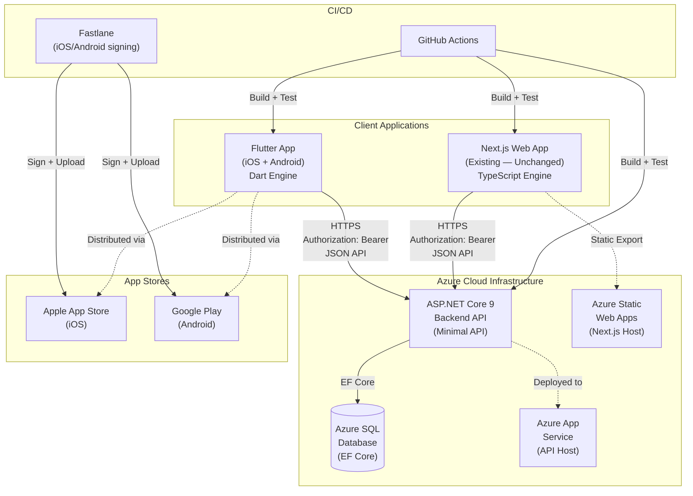

### 1.2 Key Architecture Decisions

| Decision | Choice | ADR |
|----------|--------|-----|
| Web strategy | Keep Next.js for web; Flutter = iOS + Android only | ADR-013 |
| Shared engine | Independent Dart port (`shared/draughts-engine-dart/`) | ADR-015 |
| State management | Riverpod — 8 decomposed units (6 core providers + learning + orchestration) | ADR-009 |
| AI computation | `Isolate.run()` + `TransferableTypedData` for TT transfer | ADR-011 |
| Backend auth | JWT validation middleware + refresh token rotation | ADR-012 |
| CI/CD | GitHub Actions + Fastlane | ADR-010 |
| App versioning | Custom `GET /api/v1/app-config` endpoint | ADR-014 |

### 1.3 Shared vs. Independent Components

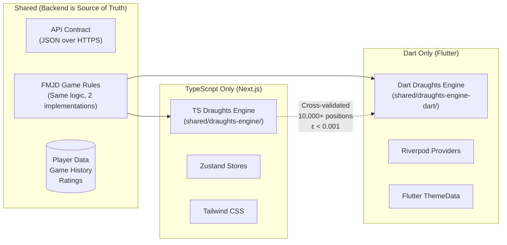

---

## 2. Component Architecture (L1)

### 2.1 Flutter App Layered Architecture

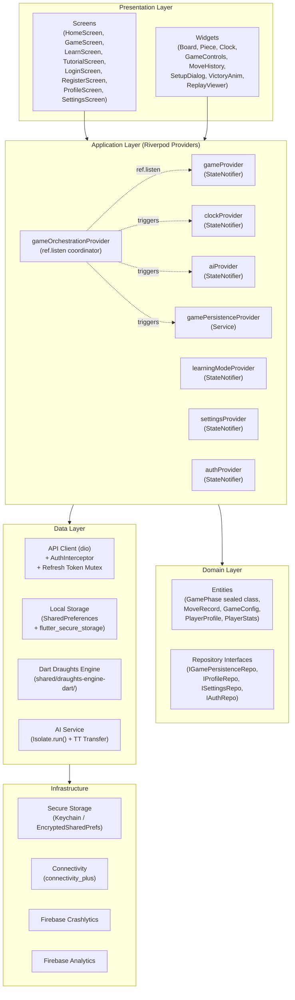

### 2.2 Riverpod Provider Dependency Graph

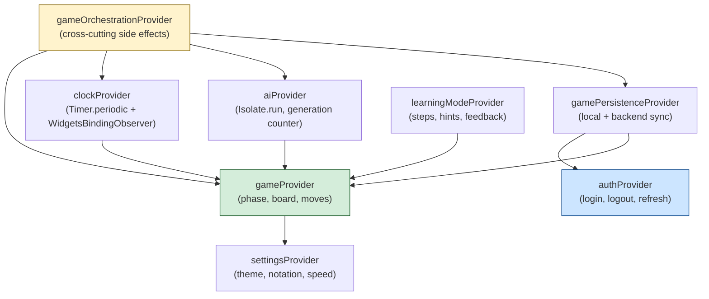

> **Note on ClockProvider (Blocking Issue #1 resolved):** `ClockNotifier` uses `Timer.periodic(Duration(milliseconds: 100))` with `WidgetsBindingObserver` for app lifecycle pause/resume, not `TickerProviderMixin` (which requires `State<T>`, not `StateNotifier`).

> **Note on Refresh Token (Blocking Issue #2 resolved):** `AuthInterceptor` uses a `Lock` (from `package:synchronized`) to serialize refresh requests and prevent concurrent 401 handlers from triggering token-family revocation.

---

## 3. Detailed Module Breakdown (L2)

### 3.1 Game Module

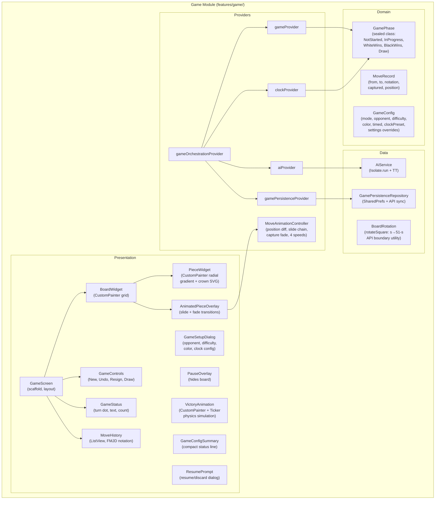

### 3.2 Auth Module

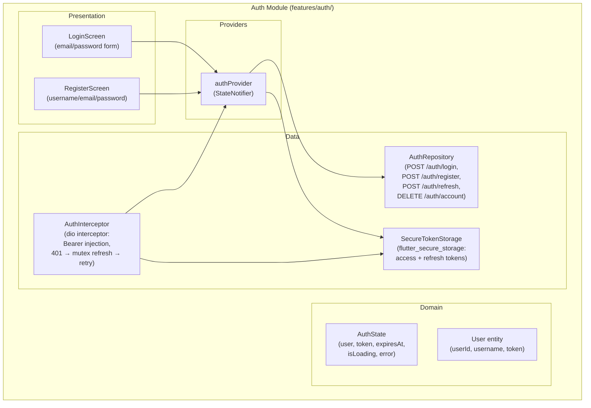

### 3.3 Profile Module

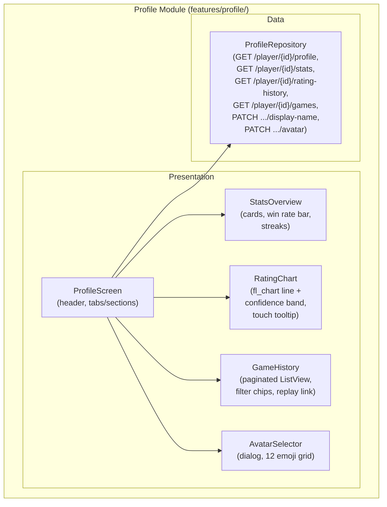

### 3.4 Engine Module

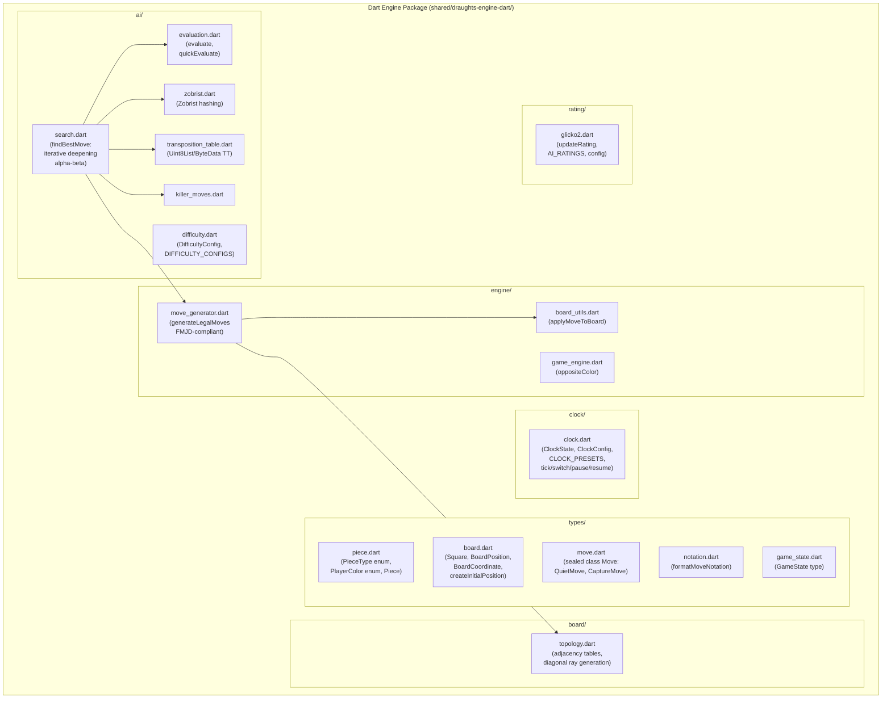

> **Board Numbering Convention (Blocking Issue #3 resolved):** The Dart engine uses the same convention as the TypeScript engine: `createInitialPosition()` places Black pieces on squares 1–20, White pieces on squares 31–50. The `rotateSquare(s) = 51 - s` transformation is applied at the API boundary in the Flutter app's `BoardRotation` utility, NOT inside the engine.

### 3.5 Navigation Module

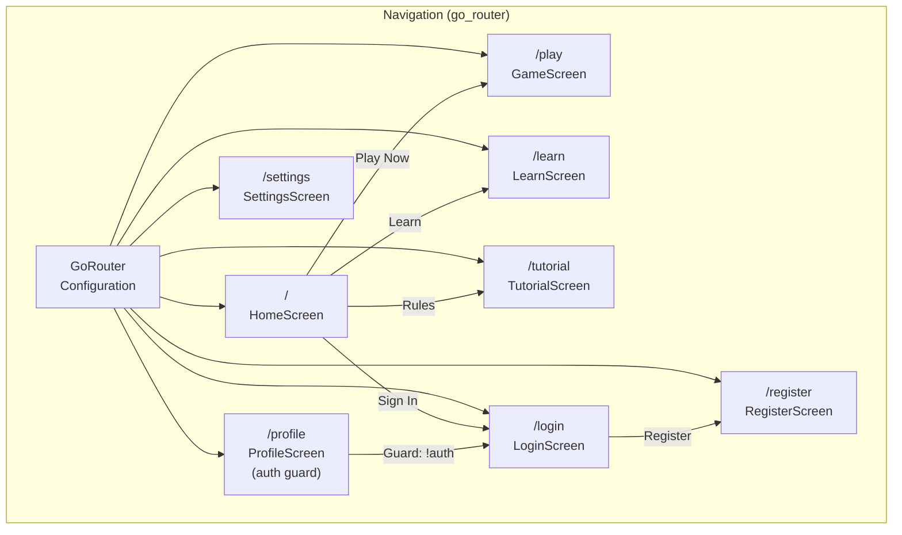

---

## 4. Phase Dependency Graph (L3)

### 4.1 Gantt Chart

```mermaid
gantt
    title Flutter Migration — Phase Schedule
    dateFormat  YYYY-MM-DD
    axisFormat  %b %d

    section Phase 0: Backend Hardening
    JWT validation middleware          :p0_1, 2026-02-23, 3d
    Authorization guards               :p0_2, after p0_1, 2d
    Refresh token support              :p0_3, after p0_1, 5d
    Update login/register responses    :p0_4, after p0_3, 1d
    App-config endpoint                :p0_5, 2026-02-23, 1d
    Rate limiting                      :p0_6, after p0_1, 2d
    CORS update for mobile             :p0_7, 2026-02-23, 1d
    Web API client Bearer update       :p0_8, after p0_1, 1d
    Backend testing (auth)             :p0_9, after p0_4, 3d
    Apple Developer enrollment         :p0_a, 2026-02-23, 10d
    Google Play registration           :p0_b, 2026-02-23, 1d
    Dart style guide                   :p0_c, 2026-02-23, 1d
    Riverpod provider graph design     :p0_d, 2026-02-23, 1d
    Android keystore generation        :p0_e, 2026-02-23, 1d
    milestone M0: Backend Ready        :milestone, m0, after p0_9, 0d

    section Phase 1: Foundation (Dev A — Engine)
    Port types/ module                 :p1_a1, after m0, 2d
    Port board/topology                :p1_a2, after p1_a1, 1d
    Port engine/ (move generator)      :p1_a3, after p1_a2, 5d
    Port ai/ (search + eval)           :p1_a4, after p1_a3, 5d
    Port clock/ module                 :p1_a5, after p1_a4, 1d
    Port rating/ (Glicko-2)            :p1_a6, after p1_a5, 1d
    Port 190+ engine tests             :p1_a7, 2026-03-16, 5d
    Cross-validation (10k positions)   :p1_a8, after p1_a7, 3d

    section Phase 1: Foundation (Dev B — App)
    Flutter project scaffold           :p1_b1, after m0, 1d
    CI/CD pipeline (GH Actions)        :p1_b2, after p1_b1, 3d
    Navigation (go_router, 8 routes)   :p1_b3, after p1_b1, 1d
    Theme system (4 themes + dark)     :p1_b4, after p1_b3, 2d
    API client (dio + interceptors)    :p1_b5, after p1_b4, 2d
    Auth provider + secure storage     :p1_b6, after p1_b5, 3d
    App version check (ADR-014)        :p1_b7, after p1_b6, 1d
    Crashlytics integration            :p1_b8, after p1_b7, 1d
    Cross-validation CI job            :p1_b9, after p1_a8, 1d
    milestone M1: Foundation Ready     :milestone, m1, after p1_b9, 0d

    section Phase 2: Core Gameplay (Dev A — Board)
    Board widget (CustomPainter)       :p2_a1, after m1, 5d
    Piece widget (gradient + crown)    :p2_a2, after p2_a1, 2d
    Tap-to-select, tap-to-move         :p2_a3, after p2_a2, 3d
    Drag-and-drop (GestureDetector)    :p2_a4, after p2_a3, 3d
    Last move highlighting             :p2_a5, after p2_a4, 1d

    section Phase 2: Core Gameplay (Dev B — State)
    Game provider (StateNotifier)      :p2_b1, after m1, 5d
    Game orchestration provider        :p2_b2, after p2_b1, 2d
    AI provider + Isolate service      :p2_b3, after p2_b2, 5d
    Game controls widget               :p2_b4, after p2_b3, 2d
    Game status widget                 :p2_b5, after p2_b4, 1d
    Move history widget                :p2_b6, after p2_b5, 2d
    Undo / Redo                        :p2_b7, after p2_b6, 2d
    milestone M2: First Playable       :milestone, m2, after p2_b7, 0d

    section Phase 3: Full Experience (Dev A)
    Move animation controller          :p3_a1, after m2, 8d
    Clock provider (Timer.periodic)    :p3_a2, after p3_a1, 4d
    Clock widget                       :p3_a3, after p3_a2, 2d
    App lifecycle handling             :p3_a4, after p3_a3, 2d

    section Phase 3: Full Experience (Dev B)
    Game setup dialog                  :p3_b1, after m2, 5d
    Expert AI integration + rotation   :p3_b2, after p3_b1, 3d
    Game persistence provider          :p3_b3, after p3_b2, 4d
    Learning mode provider + UI        :p3_b4, after p3_b3, 6d
    Pause / Resume overlay             :p3_b5, after p3_b4, 1d
    milestone M3: Feature Complete     :milestone, m3, after p3_b5, 0d

    section Phase 4: Profile & Polish (Dev A)
    Profile screen + stats             :p4_a1, after m3, 3d
    Rating chart (fl_chart)            :p4_a2, after p4_a1, 3d
    Game history (paginated)           :p4_a3, after p4_a2, 3d
    Replay viewer                      :p4_a4, after p4_a3, 3d

    section Phase 4: Profile & Polish (Dev B)
    Login / Register screens           :p4_b1, after m3, 2d
    Settings panel                     :p4_b2, after p4_b1, 1d
    Victory animation                  :p4_b3, after p4_b2, 3d
    Offline detection + banner         :p4_b4, after p4_b3, 1d
    Haptic feedback                    :p4_b5, after p4_b4, 1d
    App icons + splash screen          :p4_b6, after p4_b5, 1d
    Dark mode polish                   :p4_b7, after p4_b6, 1d
    milestone M4: Feature Parity       :milestone, m4, after p4_a4, 0d

    section Phase 5: Release
    State management tests (60+)       :p5_1, after m4, 4d
    Widget tests (170+)                :p5_2, after m4, 6d
    Integration tests (45+)            :p5_3, after p5_2, 5d
    Accessibility audit                :p5_4, after p5_3, 3d
    Performance profiling              :p5_5, after p5_3, 3d
    App store assets                   :p5_6, after m4, 2d
    Beta testing (2 weeks)             :p5_7, after p5_4, 10d
    App store submission               :p5_8, after p5_7, 1d
    milestone M5: Public Release       :milestone, m5, after p5_8, 0d
```

### 4.2 Critical Path

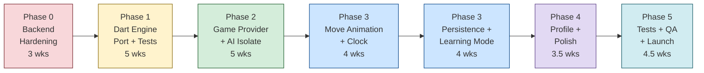

**Critical path duration:** ~25 weeks (optimistic) to ~32 weeks (conservative).

The primary bottleneck is Phase 3's animation system rewrite (8 days estimated, HIGH risk of overrun).

---

## 5. Task Breakdown

### Phase 0: Backend Hardening (3 weeks)

#### Task 0.1: JWT Validation Middleware

- **Description:** Add `AddAuthentication().AddJwtBearer()` in `Program.cs`. Configure issuer, audience, signing key from environment variables. Add `app.UseAuthentication()` before `app.UseAuthorization()`.
- **Acceptance Criteria:**
  - `Program.cs` registers JWT bearer authentication scheme
  - Invalid/expired tokens return 401
  - Valid tokens pass through with claims populated
  - Existing web client continues working (dual auth support)
- **Dependencies:** None
- **Effort:** 3 days
- **Risk:** Low

#### Task 0.2: Authorization Guards

- **Description:** Add `.RequireAuthorization()` to all protected endpoints (`/player/*`, `/settings/*`, `/games/*`, `/api/v1/ai/move`). Extract userId from JWT `sub` claim. Validate URL userId matches token userId. Keep `/api/auth/login`, `/api/auth/register`, `/health`, and `/api/v1/app-config` as anonymous.
- **Acceptance Criteria:**
  - Protected endpoints return 401 without token
  - Protected endpoints return 403 when token userId ≠ URL userId
  - Anonymous endpoints work without token
- **Dependencies:** Task 0.1
- **Effort:** 2 days
- **Risk:** Low

#### Task 0.3: Refresh Token Support

- **Description:** Create `RefreshTokens` database table (EF Core migration). Implement `POST /api/auth/refresh` endpoint accepting `{ refreshToken }`, returning new `{ token, expiresAt, refreshToken }`. Implement token rotation: each refresh invalidates the old token and issues a new one. Add token family tracking for compromise detection — if a used (revoked) refresh token is presented, revoke the entire family and force re-login.
- **Acceptance Criteria:**
  - `POST /api/auth/refresh` returns new token pair on valid refresh token
  - Old refresh token is revoked after use
  - Reuse of a revoked token revokes entire family
  - Refreshed access token has 15-minute lifetime
  - Refresh token has 30-day lifetime
- **Dependencies:** Task 0.1
- **Effort:** 5 days
- **Risk:** Medium (concurrent refresh race condition — see Task 0.3b)

#### Task 0.3b: Refresh Token 10-Second Grace Period

- **Description:** Allow a recently-revoked refresh token to be used within 10 seconds of its rotation. This handles the concurrent 401 scenario where two API calls both attempt refresh simultaneously at the backend level. The first succeeds and rotates. The second arrives within 10s and gets the same new token pair (idempotent reissue).
- **Acceptance Criteria:**
  - Two simultaneous refresh requests with the same token both succeed
  - A refresh request with a token revoked >10s ago triggers family revocation
- **Dependencies:** Task 0.3
- **Effort:** 1 day
- **Risk:** Medium

#### Task 0.4: Update Login/Register Responses

- **Description:** Update `POST /api/auth/login` and `POST /api/auth/register` to return `{ userId, username, token, expiresAt, refreshToken }`. Access token lifetime: 15 minutes. Refresh token lifetime: 30 days.
- **Acceptance Criteria:**
  - Login response includes `refreshToken` field
  - Register response includes `refreshToken` field
  - Access token `expiresAt` is 15 minutes from issuance
  - Existing web client handles the new response shape (backward compatible — extra field)
- **Dependencies:** Task 0.3
- **Effort:** 1 day
- **Risk:** Low

#### Task 0.5: App-Config Endpoint

- **Description:** Implement `GET /api/v1/app-config` (unauthenticated) returning `{ minimumVersion, latestVersion, updateUrl, maintenanceMode, maintenanceMessage }`. Values read from application configuration (appsettings.json / environment variables). Per ADR-014.
- **Acceptance Criteria:**
  - Endpoint returns valid JSON with all fields
  - `maintenanceMode` defaults to `false`
  - Endpoint requires no authentication
  - Configuration values can be changed without redeployment (environment variables)
- **Dependencies:** None
- **Effort:** 1 day
- **Risk:** Low

#### Task 0.6: Rate Limiting

- **Description:** Add `Microsoft.AspNetCore.RateLimiting` middleware. Configure per-user rate limits on authenticated endpoints (100 requests/minute). IP-based rate limits on anonymous endpoints (30 requests/minute). CPU-intensive `POST /api/v1/ai/move`: 30 requests/minute per authenticated user.
- **Acceptance Criteria:**
  - Exceeding rate limit returns HTTP 429
  - Rate limit headers (`X-RateLimit-Remaining`) included in responses
  - Expert AI endpoint has stricter limit
  - Rate limits configurable via appsettings
- **Dependencies:** Task 0.1
- **Effort:** 2 days
- **Risk:** Low

#### Task 0.7: CORS Update for Mobile

- **Description:** Verify ASP.NET Core CORS middleware passes through requests without `Origin` header (native app behavior). Add integration test confirming native-style requests work.
- **Acceptance Criteria:**
  - API responds to requests without `Origin` header
  - Existing web requests with `Origin` still receive CORS headers
  - Integration test covers both scenarios
- **Dependencies:** None
- **Effort:** 0.5 days
- **Risk:** Low

#### Task 0.8: Web API Client Bearer Update

- **Description:** Update `frontend/src/lib/api-client.ts` to send `Authorization: Bearer <token>` headers. Remove `credentials: 'include'`. Read token from auth store. Test login, profile, game persistence, Expert AI with updated backend.
- **Acceptance Criteria:**
  - All API calls include `Authorization: Bearer <token>` for authenticated users
  - `credentials: 'include'` removed
  - All existing frontend tests pass
  - Manual test: login → profile → game → persist → all work
- **Dependencies:** Task 0.1
- **Effort:** 1 day
- **Risk:** Low

#### Task 0.9: Backend Testing

- **Description:** Update existing 192 backend tests for auth changes. Add new tests: JWT validation (valid, expired, invalid, missing), refresh token rotation, token family revocation, concurrent refresh requests, rate limiting (429 response), app-config endpoint, userId claim matching. Target: 225+ total tests.
- **Acceptance Criteria:**
  - All 225+ tests pass
  - Tests cover: valid JWT, expired JWT (401), invalid JWT (401), missing JWT (401 on protected), userId mismatch (403), refresh rotation, family revocation, concurrent refresh grace period, rate limiting (429), app-config response
  - Backend builds with zero errors and zero warnings
- **Dependencies:** All Task 0.1–0.8
- **Effort:** 3 days
- **Risk:** Low

#### Task 0.10: Apple Developer & Google Play Setup

- **Description:** Enroll in Apple Developer Program ($99/year). Register Google Play Developer account ($25 one-time). Verify accounts are active and ready for uploads.
- **Acceptance Criteria:**
  - Apple Developer account approved and active
  - Google Play Console accessible
  - Team members added to both accounts
- **Dependencies:** None (start immediately — Apple approval can take 48 hours)
- **Effort:** 1 day + wait time
- **Risk:** Low

#### Task 0.11: Dart Style Guide

- **Description:** Document sealed class patterns for union types (`Move`, `GamePhase`, `DrawReason`). Establish naming conventions, immutability patterns, error handling (`Result<T>` types vs exceptions). Document: engine package has zero dependencies; `freezed` is app-only.
- **Acceptance Criteria:**
  - Style guide published at `docs/dart-style-guide.md`
  - Sealed class examples with pattern matching
  - `Result<T>` type definition
  - Clear boundary: engine = zero deps, app = freezed allowed
- **Dependencies:** None
- **Effort:** 1 day
- **Risk:** Low

#### Task 0.12: Riverpod Provider Graph Design

- **Description:** Diagram 8 units (6 core providers + `learningModeProvider` + `gameOrchestrationProvider`), their state types, actions, inter-provider dependencies. Define orchestration responsibilities (cross-cutting: `onMoveMade`, `onGameOver`, `onPause`). Use `ref.listen` pattern to avoid circular dependencies.
- **Acceptance Criteria:**
  - Provider graph diagram with 8 units (6 core + learning + orchestration)
  - Each provider's state type and public actions listed
  - Orchestrator's `ref.listen` callbacks documented
  - No circular dependencies in the graph
- **Dependencies:** None
- **Effort:** 1 day
- **Risk:** Low

#### Task 0.13: Android Release Keystore

- **Description:** Generate Android release keystore (`.jks`). Store encrypted backup in team secret vault. Document recovery/backup process. **This keystore can NEVER be regenerated** — losing it means the app can never be updated on Play Store.
- **Acceptance Criteria:**
  - `.jks` file generated
  - Encrypted backup stored in secure vault (not in git)
  - Recovery process documented
  - Keystore password stored in GitHub Actions secrets
- **Dependencies:** None
- **Effort:** 0.5 days
- **Risk:** Low (but consequence of failure is critical)

---

### Phase 1: Foundation (5–6 weeks)

#### Task 1.1: Port Types Module to Dart

- **Description:** Port `types/piece.ts`, `types/board.ts`, `types/move.ts`, `types/notation.ts`, `types/game-state.ts` to Dart. Use Dart `enum` for `PieceType` and `PlayerColor`. Use `sealed class Move` with `QuietMove` and `CaptureMove` subtypes. Board numbering: Black pieces on squares 1–20, White on 31–50 (matching TypeScript convention).
- **Acceptance Criteria:**
  - All type definitions compile with `dart analyze` zero issues
  - `sealed class Move` allows exhaustive pattern matching
  - `createInitialPosition()` produces identical board to TypeScript version
  - Board square numbering convention explicitly documented in code comments
- **Dependencies:** Phase 0 complete, Dart style guide (Task 0.11)
- **Effort:** 2 days
- **Risk:** Low

#### Task 1.2: Port Board Topology

- **Description:** Port `board/topology.ts` — adjacency tables and diagonal ray generation functions. Pure data + computation; no external dependencies.
- **Acceptance Criteria:**
  - Adjacency tables produce identical neighbor lists as TypeScript version
  - Diagonal rays match for all 50 squares
- **Dependencies:** Task 1.1
- **Effort:** 1 day
- **Risk:** Low

#### Task 1.3: Port Engine (Move Generator)

- **Description:** Port `engine/move-generator.ts` (~500 LoC), `engine/board-utils.ts` (~100 LoC), `engine/game-engine.ts` (~100 LoC). This is the most critical module — FMJD-compliant move generation with mandatory capture and maximum capture rule. Port `board-utils.ts` (`applyMoveToBoard`) and `game-engine.ts` (`oppositeColor`).
- **Acceptance Criteria:**
  - `generateLegalMoves()` produces identical move sets as TypeScript for all test positions
  - Maximum capture rule enforced correctly
  - Flying king moves (any distance diagonally) work correctly
  - Promotion only when piece stops on back row at end of turn
  - All engine-specific tests pass (subset of 190+)
- **Dependencies:** Task 1.2
- **Effort:** 5 days
- **Risk:** **High** — most critical module; any FMJD rule bug breaks gameplay

#### Task 1.4: Port AI Module

- **Description:** Port `ai/search.ts` (~400 LoC), `ai/evaluation.ts` (~300 LoC), `ai/difficulty.ts` (~100 LoC), `ai/zobrist.ts` (~100 LoC), `ai/transposition-table.ts` (~100 LoC), `ai/killer-moves.ts` (~50 LoC). Use `Uint8List`/`ByteData` for transposition table (Endian.little explicitly). Preserve Zobrist hash seed for deterministic behavior.
- **Acceptance Criteria:**
  - `findBestMove()` at fixed depth returns same move as TypeScript for test positions (or same score within ε < 0.001)
  - `evaluate()` scores match TypeScript within ε < 0.001
  - `DIFFICULTY_CONFIGS` match TypeScript values exactly
  - `TranspositionTable` uses `ByteData` with explicit `Endian.little`
  - Performance: depth 8 from initial position takes ≤ 2× TypeScript time
- **Dependencies:** Task 1.3
- **Effort:** 5 days
- **Risk:** **High** — performance-sensitive; floating-point precision (Blocking Issue #4: ε < 0.001 tolerance)

#### Task 1.5: Port Clock Module

- **Description:** Port `clock/clock.ts` (~200 LoC). Pure functions: `createClockState`, `createClockFromPreset`, `startClock`, `tickClock`, `switchClock`, `pauseClock`, `resumeClock`, `isTimeExpired`. Port all 6 `CLOCK_PRESETS`.
- **Acceptance Criteria:**
  - All clock functions produce identical output as TypeScript
  - All 6 presets have same values (name, initialTime, increment, format)
  - Clock tests pass
- **Dependencies:** Task 1.1
- **Effort:** 1 day
- **Risk:** Low

#### Task 1.6: Port Rating Module (Glicko-2)

- **Description:** Port `rating/glicko2.ts` (~200 LoC). Math-heavy module. Use Dart `double` arithmetic. Validate floating-point precision against TypeScript output.
- **Acceptance Criteria:**
  - `updateRating()` produces same results as TypeScript (within ε < 0.001)
  - `AI_RATINGS` constants match exactly
  - `DEFAULT_CONFIG` matches exactly
- **Dependencies:** Task 1.1
- **Effort:** 1 day
- **Risk:** Low (floating-point divergence possible but acceptable within tolerance)

#### Task 1.7: Port Engine Tests (190+)

- **Description:** Port all 8 test files to Dart: `ai_test.dart`, `board_utils_test.dart`, `clock_test.dart`, `game_engine_test.dart`, `glicko2_test.dart`, `move_generator_test.dart`, `topology_test.dart`, `types_test.dart`. Tests serve as the specification — port tests first, then validate modules.
- **Acceptance Criteria:**
  - All 190+ tests pass
  - ≥85% code coverage (statements, branches, functions, lines)
  - Test names follow `methodName_condition_expectedResult` pattern
- **Dependencies:** Tasks 1.1–1.6 (run iteratively as modules are ported)
- **Effort:** 5 days (parallel with module porting)
- **Risk:** Medium

#### Task 1.8: Cross-Validation Script

- **Description:** Build a cross-validation harness: Node.js script generates 10,000 legal positions by simulating 1,000 random games (10 samples each). For each position: run `generateLegalMoves()` in both TypeScript and Dart, compare move sets (exact set equality). Run `evaluate()` in both, compare scores (|TS - Dart| < 0.001). Run `findBestMove()` at depth 4 in both, compare (same move OR same score within ε). Output diff report.
- **Acceptance Criteria:**
  - 10,000+ positions tested
  - Zero discrepancies in move generation (exact set match)
  - Evaluation score divergence < 0.001 for all positions
  - `findBestMove` same move or same score for ≥99% of positions
  - Script runs in CI on every PR modifying `shared/draughts-engine-dart/`
- **Dependencies:** Tasks 1.3, 1.4, 1.7
- **Effort:** 3 days
- **Risk:** Medium

#### Task 1.9: Flutter Project Scaffold

- **Description:** Run `flutter create` with project structure from Section 6. Configure `pubspec.yaml` with dependencies: `flutter_riverpod`, `go_router`, `dio`, `flutter_secure_storage`, `shared_preferences`, `connectivity_plus`, `firebase_crashlytics`, `firebase_analytics`, `fl_chart`, `synchronized`. Add path dependency to `shared/draughts-engine-dart/`. Minimum iOS: 16.0. Minimum Android SDK: 23.
- **Acceptance Criteria:**
  - `flutter analyze --fatal-infos` produces zero issues
  - `flutter build ios --no-codesign` succeeds
  - `flutter build apk --debug` succeeds
  - Path dependency to Dart engine resolves correctly
- **Dependencies:** Phase 0 complete
- **Effort:** 1 day
- **Risk:** Low

#### Task 1.10: CI/CD Pipeline

- **Description:** Create `ci-flutter.yml` with 3 jobs per ADR-010:
  - **Job 1 (Linux):** Lint (`flutter analyze`), test (`flutter test`), coverage check (≥85% engine)
  - **Job 2 (Linux):** Android compile check (`flutter build apk --debug`)
  - **Job 3 (macOS):** iOS compile check (`flutter build ios --no-codesign`)
  - Create `deploy-flutter.yml` with Fastlane lanes for TestFlight beta and Play Store internal track. Include `--obfuscate --split-debug-info=build/symbols` in release builds. Upload debug symbols to Crashlytics.
- **Acceptance Criteria:**
  - All 3 CI jobs pass on PR
  - Path filters: only trigger on `mobile/`, `shared/draughts-engine-dart/`, `pubspec.yaml` changes
  - Fastlane `beta` lane configured (iOS + Android)
  - Build artifacts uploaded
- **Dependencies:** Task 1.9
- **Effort:** 3 days
- **Risk:** Medium (iOS code signing first-time setup)

#### Task 1.11: Navigation (go_router)

- **Description:** Configure `go_router` with 8 routes: `/`, `/play`, `/learn`, `/tutorial`, `/login`, `/register`, `/profile`, `/settings`. Add auth redirect guard on `/profile`. Configure deep link scheme: `intl-draughts://`. Placeholder `Scaffold` for each screen.
- **Acceptance Criteria:**
  - All 8 routes navigable
  - `/profile` redirects to `/login` when unauthenticated
  - Deep link `intl-draughts://play` opens game screen
  - `GoRouter.of(context).go('/play')` works from all screens
- **Dependencies:** Task 1.9
- **Effort:** 1 day
- **Risk:** Low

#### Task 1.12: Theme System

- **Description:** Create `ThemeData` for light and dark modes. Define `BoardTheme` data class with 4 themes: `classicWood` (#f0d9b5/#b58863), `dark` (#6b7280/#374151), `ocean` (#93c5fd/#1d4ed8), `tournamentGreen` (#d4edda/#2d6a4f). System-aware `ThemeMode`. Design tokens: colors, typography (system-ui), spacing, shadows (board, piece).
- **Acceptance Criteria:**
  - Light/dark themes render correctly
  - All 4 board themes have correct color pairs
  - Dark mode follows system setting by default
  - Typography uses platform default (San Francisco on iOS, Roboto on Android)
- **Dependencies:** Task 1.11
- **Effort:** 2 days
- **Risk:** Low

#### Task 1.13: API Client (dio)

- **Description:** Create `dio` HTTP client with base URL configuration (environment variable or compile-time constant). Create `AuthInterceptor`:
  - On request: inject `Authorization: Bearer <token>` from authProvider
  - On 401 response: acquire mutex (`Lock` from `synchronized`), check if token already refreshed by another call, if not call `POST /api/auth/refresh`, retry original request
  - Error handling: typed `ApiException` with status code, message, correlation ID
  - Timeout: `connectTimeout: 5s`, `receiveTimeout: 15s`
- **Acceptance Criteria:**
  - API calls include Bearer token for authenticated users
  - 401 triggers refresh (mutex prevents concurrent refresh)
  - Retry succeeds after refresh
  - `ApiException` includes status code and correlation ID
  - Timeouts configured correctly
- **Dependencies:** Task 1.12
- **Effort:** 2 days
- **Risk:** Medium (refresh mutex is critical — Blocking Issue #2)

#### Task 1.14: Auth Provider

- **Description:** Create `authProvider` (StateNotifier<AuthState>). Actions: `login(email, password)`, `register(username, email, password)`, `logout()`, `refreshToken()`, `loadStoredAuth()`. Token storage: access token in memory + `flutter_secure_storage`, refresh token in `flutter_secure_storage` only. On app launch: read refresh token from secure storage → call refresh → populate access token.
- **Acceptance Criteria:**
  - Login stores tokens in secure storage + memory
  - Register stores tokens in secure storage + memory
  - Logout clears secure storage + memory state
  - `loadStoredAuth()` on app launch refreshes token from secure storage
  - `flutter_secure_storage` errors caught gracefully (force re-login, don't crash)
  - Auth state exposes `isAuthenticated`, `user`, `isLoading`, `error`
- **Dependencies:** Task 1.13
- **Effort:** 3 days
- **Risk:** Medium

#### Task 1.15: App Version Check

- **Description:** Create `AppVersionService` consuming `GET /api/v1/app-config`. On startup: run in parallel with token refresh. If `maintenanceMode == true`, show blocking maintenance screen. If app version < `minimumVersion`, show force-update screen with link to store. Graceful degradation on network error (proceed normally).
- **Acceptance Criteria:**
  - Version check runs on startup before main screen
  - Maintenance mode shows blocking screen
  - Force update shows blocking screen with store link
  - Network error allows normal app launch
  - Runs in parallel with token refresh (not sequential)
- **Dependencies:** Task 1.14
- **Effort:** 1 day
- **Risk:** Low

#### Task 1.16: Crashlytics Integration

- **Description:** Initialize Firebase Crashlytics. Configure `FlutterError.onError` + `PlatformDispatcher.instance.onError` for uncaught exceptions. Upload debug symbols in CI (`deploy-flutter.yml`). Add structured logging (`package:logging`) that forwards to Crashlytics breadcrumbs in release mode.
- **Acceptance Criteria:**
  - Test crash appears in Crashlytics dashboard
  - Stack traces are symbolicated (debug symbols uploaded)
  - Structured log entries appear as Crashlytics breadcrumbs
  - Non-fatal errors reported for key failures (AI error, persistence error)
- **Dependencies:** Task 1.9
- **Effort:** 1 day
- **Risk:** Low

#### Task 1.17: Cross-Validation CI Job

- **Description:** Add cross-validation script (Task 1.8) as a CI job in `ci-flutter.yml`. Triggers on PRs that modify `shared/draughts-engine-dart/`. Runs Node.js TypeScript engine + Dart engine in parallel, diffs results. Fails PR if any discrepancy.
- **Acceptance Criteria:**
  - CI job runs on PRs modifying engine
  - Produces diff report as artifact
  - Fails on move generation discrepancy or eval divergence > 0.001
- **Dependencies:** Task 1.8, Task 1.10
- **Effort:** 1 day
- **Risk:** Low

---

### Phase 2: Core Gameplay (5–6 weeks)

#### Task 2.1: Board Widget

- **Description:** Create `BoardWidget` using `CustomPainter` for the 10×10 grid background (square colors from `BoardTheme`). Use `Stack` + `Positioned` for pieces. Render notation numbers (1–50) conditionally. Support orientation flip (White/Black perspective) by reversing grid data. Responsive sizing via `LayoutBuilder`: `min(width * 0.9, height * 0.9, 600)`. Wrap in `RepaintBoundary` to isolate from clock repaints. Implement `shouldRepaint()` comparing `BoardPosition`, `selectedSquare`, `legalMoveSquares`, `lastMoveSquares`, `boardTheme`.
- **Acceptance Criteria:**
  - Board renders correctly at 320px (SE) through 1366px (iPad landscape)
  - All 4 themes render with correct color pairs
  - Notation toggles on/off
  - Orientation flip works (White/Black perspective)
  - Board wrapped in `RepaintBoundary`
  - `shouldRepaint()` only repaints when board state changes
- **Dependencies:** Phase 1 complete
- **Effort:** 5 days
- **Risk:** Medium

#### Task 2.2: Piece Widget

- **Description:** Create `PieceWidget` using `CustomPainter` with `RadialGradient` for 3D ring effect. Amber for White pieces, gray for Black pieces. SVG `Path` for king crown icon. Support `isDragging` state (opacity change on source square).
- **Acceptance Criteria:**
  - Man and King pieces render correctly for both colors
  - 3D ring effect visible
  - Crown icon visible on kings
  - Dragging opacity change works
- **Dependencies:** Task 2.1
- **Effort:** 2 days
- **Risk:** Low

#### Task 2.3: Tap-to-Select, Tap-to-Move

- **Description:** Implement `GestureDetector.onTap` on board. Convert tap coordinates to square number using board geometry. On first tap: select piece (if legal), highlight square, show legal move indicators (semi-transparent circles). On second tap: if tapped square is a legal destination, execute move via `gameProvider.selectSquare()`. If tapped on another own piece, reselect. If tapped on empty non-legal square, deselect.
- **Acceptance Criteria:**
  - Single tap selects a piece with legal moves
  - Selected square shows highlight (blue/purple ring)
  - Legal move squares show indicator circles
  - Second tap on legal square executes move
  - Tapping another own piece reselects
  - Tapping invalid square deselects
  - Cannot select opponent's pieces
- **Dependencies:** Tasks 2.1, 2.2
- **Effort:** 3 days
- **Risk:** Low

#### Task 2.4: Drag-and-Drop

- **Description:** Implement `GestureDetector.onPanStart/onPanUpdate/onPanEnd` for unified mouse+touch drag. On drag start: identify source square, create drag feedback widget tracking pointer position. During drag: update feedback position. On drag end: identify target square from pointer coordinates, execute move if legal, else return piece to origin with animation.
- **Acceptance Criteria:**
  - Drag works on both iOS and Android physical devices
  - Drag feedback piece tracks finger/cursor with zero perceptible lag
  - Invalid drop returns piece to origin
  - Drag uses separate `Overlay` (outside board's `RepaintBoundary`)
  - No dropped gestures on rapid interactions
- **Dependencies:** Task 2.3
- **Effort:** 3 days
- **Risk:** Medium (lag on older Android — profile on Pixel 4a)

#### Task 2.5: Game Provider (StateNotifier)

- **Description:** Create `gameProvider` as `StateNotifier<GamePhase>` where `GamePhase` is a sealed class: `NotStarted`, `InProgress(position, currentTurn, moveHistory, moveIndex, selectedSquare, legalMoveSquares, lastMoveSquares, isPaused, gameOverReason)`, `WhiteWins(reason)`, `BlackWins(reason)`, `Draw(reason)`. Actions: `startGame(config)`, `selectSquare(square)`, `makeMove(from, to, notation, captured)`, `undoMove()`, `redoMove()`, `resign()`, `offerDraw()`, `resetGame()`. Phase transitions guarded (e.g., can't resign when NotStarted).
- **Acceptance Criteria:**
  - All phase transitions work correctly
  - Illegal state transitions are rejected
  - `selectSquare` generates legal moves via engine
  - `makeMove` applies move, promotes if applicable, checks game over
  - Position updates are immutable (new state on every change)
  - 40+ unit tests covering all phase transitions
- **Dependencies:** Phase 1 complete (engine validated)
- **Effort:** 5 days
- **Risk:** **High** — core architecture, must be rock-solid

#### Task 2.6: Game Orchestration Provider

- **Description:** Create `gameOrchestrationProvider` using `ref.listen` pattern. Watches `gameProvider` for state changes and triggers side effects:
  - On move made (InProgress with new moveIndex): trigger `aiProvider.triggerAiMove()` if AI's turn, trigger `gamePersistenceProvider.autoSave()`, switch clock via `clockProvider`
  - On game over (transition to WhiteWins/BlackWins/Draw): stop clock, cancel AI, clear saved game, record result
  - On pause: pause clock, cancel pending AI
  - On resume: resume clock
- **Acceptance Criteria:**
  - AI triggered after human move (when playing vs AI)
  - Auto-save fires after every move
  - Clock switches after every move
  - Game over stops clock and cancels AI
  - No circular dependencies
- **Dependencies:** Task 2.5
- **Effort:** 2 days
- **Risk:** Medium

#### Task 2.7: AI Provider + Isolate Service

- **Description:** Create `aiProvider` (StateNotifier<AiState>) and `AiService`. `AiState` contains `isThinking`, `currentGeneration`. `AiService.findBestMove()` uses `Isolate.run()` per ADR-011 with `TransferableTypedData` for TT buffer transfer. Generation-counter cancellation: on `triggerAiMove()`, increment generation; when result returns, discard if generation doesn't match. 150ms delay before executing AI move. Handle isolate errors: log to Crashlytics, allocate fresh TT, retry once.
- **Acceptance Criteria:**
  - AI responds within targets: Easy < 500ms, Medium < 1s, Hard < 2s
  - AI never makes an illegal move at any difficulty
  - Zero UI jank during AI computation (Flutter DevTools performance overlay)
  - Generation-based cancellation works (undo during AI thinking discards result)
  - Isolate error → retry with fresh TT → if still fails, log error + show SnackBar
  - TT buffer transferred correctly (benchmark: transfer overhead < 50ms on Pixel 4a)
- **Dependencies:** Task 2.5, Dart engine (Tasks 1.3, 1.4)
- **Effort:** 5 days
- **Risk:** **High** — isolate + TT transfer is novel

#### Task 2.8: Game Controls Widget

- **Description:** Create `GameControls` widget with buttons: New Game, Undo, Resign, Offer Draw. Conditional rendering: show only relevant buttons based on game phase and mode. Confirmation dialog for Resign (irreversible). Draw auto-accepted in AI games.
- **Acceptance Criteria:**
  - New Game button opens setup dialog (Phase 3) or starts with last config
  - Undo undoes 1 move (PvP) or 2 moves (vs AI)
  - Resign shows confirmation, then ends game
  - Draw offer auto-accepted in AI mode
  - Buttons disabled when not applicable (e.g., Undo with no moves)
- **Dependencies:** Task 2.5
- **Effort:** 2 days
- **Risk:** Low

#### Task 2.9: Game Status Widget

- **Description:** Create `GameStatus` widget showing: turn indicator dot (amber/gray), status text ("White's turn", "Black wins!", etc.), move count. Use `Semantics(liveRegion: true)` for screen reader announcements of turn changes and game results.
- **Acceptance Criteria:**
  - Turn indicator dot changes color on turn switch
  - Status text updates in real-time
  - Move count increments correctly
  - Screen reader announces turn changes
  - Game result announced on game over
- **Dependencies:** Task 2.5
- **Effort:** 1 day
- **Risk:** Low

#### Task 2.10: Move History Widget

- **Description:** Create scrollable `ListView` of paired moves (White/Black columns) with FMJD notation. Current-move highlighting. Auto-scroll to latest move using `ScrollController`.
- **Acceptance Criteria:**
  - All moves display with correct FMJD notation
  - Current move highlighted
  - Auto-scrolls to latest move
  - Works with touch scrolling on mobile
- **Dependencies:** Task 2.5
- **Effort:** 2 days
- **Risk:** Low

#### Task 2.11: Undo / Redo

- **Description:** Implement undo (1 move in PvP, 2 moves vs AI) and redo (same pattern). Redo re-checks game over on redo'd position. Cancel pending AI on undo. Update move history index.
- **Acceptance Criteria:**
  - Undo reverts board to previous position
  - Undo in AI game undoes both player and AI move
  - Pending AI computation cancelled on undo
  - Redo restores undone move
  - Redo checks game over on restored position
- **Dependencies:** Tasks 2.5, 2.7
- **Effort:** 2 days
- **Risk:** Low

#### Task 2.12: Last Move Highlighting

- **Description:** Highlight from/to squares of the last move with a background color overlay. Update on each move. Clear on game reset.
- **Acceptance Criteria:**
  - Last move origin and destination squares highlighted
  - Highlighting updates after each move
  - Cleared when game resets
- **Dependencies:** Task 2.1
- **Effort:** 0.5 days
- **Risk:** Low

---

### Phase 3: Full Experience (6–7 weeks)

#### Task 3.1: Move Animation Controller

- **Description:** Build `MoveAnimationController` class — this is a **rewrite**, not a port (CSS transitions cannot be mechanically translated). Components:
  - **Position diff algorithm:** Compare previous and next `BoardPosition` arrays to detect which pieces moved and which were captured
  - **Single-step slide:** `AnimatedPositioned` with `Tween<Offset>` for quiet moves and single captures
  - **Multi-capture sequence:** Chained `AnimationController`s with `SequenceAnimation` — piece slides to intermediate square, captured piece fades (`FadeTransition`), next slide begins
  - **Captured piece ghost:** `AnimatedOpacity` fade-out on captured piece widgets
  - **4 speed settings:** duration mapped 0ms (instant) / 100ms (fast) / 200ms (normal) / 400ms (slow)
- **Acceptance Criteria:**
  - Single-move animations play at configured speed
  - Multi-capture sequences animate step-by-step (slide → fade captured → slide → fade...)
  - "Instant" speed skips all animation
  - Animations maintain 60fps on iPhone 12 and Pixel 6
  - No animation artifacts (lingering pieces, double renders)
  - 8 golden tests: 4 speeds × 2 types (single move, multi-capture)
- **Dependencies:** Phase 2 complete
- **Effort:** 8 days
- **Risk:** **HIGH** — most complex rewrite; likely to overrun. Mitigation: build single-step first (2 days), then multi-capture (5 days), defer edge cases to Phase 4.

#### Task 3.2: Game Setup Dialog

- **Description:** Build `GameSetupDialog` via `showDialog()` with `GameSetupForm`:
  - `OpponentSelector`: AI / Human (Local) toggle
  - `DifficultySelector`: 4-segment (Easy/Medium/Hard/Expert with "Server" badge)
  - `ColorPicker`: White/Black/Random
  - `TimedModeToggle`: switch + animated expand/collapse grid with 5 clock presets
  - Quick Start button: starts with last-used configuration
  - Config persistence: save to `SharedPreferences`; load on dialog open
- **Acceptance Criteria:**
  - Dialog opens with last-used config pre-filled
  - All 5 clock presets selectable when timed mode enabled
  - Expert difficulty shows "Server" badge
  - Quick Start works without opening full dialog
  - Dialog dismissible via backdrop tap or close button
  - Config persisted to `SharedPreferences` on Start Game
- **Dependencies:** Phase 2 complete
- **Effort:** 5 days
- **Risk:** Medium

#### Task 3.3: Clock Provider

- **Description:** Create `clockProvider` (StateNotifier<ClockState?>) using `Timer.periodic(Duration(milliseconds: 100))`. Register notifier as `WidgetsBindingObserver` for app lifecycle. On `AppLifecycleState.paused`: save remaining times, cancel timer. On `AppLifecycleState.resumed`: restart timer without catching up (use remaining times, not wall-clock elapsed). Use `Stopwatch` (monotonic) for elapsed time between ticks — prevents clock manipulation via system time changes.
- **Acceptance Criteria:**
  - Clock updates every 100ms
  - Clock pauses when app backgrounded, resumes when foregrounded
  - No clock drift during background/foreground cycles (tested with varying durations)
  - `Stopwatch` (monotonic) used, not `DateTime.now()`
  - Time expiry triggers game over via orchestration provider
  - All 6 presets work correctly
- **Dependencies:** Phase 2 complete
- **Effort:** 4 days
- **Risk:** Medium (lifecycle edge cases)

#### Task 3.4: Clock Widget

- **Description:** Create dual clock faces. Active clock: `AnimatedScale` (1.05) + green border. Low-time warning: `ColorTween` pulse animation + red text at configurable threshold (default 30s). Show tenths of seconds below 10s.
- **Acceptance Criteria:**
  - Active player's clock visually distinct (scale + green ring)
  - Low-time warning activates at 30s (CSS pulse + red text)
  - Tenths of seconds shown below 10s
  - Clock widget wrapped in `RepaintBoundary` (isolated from board)
- **Dependencies:** Task 3.3
- **Effort:** 2 days
- **Risk:** Low

#### Task 3.5: App Lifecycle Handling

- **Description:** Complete `WidgetsBindingObserver` integration across providers. On `paused`/`inactive`: save game state to local storage, pause clock, cancel pending AI. On `resumed`: restore clock state, recalculate from saved remaining times (not timestamps). Handle rapid background/foreground cycling. Handle iOS memory-pressure kill (game state already persisted from last auto-save).
- **Acceptance Criteria:**
  - Game state survives app kill and restart
  - Clock doesn't lose or gain time across background/foreground
  - Rapid cycling (double-tap home, return) handles cleanly
  - AI cancelled on background, not restarted on foreground (user can resume manually)
- **Dependencies:** Tasks 3.3, Task 2.6 (orchestration)
- **Effort:** 2 days
- **Risk:** Medium

#### Task 3.6: Expert AI Integration

- **Description:** Implement authenticated `POST /api/v1/ai/move` call via `dio` (`Authorization: Bearer <token>` required). Apply `BoardRotation.rotateSquare(s) = 51 - s` at API boundary (convert frontend board to FMJD standard for backend). Parse response and apply inverse rotation. Fallback logic: any `DioException` (timeout 15s, network error, 4xx, 5xx, 401/403) → compute Hard AI move locally **for this move only**. Show SnackBar: "Expert AI requires sign-in or is unavailable — using local Hard AI for this move." Next move retries Expert. Network detection via `connectivity_plus`.
- **Acceptance Criteria:**
  - Expert AI returns valid moves with correct rotation
  - Unauthenticated Expert requests (401/403) fall back to local Hard AI with user notification
  - Round-trip integration test: 100+ positions sent to staging Expert AI, all returned moves valid
  - Fallback to Hard activates on airplane mode with SnackBar
  - Fallback is per-move (next move retries Expert)
  - Invalid move from backend → log to Crashlytics, fall back to Hard
  - `connectTimeout: 5s`, `receiveTimeout: 15s`
- **Dependencies:** Phase 2 complete, staging backend accessible
- **Effort:** 3 days
- **Risk:** Medium (board rotation is a game-breaking bug risk if wrong — covered by 100+ position tests)

#### Task 3.7: Game Persistence Provider

- **Description:** Create `gamePersistenceProvider` service. Guest users: auto-save full game state to `SharedPreferences` after each move (improvement over web's `sessionStorage` — survives app restart). Registered users: `SharedPreferences` + fire-and-forget `POST /api/v1/games/in-progress/{userId}`. On app launch: check for saved game → show `ResumePrompt`. Serialization via `json_serializable` / `freezed`. Game over or resign → clear all persisted state.
- **Acceptance Criteria:**
  - In-progress game survives app backgrounding, termination, and restart
  - Resume prompt shows correct game description, move count, save timestamp
  - Backend sync works for registered users (fire-and-forget)
  - Game state includes: position, turn, move history, move index, config, clock state
  - Game over / resign clears all saved state (local + backend)
  - Persistence failures logged to Crashlytics (don't crash, don't alert user)
- **Dependencies:** Task 2.6 (orchestration triggers auto-save)
- **Effort:** 4 days
- **Risk:** Medium

#### Task 3.8: Learning Mode Provider + UI

- **Description:** Create `learningModeProvider` (StateNotifier<LearningState>). Port 30+ tutorial step definitions from `learn/page.tsx` (838 lines): custom board positions, goals, hints, validation functions. Step navigation (next/prev/restart). Move feedback (`SnackBar` with auto-dismiss at 3s: good/neutral/bad). Hint system: compute best move via engine, highlight squares. Progress persistence to `SharedPreferences`.
- **Acceptance Criteria:**
  - All 30+ tutorial steps load with correct board positions
  - Goal validation works for each step (make specific move, capture specific piece)
  - Move feedback displays and auto-dismisses after 3 seconds
  - Hints highlight correct squares
  - Progress persists across app restarts
  - Step navigation works (next, previous, restart from step 1)
- **Dependencies:** Phase 2 complete, Dart engine
- **Effort:** 6 days
- **Risk:** Medium (tedious data port — extract into JSON data file to reduce error)

#### Task 3.9: Pause / Resume Overlay

- **Description:** Create `PauseOverlay` widget that hides the board when game is paused. Full-screen overlay with "Game Paused" text and "Resume" button. `Semantics(namesRoute: true)` for dialog-like behavior. `gameProvider.togglePause()` pauses clock, sets `isPaused`.
- **Acceptance Criteria:**
  - Board hidden when paused (no peeking at position)
  - Resume button restores game
  - Clock paused during pause
  - Screen reader announces pause dialog
- **Dependencies:** Task 2.5
- **Effort:** 1 day
- **Risk:** Low

---

### Phase 4: Profile & Polish (3–4 weeks)

#### Task 4.1: Login / Register Screens

- **Description:** Build email/password login form with validation (email format, password min length). Registration: username + email + password with validation. Loading states, error handling (SnackBar). Post-auth navigation to previous route or home.
- **Acceptance Criteria:**
  - Login with valid credentials succeeds and navigates
  - Login with invalid credentials shows error
  - Registration with valid data creates account and navigates
  - Duplicate email shows error
  - Loading indicator during API call
  - Form validation prevents submission of invalid data
- **Dependencies:** Phase 1 auth provider (Task 1.14)
- **Effort:** 2 days
- **Risk:** Low

#### Task 4.2: Profile Screen + Stats

- **Description:** Build profile screen: header (name, avatar, rating via `AsyncValue` from Riverpod), `StatsOverview` widget (games/wins/losses/draws cards, win rate stacked `LinearProgressIndicator`, current/best streak), `AvatarSelector` dialog (12 emoji grid), display name inline edit (PATCH API).
- **Acceptance Criteria:**
  - Profile data loads from API and displays correctly
  - Avatar selection persists to backend via PATCH
  - Display name editable inline
  - Stats show correct values
  - Win rate bar shows stacked W/D/L proportions
- **Dependencies:** Auth flow working, backend profile endpoints
- **Effort:** 3 days
- **Risk:** Low

#### Task 4.3: Rating Chart

- **Description:** Build Glicko-2 rating line chart using `fl_chart` package. Line data from `GET /player/{id}/rating-history`. Confidence band via `BetweenBarsData` (filled area between upper and lower deviation). Touch tooltip for data points via `LineTouchData`. Responsive sizing via `LayoutBuilder`.
- **Acceptance Criteria:**
  - Chart renders rating history as a line
  - Confidence band visible (shaded area)
  - Touch/tap on data point shows tooltip with date and rating
  - Responsive to screen size
  - Empty state when no history
- **Dependencies:** Task 4.2
- **Effort:** 3 days
- **Risk:** Low (`fl_chart` supports `BetweenBarsData`)

#### Task 4.4: Game History (Paginated)

- **Description:** Build paginated `ListView.builder` with `ScrollController` for infinite scroll ("Load More" or auto-load). Filter chips: result (Won/Lost/Draw), difficulty, mode. Each game row shows opponent, result, moves, date. Tap row → navigate to replay viewer. `GET /api/player/{id}/games?page&pageSize&result&difficulty&mode`.
- **Acceptance Criteria:**
  - History loads first page on screen open
  - "Load More" / infinite scroll fetches next page
  - Filters work (result, difficulty, mode)
  - Tap game → navigates to replay viewer with game data
  - Empty state when no games
- **Dependencies:** Task 4.2
- **Effort:** 3 days
- **Risk:** Low

#### Task 4.5: Replay Viewer

- **Description:** Build replay screen: board widget + `MoveAnimationController` reuse. Playback controls: ⏮ (start), ◀ (back), ▶ (forward), ⏭ (end). Clickable move list: tap any move to jump to that position. Game info (players, result, date).
- **Acceptance Criteria:**
  - All completed games replay correctly with animations
  - Controls navigate to any move
  - Move list highlights current position
  - Jump-to-move via move list works
  - Game info displays correctly
- **Dependencies:** Task 3.1 (animations), Task 4.4 (history links to replay)
- **Effort:** 3 days
- **Risk:** Low

#### Task 4.6: Settings Panel

- **Description:** Build settings screen: board theme selector (4 `ChoiceChip` items), show notation toggle (`SwitchListTile`), show legal moves toggle (`SwitchListTile`), animation speed selector (4-segment). Settings persist to `SharedPreferences` immediately. Registered users: sync to backend via `PUT /api/settings/{userId}`.
- **Acceptance Criteria:**
  - All 4 settings take effect immediately without restart
  - Settings persist across app restarts
  - Registered user settings sync to backend
  - Theme change reflects on board immediately
- **Dependencies:** Task 1.12 (theme system)
- **Effort:** 1 day
- **Risk:** Low

#### Task 4.7: Victory Animation

- **Description:** Build `VictoryAnimation` using `CustomPainter` + `Ticker` physics simulation: bouncing piece cascade with gravity (9.81), floor bounce (velocity * -0.6), trail effects (fading alpha path). 8-second duration with fade-out starting at 6s. Piece colors matching game winner (amber/gray). Dismissible on tap.
- **Acceptance Criteria:**
  - Animation plays on game completion
  - 60fps on iPhone 12 / Pixel 6
  - Dismissible on tap
  - Fade-out at 6s, animation ends at 8s
  - No resource leaks after dismissal
  - Accept 80% visual fidelity vs web version at launch
- **Dependencies:** Phase 2 complete (board rendering)
- **Effort:** 3 days
- **Risk:** Medium (visual fidelity gap acceptable)

#### Task 4.8: Offline Detection + Banner

- **Description:** Add `connectivity_plus` listener. Show `MaterialBanner` at top when offline, dismiss when back online. Verify Expert AI fallback integration (already in Task 3.6).
- **Acceptance Criteria:**
  - Offline banner appears within 3 seconds of network loss
  - Banner dismisses when connectivity restored
  - Expert AI fallback works when offline
- **Dependencies:** Task 3.6
- **Effort:** 1 day
- **Risk:** Low

#### Task 4.9: Haptic Feedback

- **Description:** Add `HapticFeedback.mediumImpact()` on piece placement, `HapticFeedback.heavyImpact()` on capture, vibration pattern on game end. iOS and Android only.
- **Acceptance Criteria:**
  - Haptics fire on piece placement (verified on physical device)
  - Heavier haptic on captures
  - Haptic/vibration on game end
  - No haptics on web (silently no-op)
- **Dependencies:** Phase 2 (piece interaction)
- **Effort:** 0.5 days
- **Risk:** Low

#### Task 4.10: App Icons + Splash Screen

- **Description:** Generate platform-specific app icons with `flutter_launcher_icons` from 1024×1024 source. Configure `flutter_native_splash` for launch screen with app logo on theme-appropriate background. Adaptive icon for Android.
- **Acceptance Criteria:**
  - App icon appears correctly on iOS home screen
  - App icon appears correctly on Android (adaptive icon)
  - Splash screen shows on launch with smooth transition to app
- **Dependencies:** Design assets provided
- **Effort:** 0.5 days
- **Risk:** Low

#### Task 4.11: Dark Mode Polish

- **Description:** Verify all screens render correctly in dark mode. Ensure 4.5:1 contrast ratios (WCAG AA) on all text elements. Test clock, dialogs, profile, settings, learning mode in dark mode. Fix any contrast or readability issues.
- **Acceptance Criteria:**
  - All screens pass WCAG AA contrast requirements in dark mode
  - No invisible or barely-visible text
  - Board themes all look correct in dark mode
  - Tested via accessibility scanner
- **Dependencies:** All Phase 4 screens built
- **Effort:** 1 day
- **Risk:** Low

---

### Phase 5: Release (4–5 weeks)

#### Task 5.1: State Management Tests (60+)

- **Description:** Unit tests for 8 Riverpod units (6 core providers + `learningModeProvider` + `gameOrchestrationProvider`). Test every phase transition, every action, every error path. Use `ProviderContainer` overrides for isolation. Mock `AiService`, API client, local storage. Test: start → move → AI response → undo → resign → new game. Test: clock tick → time expiry → game over. Test: persistence save → load → resume.
- **Acceptance Criteria:**
  - 60+ tests covering all providers
  - All phase transition paths tested
  - Error paths tested (API failure, isolate error, storage error)
  - `ProviderContainer` overrides used for isolation (no real network/storage)
  - All tests pass in CI
- **Dependencies:** Phase 4 complete
- **Effort:** 4 days
- **Risk:** Low

#### Task 5.2: Widget Tests (170+)

- **Description:** Test all screens and components using `flutter_test`. `find.byType`, `find.text`, `tester.tap`, `tester.drag`. Golden tests for board rendering: 4 themes × 2 orientations × 2 modes (light/dark) = 16 board goldens minimum. Piece rendering goldens. Clock widget states. Test dialogs, forms, navigation. Target: 170+ tests, ≥50% statement coverage, ≥40% branch coverage.
- **Acceptance Criteria:**
  - 170+ widget tests pass
  - Statement coverage ≥50%
  - Branch coverage ≥40%
  - 40–50 golden images generated and stored in repo
  - Golden tests run on pinned Linux baseline environment (pinned Flutter version)
- **Dependencies:** Phase 4 complete
- **Effort:** 6 days
- **Risk:** Medium (golden test environment consistency)

#### Task 5.3: Integration Tests (45+)

- **Description:** Full user journeys using `integration_test` package on real devices/emulators. Critical scenarios:
  1. Game setup → play 3 moves → AI responds → verify board state
  2. Login → profile → view stats → change avatar → verify
  3. Learning mode: complete 3 steps → verify progress saved
  4. Replay viewer: open completed game → navigate moves → verify
  5. Full game to completion against AI (depth 1 for speed)
  6. Resume after kill: start game → background → kill → relaunch → resume
  7. Expert AI fallback: start Expert → airplane mode → verify Hard fallback + SnackBar
  8. Clock expiry: start timed game → advance to near-zero → verify game ends
  9. Settings: change theme → notation → legal moves → verify all take effect
  10. Offline: disable network → verify client AI still works → enable → verify Expert works
- **Acceptance Criteria:**
  - 45+ integration test scenarios pass on iOS simulator + Android emulator
  - Full game completion test passes
  - Resume-after-kill test passes
  - Expert fallback test passes
  - Clock expiry test passes
- **Dependencies:** Phase 4 complete
- **Effort:** 5 days
- **Risk:** Medium (integration tests are flaky by nature — build retry logic)

#### Task 5.4: Accessibility Audit

- **Description:** VoiceOver (iOS) and TalkBack (Android) testing on physical devices. Verify all interactive elements have `Semantics` labels. Board squares: `Semantics(label: "Square 23, White king")`. Game status via `SemanticsService.announce()`. Minimum 48×48dp touch targets. Text scaling up to 2× without layout breakage. Focus order for dialogs and controls. Reduce motion: respect `MediaQuery.disableAnimations`.
- **Acceptance Criteria:**
  - Full game playable via VoiceOver on iOS
  - Full game playable via TalkBack on Android
  - All interactive elements have semantic labels
  - All touch targets ≥ 48×48dp
  - Text scaling to 2× doesn't break layout
  - Reduce motion setting respected
- **Dependencies:** Phase 4 complete
- **Effort:** 3 days
- **Risk:** Medium

#### Task 5.5: Performance Profiling

- **Description:** Profile using Flutter DevTools on target devices (iPhone 12, Pixel 6, iPad Air). Verify targets: cold start < 2s, warm start < 500ms, 60fps during animations, board render < 16ms, memory peak < 150 MB, binary size < 30 MB (iOS) / < 20 MB (Android per ABI). AI perf: Easy < 500ms, Medium < 1s, Hard < 2s. Fix any regressions.
- **Acceptance Criteria:**
  - Cold start < 2s on iPhone 12 and Pixel 6
  - 60fps sustained during gameplay animations
  - Memory peak < 150 MB
  - Binary < 30 MB (iOS) / < 20 MB (Android)
  - No dropped frames during board interaction
  - AI compute times within targets
- **Dependencies:** Phase 4 complete
- **Effort:** 3 days
- **Risk:** Medium (may uncover issues requiring optimization)

#### Task 5.6: App Store Assets

- **Description:** Create app store assets:
  - **iOS:** Screenshots at 6.7" (iPhone 15 Pro Max), 5.5" (iPhone 8 Plus), iPad (12.9"). App description, keywords ("draughts", "checkers", "board game", "10x10"), privacy policy URL, age rating (4+), Privacy Nutrition Labels.
  - **Android:** Screenshots at phone + 7" tablet + 10" tablet. Feature graphic (1024×500). Short/full description, content rating (Everyone), data safety declaration.
  - Test account credentials for both reviewers.
- **Acceptance Criteria:**
  - All required screenshot resolutions generated
  - Descriptions written and reviewed
  - Privacy policy hosted at public URL
  - Test account credentials documented
  - Age rating declaration complete
- **Dependencies:** Phase 4 complete (for screenshots of final app)
- **Effort:** 2 days
- **Risk:** Low

#### Task 5.7: Beta Testing (2 weeks)

- **Description:** Distribute via TestFlight (iOS, up to 10,000 external testers) + Google Play internal testing track. 2-week minimum beta period. Monitor Crashlytics for crash-free rate (target ≥99.5%). Track: crashes, ANRs, user feedback. Fix all P0 bugs immediately. Document P1 bugs for post-launch.
- **Acceptance Criteria:**
  - TestFlight build distributed to beta testers
  - Google Play internal track build distributed
  - Crash-free rate ≥99.5%
  - Zero P0 bugs open at end of beta
  - ANR rate < 0.5% (Android)
  - At least 10 beta testers complete a full game
- **Dependencies:** All Phase 5 tests passing
- **Effort:** 10 days (monitoring, hotfixes)
- **Risk:** Medium (may find critical bugs requiring hotfixes)

#### Task 5.8: App Store Submission

- **Description:** Submit to App Store (1–3 days review) and Google Play (1–7 days review). Provide test account credentials for reviewers. Ensure guest mode works without auth (Apple §4.2.2). No copyrighted assets in screenshots. Detailed review notes explaining app functionality.
- **Acceptance Criteria:**
  - App approved on App Store
  - App approved on Google Play
  - Guest mode fully functional (Apple requirement)
  - No review rejections (or quickly resolved)
- **Dependencies:** Task 5.7 (beta complete)
- **Effort:** 1 day + review wait time
- **Risk:** Medium (App Store rejection possible — submit early, respond fast)

---

## 6. File/Folder Structure

### 6.1 Flutter App

```
mobile/
├── pubspec.yaml
├── analysis_options.yaml
├── lib/
│   ├── main.dart                           # Entry point, ProviderScope, MaterialApp
│   ├── app/
│   │   ├── app.dart                        # MaterialApp.router configuration
│   │   └── startup.dart                    # Initialization: version check, token refresh
│   ├── core/
│   │   ├── di/
│   │   │   └── providers.dart              # Global provider declarations (dio, etc.)
│   │   ├── errors/
│   │   │   ├── result.dart                 # Result<T> sealed class (Success/Failure)
│   │   │   ├── app_error.dart              # Typed error classes
│   │   │   └── error_handler.dart          # Global error handling
│   │   ├── routing/
│   │   │   └── router.dart                 # GoRouter configuration, 8 routes
│   │   ├── theme/
│   │   │   ├── app_theme.dart              # ThemeData (light + dark)
│   │   │   ├── board_theme.dart            # BoardTheme data class (4 themes)
│   │   │   └── design_tokens.dart          # Colors, typography, spacing, shadows
│   │   ├── network/
│   │   │   ├── api_client.dart             # dio instance configuration
│   │   │   ├── auth_interceptor.dart       # Bearer injection + refresh mutex
│   │   │   └── api_exception.dart          # Typed API errors
│   │   └── constants/
│   │       └── api_endpoints.dart          # Endpoint path constants
│   ├── features/
│   │   ├── auth/
│   │   │   ├── data/
│   │   │   │   ├── auth_repository.dart    # API calls: login, register, refresh
│   │   │   │   └── secure_token_storage.dart # flutter_secure_storage wrapper
│   │   │   ├── domain/
│   │   │   │   ├── auth_state.dart         # AuthState (user, tokens, loading, error)
│   │   │   │   └── user.dart               # User entity
│   │   │   └── presentation/
│   │   │       ├── auth_provider.dart       # authProvider StateNotifier
│   │   │       ├── login_screen.dart        # Email/password form
│   │   │       └── register_screen.dart     # Registration form
│   │   ├── game/
│   │   │   ├── data/
│   │   │   │   ├── game_persistence_repository.dart  # SharedPrefs + API sync
│   │   │   │   ├── ai_service.dart          # Isolate.run() + TT transfer
│   │   │   │   └── board_rotation.dart      # rotateSquare(s) = 51-s utility
│   │   │   ├── domain/
│   │   │   │   ├── game_phase.dart          # Sealed class hierarchy
│   │   │   │   ├── game_config.dart         # GameConfig model
│   │   │   │   ├── move_record.dart         # MoveRecord model
│   │   │   │   └── serialized_game.dart     # Serialization models (freezed)
│   │   │   └── presentation/
│   │   │       ├── providers/
│   │   │       │   ├── game_provider.dart            # gameProvider StateNotifier
│   │   │       │   ├── clock_provider.dart            # clockProvider (Timer.periodic)
│   │   │       │   ├── ai_provider.dart               # aiProvider + generation counter
│   │   │       │   ├── game_persistence_provider.dart # Auto-save service
│   │   │       │   └── game_orchestration_provider.dart # ref.listen coordinator
│   │   │       ├── screens/
│   │   │       │   └── game_screen.dart      # Main game screen layout
│   │   │       ├── widgets/
│   │   │       │   ├── board/
│   │   │       │   │   ├── board_widget.dart           # CustomPainter grid
│   │   │       │   │   ├── board_painter.dart          # CustomPainter implementation
│   │   │       │   │   ├── piece_widget.dart           # Piece rendering
│   │   │       │   │   ├── piece_painter.dart          # CustomPainter for pieces
│   │   │       │   │   └── animated_piece_overlay.dart # Animation overlay
│   │   │       │   ├── controls/
│   │   │       │   │   ├── game_controls.dart          # New, Undo, Resign, Draw
│   │   │       │   │   ├── game_status.dart            # Turn, text, count
│   │   │       │   │   ├── move_history.dart           # Scrollable move list
│   │   │       │   │   ├── game_config_summary.dart    # Compact config display
│   │   │       │   │   └── resume_prompt.dart          # Resume/discard dialog
│   │   │       │   ├── setup/
│   │   │       │   │   ├── game_setup_dialog.dart      # Main setup dialog
│   │   │       │   │   ├── opponent_selector.dart      # AI / Human toggle
│   │   │       │   │   ├── difficulty_selector.dart    # 4-segment + Server badge
│   │   │       │   │   ├── color_picker.dart           # White/Black/Random
│   │   │       │   │   └── timed_mode_toggle.dart      # Switch + preset grid
│   │   │       │   ├── clock/
│   │   │       │   │   └── chess_clock.dart             # Dual clock widget
│   │   │       │   ├── pause_overlay.dart              # Pause screen
│   │   │       │   ├── victory_animation.dart          # Physics celebration
│   │   │       │   └── move_feedback.dart              # Learning mode toast
│   │   │       └── controllers/
│   │   │           └── move_animation_controller.dart  # Position diff + animation chain
│   │   ├── learning/
│   │   │   ├── data/
│   │   │   │   └── tutorial_steps.dart      # 30+ step definitions (data)
│   │   │   ├── domain/
│   │   │   │   └── learning_state.dart      # LearningState model
│   │   │   └── presentation/
│   │   │       ├── learning_provider.dart    # learningModeProvider
│   │   │       └── learn_screen.dart         # Learning mode UI
│   │   ├── tutorial/
│   │   │   └── presentation/
│   │   │       └── tutorial_screen.dart      # Static rules tutorial
│   │   ├── profile/
│   │   │   ├── data/
│   │   │   │   └── profile_repository.dart   # Profile API calls
│   │   │   ├── domain/
│   │   │   │   ├── player_profile.dart       # Profile entity
│   │   │   │   └── player_stats.dart         # Stats entity
│   │   │   └── presentation/
│   │   │       ├── profile_screen.dart        # Profile page
│   │   │       ├── stats_overview.dart        # Stats cards + win rate bar
│   │   │       ├── rating_chart.dart          # fl_chart line + confidence band
│   │   │       ├── game_history.dart          # Paginated list + filters
│   │   │       └── avatar_selector.dart       # 12-emoji dialog
│   │   ├── settings/
│   │   │   ├── data/
│   │   │   │   └── settings_repository.dart  # SharedPrefs + API sync
│   │   │   └── presentation/
│   │   │       ├── settings_provider.dart     # settingsProvider StateNotifier
│   │   │       └── settings_screen.dart       # Settings panel
│   │   ├── replay/
│   │   │   └── presentation/
│   │   │       └── replay_viewer.dart         # Board + controls + move list
│   │   └── home/
│   │       └── presentation/
│   │           └── home_screen.dart           # Landing page (nav to Play, Learn, etc.)
│   └── shared/
│       ├── widgets/
│       │   ├── loading_indicator.dart         # Common loading spinner
│       │   ├── error_widget.dart              # Common error display
│       │   └── offline_banner.dart            # MaterialBanner for offline
│       └── utils/
│           ├── date_formatter.dart            # Date formatting helpers
│           ├── validators.dart                # Email, password validation
│           └── constants.dart                 # App-wide constants
├── test/
│   ├── features/
│   │   ├── auth/
│   │   │   └── presentation/
│   │   │       └── auth_provider_test.dart
│   │   ├── game/
│   │   │   ├── data/
│   │   │   │   ├── ai_service_test.dart
│   │   │   │   └── board_rotation_test.dart    # 50+ parameterized tests
│   │   │   └── presentation/
│   │   │       ├── providers/
│   │   │       │   ├── game_provider_test.dart
│   │   │       │   ├── clock_provider_test.dart
│   │   │       │   ├── ai_provider_test.dart
│   │   │       │   └── game_orchestration_test.dart
│   │   │       └── widgets/
│   │   │           ├── board_widget_test.dart
│   │   │           ├── game_controls_test.dart
│   │   │           └── game_setup_dialog_test.dart
│   │   ├── profile/
│   │   │   └── presentation/
│   │   │       └── profile_screen_test.dart
│   │   └── settings/
│   │       └── presentation/
│   │           └── settings_provider_test.dart
│   └── goldens/
│       ├── board_classic_wood_white.png
│       ├── board_classic_wood_black.png
│       ├── board_dark_white.png
│       ├── board_dark_black.png
│       ├── board_ocean_white.png
│       ├── board_ocean_black.png
│       ├── board_tournament_green_white.png
│       ├── board_tournament_green_black.png
│       └── ... (40-50 total golden images)
├── integration_test/
│   ├── game_flow_test.dart                   # Full game against AI
│   ├── auth_flow_test.dart                   # Login → profile → settings
│   ├── learning_mode_test.dart               # Complete tutorial steps
│   ├── replay_viewer_test.dart               # Replay completed game
│   ├── resume_after_kill_test.dart           # Persistence across kill
│   ├── expert_fallback_test.dart             # Expert → Hard on airplane mode
│   ├── clock_expiry_test.dart                # Timed game timeout
│   └── offline_test.dart                     # Client AI offline
├── ios/
├── android/
└── assets/
    └── app_icon.png                          # 1024×1024 source icon
```

### 6.2 Dart Engine Package

```
shared/
├── draughts-engine/                # Existing TypeScript engine (unchanged)
│   └── ...
└── draughts-engine-dart/           # New Dart engine
    ├── pubspec.yaml                # name: draughts_engine, no deps
    ├── analysis_options.yaml
    ├── lib/
    │   ├── draughts_engine.dart    # Barrel export
    │   └── src/
    │       ├── types/
    │       │   ├── piece.dart      # PieceType, PlayerColor, Piece
    │       │   ├── board.dart      # Square, BoardPosition, coordinate utils
    │       │   ├── move.dart       # sealed class Move (QuietMove, CaptureMove)
    │       │   ├── notation.dart   # formatMoveNotation
    │       │   └── game_state.dart
    │       ├── board/
    │       │   └── topology.dart   # Adjacency tables, diagonal rays
    │       ├── engine/
    │       │   ├── move_generator.dart   # generateLegalMoves (FMJD)
    │       │   ├── board_utils.dart      # applyMoveToBoard
    │       │   └── game_engine.dart      # oppositeColor, game logic
    │       ├── ai/
    │       │   ├── search.dart           # findBestMove (iterative deepening)
    │       │   ├── evaluation.dart       # evaluate, quickEvaluate
    │       │   ├── difficulty.dart       # DifficultyConfig, DIFFICULTY_CONFIGS
    │       │   ├── zobrist.dart          # Zobrist hashing
    │       │   ├── transposition_table.dart # Uint8List/ByteData TT
    │       │   └── killer_moves.dart
    │       ├── clock/
    │       │   └── clock.dart            # ClockState, presets, tick/switch/pause
    │       └── rating/
    │           └── glicko2.dart          # Glicko-2 rating system
    └── test/
        ├── ai_test.dart
        ├── board_utils_test.dart
        ├── clock_test.dart
        ├── game_engine_test.dart
        ├── glicko2_test.dart
        ├── move_generator_test.dart
        ├── topology_test.dart
        └── types_test.dart
```

---

## 7. Data Flow Diagrams

### 7.1 Game Start Flow

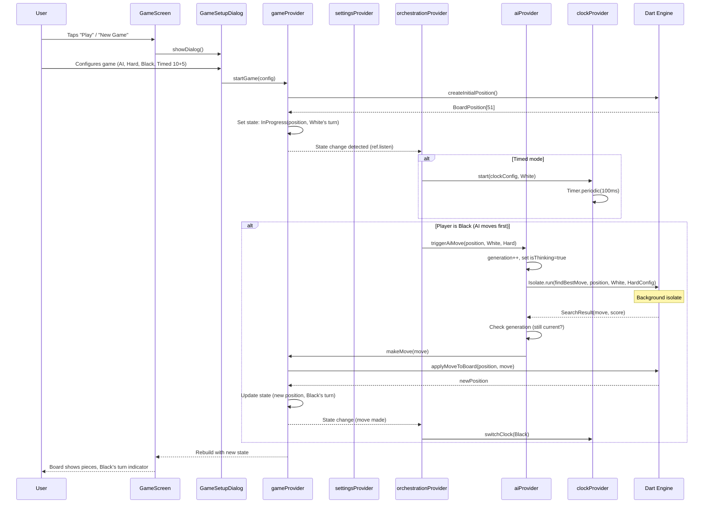

### 7.2 Expert AI Move Flow

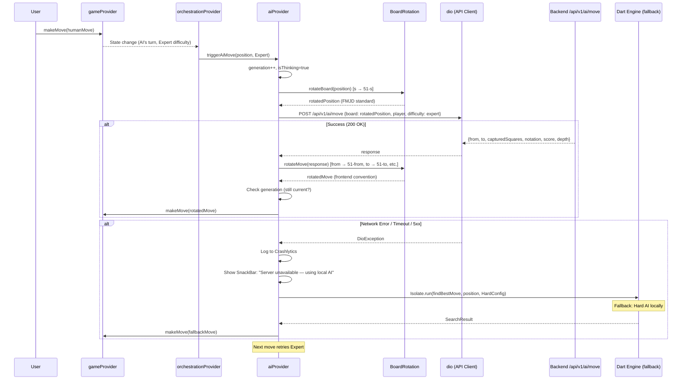

### 7.3 Auth Flow (Login → Token Storage → Authenticated Request → Token Refresh)

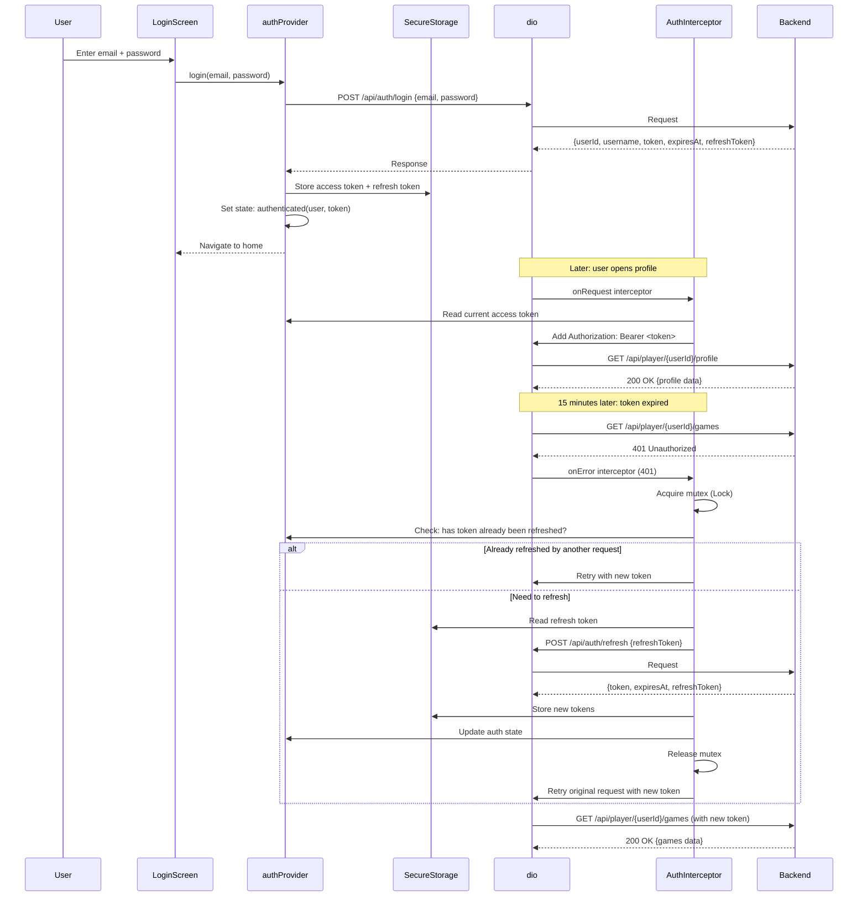

### 7.4 Game Persistence Flow

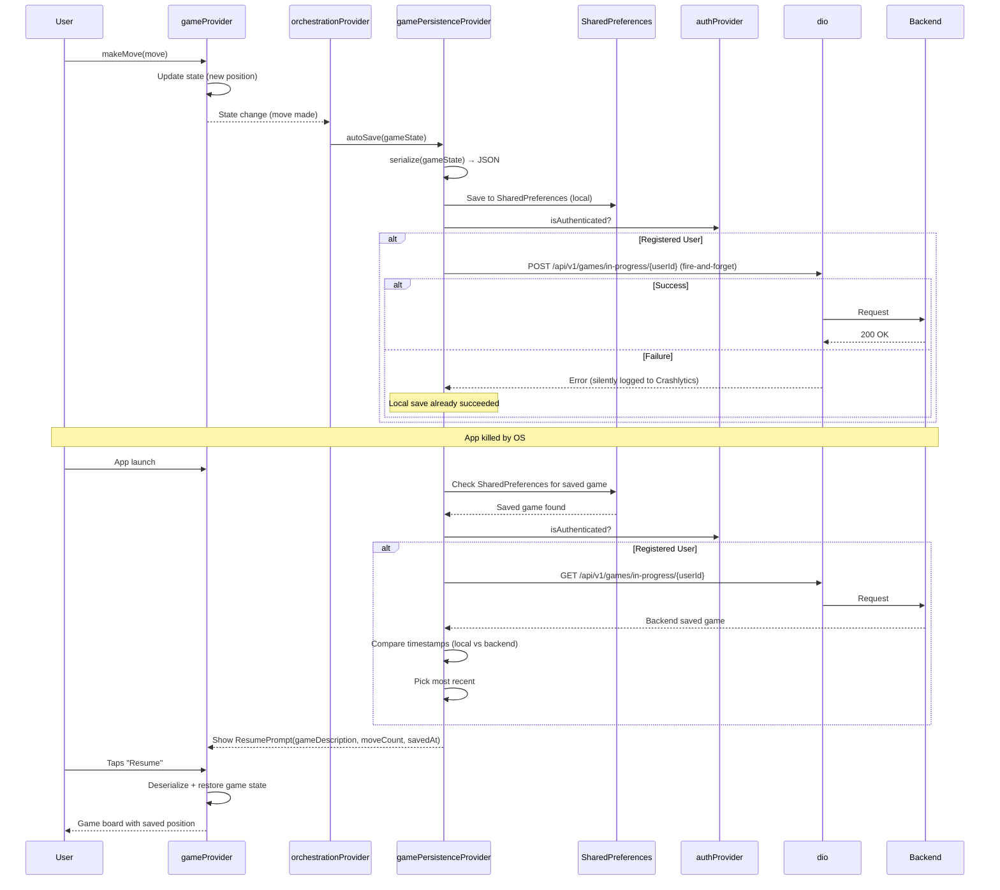

---

## 8. Testing Plan

### 8.1 Unit Test Plan (Engine + Providers + Models)

| Test Target | Test Count | Coverage Target | Key Scenarios |
|-------------|-----------|-----------------|---------------|
| **Dart Engine — types** | ~15 | ≥85% | Piece creation, board coordinate conversion, move sealed class matching |
| **Dart Engine — topology** | ~20 | ≥85% | Adjacency for all 50 squares, diagonal rays for corners and edges |
| **Dart Engine — move generator** | ~60 | ≥85% | Initial position moves, mandatory capture, max capture rule, flying king moves, promotion rules, no-moves game over |
| **Dart Engine — board utils** | ~10 | ≥85% | Apply move, apply capture, promotion on application |
| **Dart Engine — AI search** | ~20 | ≥85% | findBestMove returns legal move, depth limits respected, difficulty configs applied, TT lookups, killer move ordering |
| **Dart Engine — evaluation** | ~15 | ≥85% | Initial position = 0, material advantage positive, king value > man, edge cases |
| **Dart Engine — clock** | ~20 | ≥85% | Create, start, tick, switch, pause, resume, time expiry, all 6 presets |
| **Dart Engine — Glicko-2** | ~15 | ≥85% | Rating update, win/loss/draw, volatility convergence, AI ratings |
| **Dart Engine — zobrist** | ~5 | ≥85% | Hash uniqueness, hash update correctness |
| **Cross-validation** | 10,000+ | N/A | Move generation parity, eval parity (ε < 0.001), best move parity |
| **gameProvider** | ~20 | ≥80% | Phase transitions, illegal transitions rejected, move execution, undo/redo, resign, draw |
| **clockProvider** | ~10 | ≥80% | Tick, switch, pause, resume, time expiry, lifecycle handling |
| **aiProvider** | ~10 | ≥80% | Trigger, cancel (generation counter), error handling, Expert fallback |
| **gamePersistenceProvider** | ~8 | ≥80% | Save guest, save user, load, resume, clear on game over |
| **learningModeProvider** | ~8 | ≥80% | Step navigation, hint, feedback, progress persistence |
| **settingsProvider** | ~6 | ≥80% | Theme change, toggle notation, persist, backend sync |
| **authProvider** | ~10 | ≥80% | Login, register, logout, refresh, stored auth load, error handling |
| **orchestrationProvider** | ~8 | ≥80% | AI triggered on move, clock switched, auto-save fired, game over cleanup |
| **BoardRotation** | ~50 | 100% | All 50 squares round-trip, capture moves, initial position rotation, edge squares |
| **Models** | ~10 | ≥80% | GameConfig serialization, MoveRecord, GamePhase sealed class |
| **Total** | **~320+** | | |

### 8.2 Widget Test Plan (Per Screen/Component)

| Widget | Test Count | Key Scenarios |
|--------|-----------|---------------|
| BoardWidget | ~15 | Renders 50 dark squares, themes apply correctly, orientation flip, notation toggle, responsive sizing |
| PieceWidget | ~6 | Man/King × White/Black renders correctly, drag opacity |
| GameControls | ~10 | Buttons visible/hidden per phase, tap triggers action, disabled states |
| GameStatus | ~6 | Turn indicator color, status text, move count, accessibility |
| MoveHistory | ~6 | Renders paired moves, current move highlighted, auto-scroll |
| GameSetupDialog | ~12 | Opens with saved config, all selectors work, Quick Start, dismiss |
| ChessClock | ~8 | Active clock styled, low-time warning, tenths below 10s |
| PauseOverlay | ~4 | Board hidden, resume button works, accessibility |
| VictoryAnimation | ~4 | Plays on game over, dismissible, no leaks |
| LoginScreen | ~8 | Form validation, loading state, error display, submit |
| RegisterScreen | ~8 | Form validation, loading state, error display, submit |
| ProfileScreen | ~8 | Data loads, avatar change, name edit, error state |
| StatsOverview | ~4 | Cards render, win rate bar proportions |
| RatingChart | ~4 | Renders line, confidence band, empty state |
| GameHistory | ~6 | Pagination, filters, tap-to-replay |
| ReplayViewer | ~6 | Controls work, move list click, jump-to-move |
| SettingsPanel | ~6 | Theme change, toggles, persist |
| HomeScreen | ~6 | Navigation links work, layout correct |
| LearnScreen | ~8 | Step renders, goal validation, hint, feedback, navigation |
| TutorialScreen | ~6 | All steps render, navigation works |
| OfflineBanner | ~3 | Shows when offline, hides when online |
| ResumePrompt | ~4 | Displays game info, resume/discard both work |
| MoveFeedback | ~3 | Shows good/neutral/bad, auto-dismiss 3s |
| **Total** | **~170+** | |

**Golden Tests (subset of widget tests):**

| Golden | Count | Description |
|--------|-------|-------------|
| Board themes (4 themes × 2 orientations × 2 modes) | 16 | Board rendering at each theme/orientation/mode combination |
| Piece types (Man/King × White/Black) | 4 | Piece rendering |
| Clock states (active, inactive, low-time) | 3 | Clock widget |
| Game setup dialog | 2 | Dialog in default and configured states |
| Profile (light + dark) | 2 | Profile screen |
| **Total** | **~27+** | Additional goldens added as needed up to ~50 |

### 8.3 Integration Test Plan (Full Game Flow)

| Test ID | Scenario | Steps | Pass Criteria |
|---------|----------|-------|---------------|
| INT-01 | **Full game vs AI** | Start Easy AI game → make 3 moves → verify AI responds → play to checkmate (use depth 1 for speed) | Game reaches completion; all moves legal |
| INT-02 | **Login → Profile** | Login with test account → navigate to profile → verify stats load → change avatar → verify persisted | Profile data correct; avatar change saved |
| INT-03 | **Learning mode** | Open learn → complete steps 1-3 → verify hint → verify feedback → navigate back | Steps complete; progress saved |
| INT-04 | **Replay viewer** | Login → profile → game history → tap game → forward through moves → jump to move 5 | Moves replay correctly; jump works |
| INT-05 | **Resume after kill** | Start game → make 2 moves → background app → force-kill → relaunch → resume prompt | Resume prompt shows; game state correct |
| INT-06 | **Expert AI fallback** | Start Expert game → enable airplane mode → trigger AI move → verify Hard fallback + SnackBar | SnackBar shown; Hard move computed |
| INT-07 | **Clock expiry** | Start timed game (1+0) → make moves → let clock run out | Game ends with correct time-out result |
| INT-08 | **Settings** | Change theme → change notation → change speed → verify all applied | All settings reflect immediately |
| INT-09 | **Offline client AI** | Disable network → start Easy game → make 5 moves | Game fully playable offline |
| INT-10 | **Guest persistence** | Start game (not logged in) → make 3 moves → restart app → resume | Resume prompt; correct position |
| INT-11 | **Drag-and-drop** | Start game → drag piece to valid square → verify move | Move executes via drag |
| INT-12 | **Setup dialog config** | Open setup → select Hard → Black → Timed 10+5 → start → verify | Config applied correctly |
| INT-13 | **Undo vs AI** | Start AI game → make move → AI responds → undo → verify 2 moves undone | Board back 2 moves; AI cancelled |
| INT-14 | **Resign with confirmation** | Start game → resign → confirm → verify game over | Game over with correct result |
| INT-15+ | ... (45+ total) | Additional: draw offer, redo, multi-capture, promotion, theme switch mid-game | Comprehensive coverage |

### 8.4 Golden Test Plan (Visual Regression)

- **Environment:** Linux baseline runner/image, pinned Flutter version (e.g., 3.22.x)
- **Regeneration:** Manual `flutter test --update-goldens` when themes or renderers change
- **Storage:** Committed to repository in `test/goldens/`
- **CI:** Linux test job runs golden comparisons; fails on any pixel difference (within threshold)
- **Dark mode variants:** Light + dark for all board themes = 16 board goldens
- **Target:** 40–50 golden images total

### 8.5 Cross-Validation Plan (Dart Engine vs TypeScript Engine)

| Stage | Method | Count | Tolerance | Pass Criteria |
|-------|--------|-------|-----------|---------------|
| **Legal move generation** | Compare `generateLegalMoves()` output sets (order-independent) | 10,000 positions | Exact match | Zero discrepancies |
| **Evaluation function** | Compare `evaluate(position, player)` scores | 10,000 positions | ε < 0.001 | All within tolerance |
| **Best move search** | Compare `findBestMove()` at depth 4 | 10,000 positions | Same move OR same score (ε < 0.001) | ≥99% agreement |
| **Position generation** | Simulate 1,000 random games (legal moves only), sample 10 positions each | 1,000 games | N/A | All positions are legal |
| **Adversarial cases** | Positions targeting: max capture ambiguity, flying king edge, draw rules, promotion at back row | 100 hand-crafted | Exact match | Zero discrepancies |
| **Performance parity** | `findBestMove()` at depth 8 from initial position | 10 runs | ≤ 2× TypeScript time | Median within 2× |
| **CI integration** | Run on every PR modifying `shared/draughts-engine-dart/` | Full suite | All above | All pass |

**Harness architecture:** Node.js script generates test corpus as JSON → write to `test/fixtures/cross-validation.json` → Dart test reads JSON → compares outputs → fails on mismatch.

---

## 9. Milestone Schedule

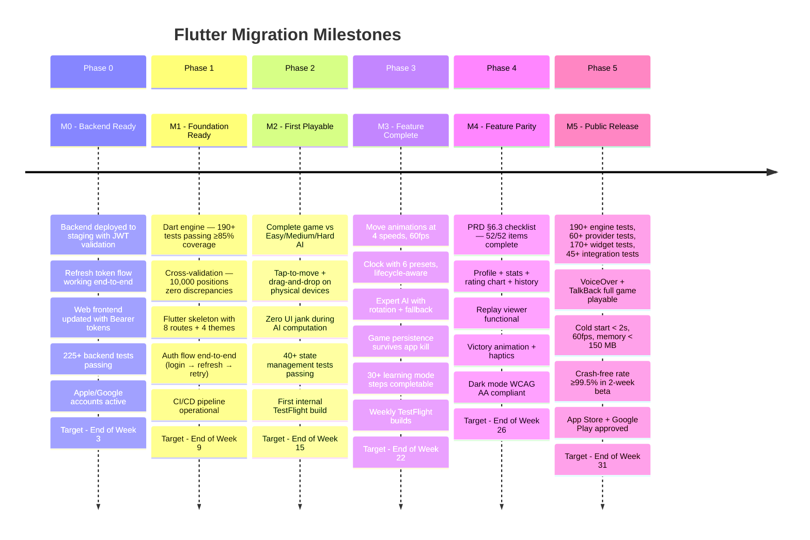

### Summary Table

| Milestone | Phase | Target Week | Key Gate |
|-----------|-------|-------------|----------|
| **M0: Backend Ready** | Phase 0 | Week 3 | 225+ backend tests pass; refresh flow works; web client updated |
| **M1: Foundation Ready** | Phase 1 | Week 9 | 190+ engine tests pass; cross-validation clean; CI operational |
| **M2: First Playable** | Phase 2 | Week 15 | Complete game vs AI; TestFlight build installed and played |
| **M3: Feature Complete** | Phase 3 | Week 22 | All gameplay features working; weekly beta builds |
| **M4: Feature Parity** | Phase 4 | Week 26 | 52/52 parity checklist items; all screens implemented |
| **M5: Public Release** | Phase 5 | Week 31 | All tests pass; beta clean; app stores approved |

### Timeline Range

| Scenario | Total Duration | Notes |
|----------|---------------|-------|
| **Optimistic** | 26 weeks (6.5 months) | No major risks materialize; Phase 3 stays at 6 weeks |
| **Expected** | 30 weeks (7.5 months) | Animation rewrite +2 weeks; 1 App Store rejection cycle |
| **Conservative** | 34 weeks (8.5 months) | Multiple risk materializations; extended beta |

### Error Handling Matrix (from Architecture Review)

| Error Source | Error Type | User-Facing Behavior | State Recovery |
|-------------|-----------|---------------------|----------------|
| AI Isolate | Exception | "AI error, trying again..." + auto-retry once | Fresh TT, retry |
| AI Isolate | Stale generation | Silent discard | No action |
| Expert AI API | Network timeout | SnackBar + fallback to Hard (this move only) | Automatic |
| Expert AI API | 500 Server Error | SnackBar + fallback to Hard (this move only) | Automatic |
| Expert AI API | Invalid move returned | Log to Crashlytics + fallback to Hard | Automatic |
| Game persistence | Network error | Silent (fire-and-forget) | Local save succeeds |
| Game persistence | Backend 500 | Silent + log to Crashlytics | Local save succeeds |
| Auth refresh | 401 (token revoked) | "Session expired" dialog → login screen | Save game locally before logout |
| Auth refresh | Network error | Retry 3× with backoff, then dialog | Keep current token if not expired |
| Secure storage | Read/write exception | Force re-login (don't crash) | Clear corrupted state |
| App-config check | Network error | Proceed normally (graceful degradation) | No action |
| App-config check | Force update required | Blocking screen with store link | No bypass |

---

*This implementation plan is the authoritative reference for the Flutter migration. All tasks are actionable, all acceptance criteria are testable, and all blocking issues from the DevLead review have been resolved. The plan drives the actual implementation.*
