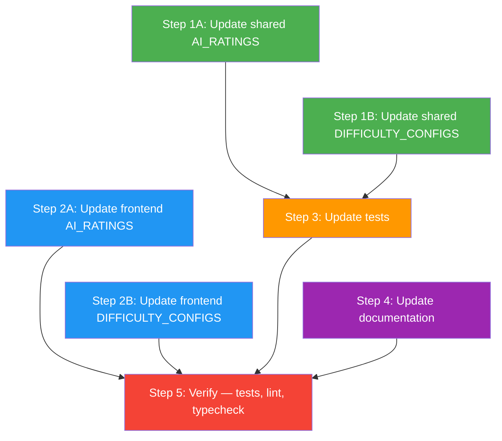

# AI Difficulty Recalibration — Implementation Plan

> **Goal:** Recalibrate AI difficulty levels to use uniform 500-Elo bands (250 / 750 / 1250 / 2200) and adjust difficulty configs so each level plays at its target rating.

---

## Task Dependency Graph



**Legend:** Steps 1A/1B/2A/2B are all independent and can be executed in parallel. Step 3 depends on Step 1 (tests import from shared engine). Step 4 is independent. Step 5 runs after everything.

---

## Step 1: Update Shared Engine Source Files

Steps 1A and 1B can be done in parallel.

### Task 1A — Update `AI_RATINGS` in shared engine

**File:** `shared/draughts-engine/src/rating/glicko2.ts` (lines 47–51)

Replace the `AI_RATINGS` values:

| Difficulty | Old Rating | New Rating |
|-----------|-----------|-----------|
| easy      | 800       | **250**   |
| medium    | 1200      | **750**   |
| hard      | 1800      | **1250**  |
| expert    | 2200      | 2200 *(unchanged)* |

**Before:**
```typescript
export const AI_RATINGS: Record<string, { rating: number; rd: number }> = {
  easy: { rating: 800, rd: 0 },
  medium: { rating: 1200, rd: 0 },
  hard: { rating: 1800, rd: 0 },
  expert: { rating: 2200, rd: 0 },
};
```

**After:**
```typescript
export const AI_RATINGS: Record<string, { rating: number; rd: number }> = {
  easy: { rating: 250, rd: 0 },
  medium: { rating: 750, rd: 0 },
  hard: { rating: 1250, rd: 0 },
  expert: { rating: 2200, rd: 0 },
};
```

### Task 1B — Update `DIFFICULTY_CONFIGS` in shared engine

**File:** `shared/draughts-engine/src/ai/difficulty.ts` (lines 19–44)

| Parameter           | Easy old → new    | Medium old → new  | Hard old → new    |
|--------------------|-------------------|-------------------|-------------------|
| maxDepth           | 2 → **1**         | 5 → **3**         | 8 → **5**         |
| timeLimitMs        | *(unchanged)*     | *(unchanged)*     | *(unchanged)*     |
| noiseAmplitude     | 150 → **300**     | 50 → **120**      | 0 → **30**        |
| blunderProbability | 0.35 → **0.50**   | 0.10 → **0.20**   | 0 → **0.05**      |
| blunderMargin      | 200 → **350**     | 100 → **200**     | 0 → **75**        |

**After:**
```typescript
export const DIFFICULTY_CONFIGS: Record<string, DifficultyConfig> = {
  easy: {
    name: 'Easy',
    maxDepth: 1,
    timeLimitMs: 1000,
    noiseAmplitude: 300,
    blunderProbability: 0.50,
    blunderMargin: 350,
  },
  medium: {
    name: 'Medium',
    maxDepth: 3,
    timeLimitMs: 1500,
    noiseAmplitude: 120,
    blunderProbability: 0.20,
    blunderMargin: 200,
  },
  hard: {
    name: 'Hard',
    maxDepth: 5,
    timeLimitMs: 2000,
    noiseAmplitude: 30,
    blunderProbability: 0.05,
    blunderMargin: 75,
  },
};
```

---

## Step 2: Update Frontend Copies

Steps 2A and 2B can be done in parallel (and in parallel with Step 1).

### Task 2A — Update `AI_RATINGS` in frontend

**File:** `frontend/src/lib/engine/rating/glicko2.ts` (lines 44–49)

Identical change to Task 1A — update `easy: 800→250`, `medium: 1200→750`, `hard: 1800→1250`, expert unchanged.

### Task 2B — Update `DIFFICULTY_CONFIGS` in frontend

**File:** `frontend/src/lib/engine/ai/difficulty.ts` (lines 19–52)

Identical changes to Task 1B for easy/medium/hard blocks. The `expert` block (lines 44–51) remains unchanged.

---

## Step 3: Update Tests

Depends on Step 1 being complete (test assertions must match new source values).

### Task 3A — Update Glicko-2 test assertions

**File:** `shared/draughts-engine/tests/glicko2.test.ts` (lines 167–170)

Three assertions in the `'has all AI difficulties configured'` test:

| Line | Old Assertion | New Assertion |
|------|--------------|--------------|
| 167  | `expect(AI_RATINGS.medium!.rating).toBe(1200)` | `expect(AI_RATINGS.medium!.rating).toBe(750)` |
| 168  | `expect(AI_RATINGS.hard!.rating).toBe(1800)` | `expect(AI_RATINGS.hard!.rating).toBe(1250)` |
| 170  | `expect(AI_RATINGS.easy!.rating).toBe(800)` | `expect(AI_RATINGS.easy!.rating).toBe(250)` |

### Task 3B — Update AI test assertions

**File:** `shared/draughts-engine/tests/ai.test.ts` (lines 115–117)

Two assertions in the `'hard has high depth and no blunders'` test:

| Line | Old Assertion | New Assertion |
|------|--------------|--------------|
| 116  | `expect(hard.maxDepth).toBeGreaterThanOrEqual(6)` | `expect(hard.maxDepth).toBeGreaterThanOrEqual(5)` |
| 117  | `expect(hard.blunderProbability).toBe(0)` | `expect(hard.blunderProbability).toBeLessThan(0.1)` |

---

## Step 4: Update Documentation

Can be done in parallel with Step 3.

### Task 4A — Update AI engine docs

**File:** `docs/ai-engine.md` (lines 6–10)

Update the difficulty levels table:

**Before:**
```markdown
| **Easy** | Client | 2 ply | 1s | 35% | Beginners |
| **Medium** | Client | 5 ply | 1.5s | 10% | Casual players |
| **Hard** | Client | 8 ply | 2s | 0% | Experienced players |
```

**After:**
```markdown
| **Easy** | Client | 1 ply | 1s | 50% | Beginners |
| **Medium** | Client | 3 ply | 1.5s | 20% | Casual players |
| **Hard** | Client | 5 ply | 2s | 5% | Experienced players |
```

Also update the "Difficulty Tuning" section (line 33):
```markdown
- **Evaluation noise**: Random value added to scores (±300cp for Easy, ±120cp for Medium)
```

---

## Step 5: Verification

Depends on all preceding steps.

### 5.1 — Type-check shared engine
```bash
cd shared/draughts-engine && npx tsc --noEmit
```
**Expected:** 0 errors.

### 5.2 — Lint shared engine
```bash
cd shared/draughts-engine && npx eslint .
```
**Expected:** 0 errors, 0 warnings.

### 5.3 — Run shared engine tests
```bash
cd shared/draughts-engine && npx vitest run
```
**Expected:** All 190 tests pass.

### 5.4 — Type-check frontend
```bash
cd frontend && npx tsc --noEmit
```
**Expected:** 0 errors.

### 5.5 — Lint frontend
```bash
cd frontend && npx eslint . --max-warnings 0
```
**Expected:** 0 errors, 0 warnings.

### 5.6 — Run frontend tests
```bash
cd frontend && npx vitest run
```
**Expected:** All 162 tests pass.

### 5.7 — Check for errors in modified files
Review compile/lint diagnostics for all 7 modified files.

---

## File Change Summary

| # | File | Type | Change |
|---|------|------|--------|
| 1 | `shared/draughts-engine/src/rating/glicko2.ts` | Source | AI_RATINGS: 800→250, 1200→750, 1800→1250 |
| 2 | `shared/draughts-engine/src/ai/difficulty.ts` | Source | DIFFICULTY_CONFIGS: depth, noise, blunder params |
| 3 | `frontend/src/lib/engine/rating/glicko2.ts` | Source | AI_RATINGS: identical to #1 |
| 4 | `frontend/src/lib/engine/ai/difficulty.ts` | Source | DIFFICULTY_CONFIGS: identical to #2 (expert block untouched) |
| 5 | `shared/draughts-engine/tests/glicko2.test.ts` | Test | 3 assertion values updated |
| 6 | `shared/draughts-engine/tests/ai.test.ts` | Test | 2 assertion values/matchers updated |
| 7 | `docs/ai-engine.md` | Docs | Difficulty table + tuning section updated |

**Total: 7 files modified, 0 files created.**

---

## Estimated Effort

| Step | Tasks | Estimated Time |
|------|-------|---------------|
| Step 1 | 2 source file edits | 2 min |
| Step 2 | 2 source file edits | 2 min |
| Step 3 | 2 test file edits | 2 min |
| Step 4 | 1 doc file edit | 1 min |
| Step 5 | 6 verification commands | 5 min |
| **Total** | | **~12 min** |

---

## Risk Assessment

| Risk | Mitigation |
|------|-----------|
| Frontend copy diverges from shared engine | Tasks 2A/2B mirror 1A/1B exactly; verify with diff |
| Test assertions miss edge cases | Steps 5.3/5.6 run full suites catching any missed updates |
| Other tests depend on old values | Full test run in Step 5 catches transitive failures |
| Doc table formatting broken | Visual inspection after edit |
