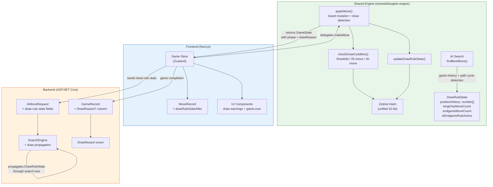
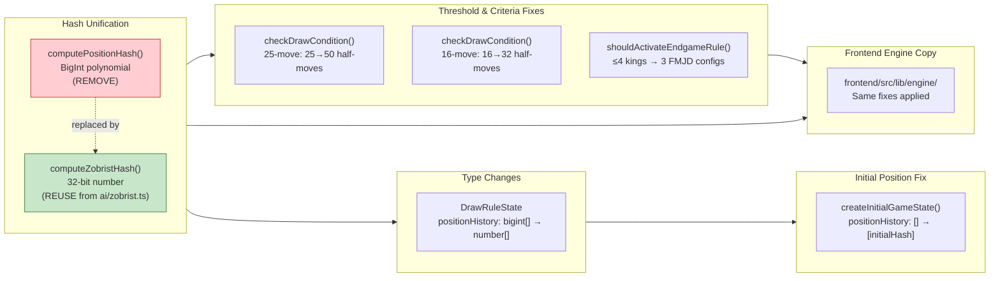
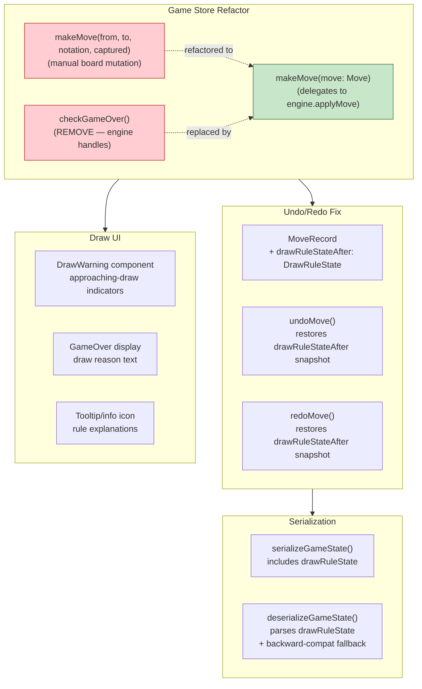
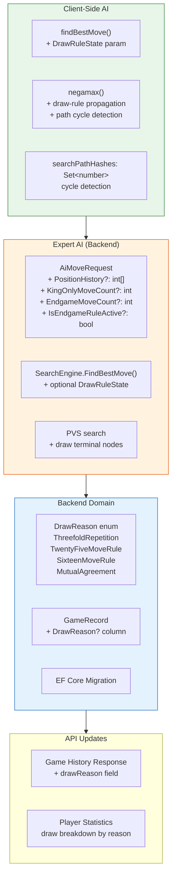
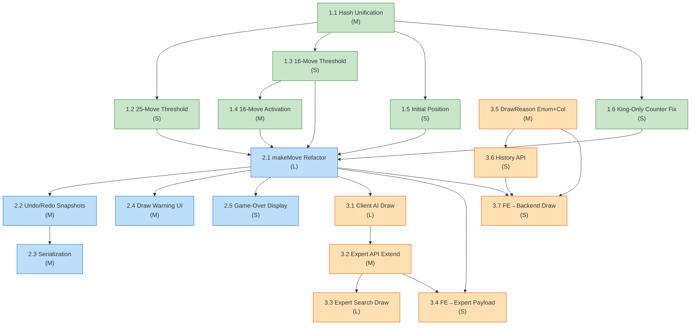

# Draw Rules Implementation Plan — FMJD Compliance

**Feature:** `draw-rules-compliance`  
**ADR:** `ADR-007`  
**Created:** 2026-02-17  
**Status:** Planned  

---

## 1. System Overview — L0 Data Flow

---

## 2. Component Breakdown — L1 Diagrams

### Phase 1: Engine Correctness

### Phase 2: Frontend Integration

### Phase 3: AI & Backend

---

## 3. Phased Implementation Plan

### Phase 1: Engine Correctness
> **Goal:** Fix all draw-rule logic in the shared engine so that the engine, when called correctly, produces FMJD-compliant outcomes. No frontend or AI changes yet.

### Phase 2: Frontend Integration
> **Goal:** Wire the corrected engine into the frontend game loop. Draws actually fire in the UI. Undo/redo preserves draw state. UI communicates draw proximity and reasons.

### Phase 3: AI & Backend
> **Goal:** Give both client-side and server-side AI draw awareness. Persist draw reasons in the backend. Complete FMJD compliance across all layers.

---

## 4. Detailed Task Breakdown

### Phase 1: Engine Correctness

#### Task 1.1 — Unify Position Hashing to 32-bit Zobrist

| Field | Detail |
|-------|--------|
| **Description** | Remove the `computePositionHash()` BigInt polynomial hash from `game-engine.ts`. Replace all usages with `computeZobristHash()` from `ai/zobrist.ts`. Update `DrawRuleState.positionHistory` type from `readonly bigint[]` to `readonly number[]`. Re-export `computeZobristHash` from the engine barrel. |
| **Files affected** | `shared/draughts-engine/src/engine/game-engine.ts` (remove `computePositionHash`, update `checkDrawCondition` and `updateDrawRuleState` to call `computeZobristHash`), `shared/draughts-engine/src/types/game-state.ts` (change `positionHistory` type), `shared/draughts-engine/src/engine/index.ts` (re-export), `frontend/src/lib/engine/engine/game-engine.ts` (same changes), `frontend/src/lib/engine/types/game-state.ts` (same type change) |
| **Complexity** | **M** |
| **Dependencies** | None (first task) |
| **Acceptance criteria** | AC-07 hash consistency: `computeZobristHash` produces the same hash for identical positions; `BigInt` is no longer referenced in `DrawRuleState`; `JSON.stringify(drawRuleState)` works without custom serializer; all existing engine tests pass with the new hash function. |
| **Test requirements** | Update existing hash tests. Add test: identical boards → same Zobrist hash. Add test: different boards → different hash (probabilistic). Add test: `JSON.stringify(createInitialGameState())` does not throw. Verify all `game-engine.test.ts` tests pass. ≥85% coverage on modified files. |

---

#### Task 1.2 — Fix 25-Move Rule Threshold (25→50 Half-Moves)

| Field | Detail |
|-------|--------|
| **Description** | In `checkDrawCondition()`, change the 25-move rule threshold from `>= 25` to `>= 50`. The counter already counts half-moves; only the comparison constant is wrong. |
| **Files affected** | `shared/draughts-engine/src/engine/game-engine.ts` (line ~146: `drawRuleState.kingOnlyMoveCount >= 25` → `>= 50`), `frontend/src/lib/engine/engine/game-engine.ts` (same fix) |
| **Complexity** | **S** |
| **Dependencies** | Task 1.1 (hash unification must be done first so tests use consistent hashing) |
| **Acceptance criteria** | AC-06: at 49 half-moves, game remains in progress. AC-07: at 50 half-moves, draw declared with reason `TwentyFiveMoveRule`. AC-08: capture at half-move 45 resets counter, 50 new half-moves required. AC-09: counter does not increment when a man is on the board. AC-10: counter starts from 0 when men are eliminated. |
| **Test requirements** | Update existing tests that assert draw at 25. Add test for 49 half-moves (no draw). Add test for 50 half-moves (draw). Add capture-reset test at counter 45. ≥85% coverage. |

---

#### Task 1.3 — Fix 16-Move Rule Threshold (16→32 Half-Moves)

| Field | Detail |
|-------|--------|
| **Description** | In `checkDrawCondition()`, change the 16-move rule threshold from `>= 16` to `>= 32`. |
| **Files affected** | `shared/draughts-engine/src/engine/game-engine.ts` (line ~153: `drawRuleState.endgameMoveCount >= 16` → `>= 32`), `frontend/src/lib/engine/engine/game-engine.ts` (same fix) |
| **Complexity** | **S** |
| **Dependencies** | Task 1.1 |
| **Acceptance criteria** | AC-16: at 31 half-moves, game remains in progress. AC-17: at 32 half-moves, draw declared with reason `SixteenMoveRule`. |
| **Test requirements** | Update existing tests that assert draw at 16. Add test for 31 half-moves (no draw). Add test for 32 half-moves (draw). ≥85% coverage. |

---

#### Task 1.4 — Fix 16-Move Rule Activation Criteria (FMJD Configurations)

| Field | Detail |
|-------|--------|
| **Description** | Replace `shouldActivateEndgameRule()` which currently activates on "≤4 pieces, all kings" with the correct FMJD criteria: activates **only** when the material exactly matches one of three configurations (or their symmetric equivalents): (1) 3 kings vs. 1 king, (2) 2 kings + 1 man vs. 1 king, (3) 1 king + 2 men vs. 1 king. |
| **Files affected** | `shared/draughts-engine/src/engine/game-engine.ts` (rewrite `shouldActivateEndgameRule()`), `frontend/src/lib/engine/engine/game-engine.ts` (same rewrite) |
| **Complexity** | **M** |
| **Dependencies** | Task 1.3 (threshold fix should precede criteria fix for clean testing) |
| **Acceptance criteria** | AC-11: 3K-vs-1K activates the rule. AC-12: 2K+1M-vs-1K activates. AC-13: 1K+2M-vs-1K activates. AC-14: 2K-vs-2K does NOT activate. AC-15: 4K-vs-1K does NOT activate. AC-18: capture changing 3K-vs-1K to 2K-vs-1K (non-qualifying) deactivates and resets counter. AC-19: symmetry — rule applies regardless of which colour has the advantage. EC-12: 2K-vs-1K does NOT activate. |
| **Test requirements** | Test each of the 3 qualifying configurations (both colour orientations = 6 tests). Test at least 3 non-qualifying configurations (2K-vs-2K, 4K-vs-1K, 2K-vs-1K). Test transition from qualifying to non-qualifying (counter reset). Test transition from qualifying to different qualifying (counter reset per FR-DRAW-03.7). ≥85% coverage. |

---

#### Task 1.5 — Add Initial Position to Repetition History

| Field | Detail |
|-------|--------|
| **Description** | In `createInitialGameState()`, compute the Zobrist hash of the initial board position (with White to move) and include it in `positionHistory` instead of starting with an empty array. |
| **Files affected** | `shared/draughts-engine/src/types/game-state.ts` (update `createInitialGameState()` — needs import of `computeZobristHash`; OR move the initial-hash logic into `game-engine.ts` and export a `createInitialGameStateWithHash()` function to avoid circular deps), `frontend/src/lib/engine/types/game-state.ts` (same) |
| **Complexity** | **S** |
| **Dependencies** | Task 1.1 (needs Zobrist hash, not BigInt) |
| **Acceptance criteria** | AC-01: initial position is present in position history before any moves. AC-03: threefold repetition correctly counts the initial position as one occurrence. EC-01: early threefold repetition (e.g., move 4 back-and-forth) is detected. |
| **Test requirements** | Test that `createInitialGameState().drawRuleState.positionHistory.length === 1`. Test that the hash in position history matches `computeZobristHash(initialBoard, White)`. Test threefold repetition scenario starting from move 1 (initial + 2 returns to initial = 3 occurrences). ≥85% coverage. |

---

#### Task 1.6 — Fix `updateDrawRuleState()` King-Only Counter Logic

| Field | Detail |
|-------|--------|
| **Description** | The current `updateDrawRuleState()` resets `kingOnlyMoveCount` to 0 on man-move or capture, and increments otherwise. This is _almost_ correct but doesn't check that **both** sides have only kings on the **resulting** board. Per FR-DRAW-02.2/02.4, the counter should only increment when both sides have zero men on the board after the move. Currently, if one side still has men but the move was a king move, the counter incorrectly increments. Fix: after applying the move, check `countPieces` for both sides — if either side has men, reset counter to 0. |
| **Files affected** | `shared/draughts-engine/src/engine/game-engine.ts` (`updateDrawRuleState()`), `frontend/src/lib/engine/engine/game-engine.ts` (same) |
| **Complexity** | **S** |
| **Dependencies** | Task 1.1 |
| **Acceptance criteria** | AC-09: king-only counter does not increment when a man is on the board. The counter correctly increments only in all-kings positions. |
| **Test requirements** | Test: board with 1 remaining man, king moves → counter stays at 0. Test: board with only kings → counter increments. ≥85% coverage. |

---

### Phase 2: Frontend Integration

#### Task 2.1 — Refactor `makeMove` to Delegate to Shared Engine's `applyMove`

| Field | Detail |
|-------|--------|
| **Description** | Refactor the game store's `makeMove` method to accept an engine `Move` object (instead of `from, to, notation, capturedSquares`) and delegate board mutation, promotion, draw-rule state update, and game-outcome detection to the shared engine's `applyMove()`. Remove the manual board mutation code, the `checkGameOver()` helper, and the inline promotion logic. The store reads `newState.phase` and `newState.drawReason` from the engine's result. Update all callers of `makeMove` (`selectSquare`, `triggerAiMove`, learning mode). |
| **Files affected** | `frontend/src/stores/game-store.ts` (`makeMove` rewrite, `selectSquare` update, `checkGameOver` removal, `convertEngineMove` removal/update, `triggerAiMove` update), all test files referencing `makeMove` |
| **Complexity** | **L** |
| **Dependencies** | Tasks 1.1–1.6 (engine must be correct before frontend delegates to it) |
| **Acceptance criteria** | AC-20: PvC threefold repetition ends game automatically. AC-21: PvP 25-move rule ends game automatically. AC-22: game-over displays specific draw reason. FR-DRAW-04.1–04.5 all passing. All existing game-store tests pass with updated API. |
| **Test requirements** | Update all `makeMove` tests to use `Move` objects. Test draw detection in PvC game loop. Test draw detection in PvP game loop. Test that makeMove rejects moves when phase is not in-progress. Test learning mode move evaluation still works. ≥40% statement coverage on game-store. |

---

#### Task 2.2 — Add `DrawRuleState` to `MoveRecord` for Undo/Redo

| Field | Detail |
|-------|--------|
| **Description** | Add `drawRuleStateAfter: DrawRuleState` to the `MoveRecord` interface. In `makeMove`, store the engine's `newState.drawRuleState` in each `MoveRecord`. In `undoMove`, restore `drawRuleState` from the target move's snapshot (or initial state if undoing to before move 0). In `redoMove`, restore from the redone move's snapshot. Also restore `phase` and `gameOverReason` correctly (draw detection on redo). |
| **Files affected** | `frontend/src/stores/game-store.ts` (`MoveRecord` interface, `makeMove`, `undoMove`, `redoMove`), `frontend/src/stores/__tests__/game-store.test.ts` |
| **Complexity** | **M** |
| **Dependencies** | Task 2.1 (makeMove refactor provides drawRuleState in the flow) |
| **Acceptance criteria** | AC-33: undo 3 / redo 2 produces correct draw-rule counters. AC-34: undo of draw-causing move reverts to in-progress. AC-05: undo after threefold repetition reverts game. FR-DRAW-08.1–08.4 all passing. |
| **Test requirements** | Test undo after draw: phase reverts. Test redo to draw: phase re-enters draw. Test undo/redo counter consistency (compare to forward-play values). Test undo to initial position: drawRuleState matches initial. ≥40% statement coverage. |

---

#### Task 2.3 — Update Game State Serialization (Persistence + Backward Compat)

| Field | Detail |
|-------|--------|
| **Description** | Update `serializeGameState()` to include `drawRuleState` (positionHistory as `number[]`, counters, active flag) in the serialized output. Update `deserializeGameState()` to parse `drawRuleState` from saved data. Add backward-compatibility: if `drawRuleState` is missing or `positionHistory` contains non-number values, reconstruct by replaying `moveHistory` from the initial position using `applyMove`, or fall back to defaults (counters at 0, position history containing only the current position hash). Also update `MoveRecord` serialization to include `drawRuleStateAfter`. |
| **Files affected** | `frontend/src/stores/game-store.ts` (`serializeGameState`, `deserializeGameState`, `SerializedGameState` type in `frontend/src/lib/game-persistence.ts`), `frontend/src/lib/game-persistence.ts` |
| **Complexity** | **M** |
| **Dependencies** | Task 2.2 (drawRuleStateAfter added to MoveRecord) |
| **Acceptance criteria** | EC-11: save mid-game with active counters, resume → counters resume correctly. Backward compat: saved game without drawRuleState loads without crash. `JSON.stringify`/`JSON.parse` round-trip preserves all draw-rule state. |
| **Test requirements** | Test serialize → deserialize round-trip with active draw-rule state. Test deserialize of legacy saved game (no drawRuleState field). Test deserialize with corrupted positionHistory. ≥40% coverage. |

---

#### Task 2.4 — Draw-Approaching Warning UI Component

| Field | Detail |
|-------|--------|
| **Description** | Create a `DrawWarning` React component that displays a non-intrusive banner when a draw is approaching. Thresholds: 25-move rule shows warning at 40 half-moves (5 moves/side remaining); 16-move rule at 22 half-moves (5 moves/side remaining); threefold repetition when a position has occurred twice. The component reads draw-rule state from the game store and computes proximity. Include an info-icon tooltip explaining the relevant rule. |
| **Files affected** | New: `frontend/src/components/game/DrawWarning.tsx`. Modified: `frontend/src/app/play/page.tsx` or game board container (integrate DrawWarning). `frontend/src/stores/game-store.ts` (expose drawRuleState to UI or add a computed selector). |
| **Complexity** | **M** |
| **Dependencies** | Task 2.1 (drawRuleState must be populated in the store) |
| **Acceptance criteria** | AC-27: warning at 40 half-moves for 25-move rule. AC-28: warning when position occurred twice. AC-30: tooltip/info icon. FR-DRAW-06.2–06.5. Warning is non-blocking; gameplay continues unimpeded. |
| **Test requirements** | Unit test DrawWarning renders nothing when no threshold approaching. Test renders warning at each threshold. Test tooltip content. Test visibility in both PvC and PvP. ≥40% coverage. |

---

#### Task 2.5 — Game-Over Draw Reason Display

| Field | Detail |
|-------|--------|
| **Description** | Update the game-over / result display component to show the specific draw reason in clear language. Map engine `DrawReason` values to user-facing strings: `ThreefoldRepetition` → "Draw — the same position occurred three times", `TwentyFiveMoveRule` → "Draw — 25 moves without a capture (kings only)", `SixteenMoveRule` → "Draw — 16-move endgame limit reached", `Agreement` → "Draw by mutual agreement". Ensure visual distinction between automatic draws and mutual-agreement draws. |
| **Files affected** | `frontend/src/components/game/GameOverDialog.tsx` (or the existing game-over display component), `frontend/src/stores/game-store.ts` (ensure `gameOverReason` propagates the draw reason text) |
| **Complexity** | **S** |
| **Dependencies** | Task 2.1 (draw reasons must flow through makeMove) |
| **Acceptance criteria** | AC-22: game-over display shows specific draw reason. AC-29: automatic draw messages are distinct from "Draw by mutual agreement". FR-DRAW-06.1, FR-DRAW-06.6. |
| **Test requirements** | Test each draw reason renders the correct message. Test mutual-agreement draw shows different text. ≥40% coverage. |

---

### Phase 3: AI & Backend

#### Task 3.1 — Client-Side AI Draw-Rule State Propagation

| Field | Detail |
|-------|--------|
| **Description** | Extend `findBestMove()` to accept an optional `DrawRuleState` parameter (the current game's draw-rule state). At the search root, clone the draw-rule state. At each node in `negamax()`, incrementally update the draw-rule state (append position hash, increment/reset counters based on the move). If `checkDrawCondition()` returns a draw at any node, score that node as `0` (draw) and treat it as terminal. Add path-based cycle detection: maintain a `Set<number>` of Zobrist hashes along the current root→node path; if a child's hash is already in the set, score as `0`. |
| **Files affected** | `shared/draughts-engine/src/ai/search.ts` (`findBestMove` signature, `SearchState` interface + `drawRuleState` field + `pathHashes` field, `negamax` function, `searchRoot`), `frontend/src/lib/engine/ai/search.ts` (same), `frontend/src/stores/game-store.ts` (`triggerAiMove` — pass `drawRuleState` to `findBestMove`) |
| **Complexity** | **L** |
| **Dependencies** | Tasks 1.1–1.6 (engine correctness), Task 2.1 (frontend passes drawRuleState) |
| **Acceptance criteria** | AC-23: losing AI allows/seeks draw when threshold is 1 move away. AC-24: winning AI prefers capture to reset counter at 40 half-moves. AC-25: AI does not play past draw positions. AC-26: response times remain <2s for Easy–Hard. FR-DRAW-05.1–05.5. |
| **Test requirements** | Test AI returns draw-score (0) at a position where draw is triggered. Test AI does not loop in a 3K-vs-1K endgame. Test path cycle detection: AI avoids repeating positions in search. Performance benchmark: 100 positions, verify <2s average for Hard difficulty. ≥85% coverage on modified search functions. |

---

#### Task 3.2 — Expert AI: Extend `AiMoveRequest` with Draw-Rule State

| Field | Detail |
|-------|--------|
| **Description** | Add optional draw-rule state fields to `AiMoveRequest`: `int[]? PositionHistory`, `int? KingOnlyMoveCount`, `int? EndgameMoveCount`, `bool? IsEndgameRuleActive`. Create a C# `DrawRuleState` record in the Application layer to represent this data internally. In `AiService`, parse the optional fields from the request and construct a `DrawRuleState` if present. Pass it to `SearchEngine.FindBestMove()`. Update the API endpoint to accept the extended request. All new fields are nullable for backward compatibility. |
| **Files affected** | `backend/src/InternationalDraughts.Application/Interfaces/IAiService.cs` (`AiMoveRequest` record), new: `backend/src/InternationalDraughts.Application/ExpertAi/DrawRuleState.cs`, `backend/src/InternationalDraughts.Application/Services/AiService.cs`, `backend/src/InternationalDraughts.Application/ExpertAi/SearchEngine.cs` (`FindBestMove` signature), `backend/src/InternationalDraughts.Api/Endpoints/AiEndpoints.cs` |
| **Complexity** | **M** |
| **Dependencies** | Task 3.1 (TypeScript implementation proven first) |
| **Acceptance criteria** | Old requests without draw-rule fields still work (backward compat). New requests with draw-rule fields are parsed correctly. `SearchEngine` receives the draw-rule state. API returns 200 for both old and new payloads. |
| **Test requirements** | Test `AiMoveRequest` deserialization with and without optional fields. Test `AiService` constructs `DrawRuleState` from request. Integration test: POST with draw-rule state returns valid move. Test backward compat: POST without draw-rule state returns valid move. ≥85% coverage on modified code. |

---

#### Task 3.3 — Expert AI: Search-Tree Draw Propagation (C#)

| Field | Detail |
|-------|--------|
| **Description** | Implement draw-rule state propagation in the C# `SearchEngine`. At each node in the PVS/alpha-beta search: update counters, check `checkDrawCondition`, score draws as 0. Add path-based cycle detection with a `HashSet<uint>` of Zobrist hashes along the search path. Port the three draw-condition checks from the TypeScript engine: threefold repetition (count position hash occurrences), 25-move king-only rule (counter ≥ 50), 16-move endgame rule (counter ≥ 32, correct FMJD activation criteria). |
| **Files affected** | `backend/src/InternationalDraughts.Application/ExpertAi/SearchEngine.cs` (PVS search loop, new draw-check methods), `backend/src/InternationalDraughts.Application/ExpertAi/DrawRuleState.cs` (update methods) |
| **Complexity** | **L** |
| **Dependencies** | Task 3.2 (draw-rule state must be receivable by SearchEngine) |
| **Acceptance criteria** | AC-25 (Expert): AI does not play past draw positions. Expert AI does not loop in drawn endgames. Draw detection in C# matches TypeScript for equivalent positions. Performance: Expert AI stays within configured time limit. FR-DRAW-05.3–05.5. |
| **Test requirements** | Unit test: C# draw condition check matches TS for test positions. Test: search returns score 0 at draw-triggering position. Test: search terminates in 3K-vs-1K endgame. Performance benchmark: 50 endgame positions, verify search completes within time limit. ≥85% coverage. |

---

#### Task 3.4 — Frontend: Send Draw-Rule State to Expert AI Endpoint

| Field | Detail |
|-------|--------|
| **Description** | Update `triggerAiMove` in the game store to include draw-rule state in the Expert AI API request. Serialize `positionHistory` as `number[]`, `kingOnlyMoveCount`, `endgameMoveCount`, `isEndgameRuleActive`. Update the `requestAiMove` function in `frontend/src/lib/api-client.ts` to accept and forward these fields. |
| **Files affected** | `frontend/src/stores/game-store.ts` (`triggerAiMove` Expert branch), `frontend/src/lib/api-client.ts` (`requestAiMove` function signature and request body) |
| **Complexity** | **S** |
| **Dependencies** | Task 2.1 (drawRuleState in store), Task 3.2 (backend accepts the fields) |
| **Acceptance criteria** | Expert AI request includes draw-rule state. Fallback to Hard AI still works when Expert is unreachable. Old API backend (without draw-rule support) ignores unknown fields gracefully. |
| **Test requirements** | Test that `requestAiMove` includes draw-rule state in request body. Mock API test: verify request payload shape. ≥40% coverage. |

---

#### Task 3.5 — Backend: `DrawReason` Enum + `GameRecord` Column

| Field | Detail |
|-------|--------|
| **Description** | Create `DrawReason` enum in `InternationalDraughts.Domain/Enums/`. Add nullable `DrawReason?` property to `GameRecord`. Update `GameRecord.Complete()` to accept optional `DrawReason?` parameter. Create EF Core migration to add the column. Update `GameRecordConfiguration` for the enum column. |
| **Files affected** | New: `backend/src/InternationalDraughts.Domain/Enums/DrawReason.cs`. Modified: `backend/src/InternationalDraughts.Domain/Entities/GameRecord.cs` (new property, updated `Complete()`), `backend/src/InternationalDraughts.Infrastructure/Configurations/GameRecordConfiguration.cs` (column mapping), new EF migration file. |
| **Complexity** | **M** |
| **Dependencies** | None within Phase 3 (can be parallelized with 3.1–3.3) |
| **Acceptance criteria** | AC-31: completed draw game includes draw sub-type. AC-32: existing records with null DrawReason are valid. FR-DRAW-07.1, FR-DRAW-07.4. Schema migration runs without error on existing data. |
| **Test requirements** | Test `GameRecord.Complete()` with draw reason. Test `GameRecord.Complete()` without draw reason (backward compat). Test EF migration applies and rolls back cleanly. Test enum values match spec. ≥85% coverage on domain layer. |

---

#### Task 3.6 — Backend: Game History API — Include Draw Reason

| Field | Detail |
|-------|--------|
| **Description** | Update game history API response DTOs to include `drawReason` field (nullable string). Update the player game history endpoint and the individual game record endpoint to return the `DrawReason` value from `GameRecord`. Map the C# enum to the appropriate string representation. |
| **Files affected** | `backend/src/InternationalDraughts.Api/Endpoints/PlayerEndpoints.cs` (or game-history endpoint), `backend/src/InternationalDraughts.Application/` (DTOs/response records), API integration tests |
| **Complexity** | **S** |
| **Dependencies** | Task 3.5 (DrawReason enum and column must exist) |
| **Acceptance criteria** | AC-31: API response includes drawReason. AC-32: null drawReason for legacy records. FR-DRAW-07.2. API response shape matches spec. |
| **Test requirements** | Test API returns draw reason for draw game. Test API returns null for legacy draw game. Test API returns null for non-draw games. ≥85% coverage. |

---

#### Task 3.7 — Frontend: Persist Draw Reason to Backend on Game Completion

| Field | Detail |
|-------|--------|
| **Description** | When a game completes with a draw, include the `drawReason` in the game-completion API call to the backend. Update the game completion flow in the store to send the draw reason from `gameOverReason` or the engine's `drawReason`. Map frontend `DrawReason` enum values to backend string values. |
| **Files affected** | `frontend/src/stores/game-store.ts` (game completion flow), `frontend/src/lib/api-client.ts` (game completion API call) |
| **Complexity** | **S** |
| **Dependencies** | Task 3.5, Task 3.6 (backend must accept and store draw reason), Task 2.1 (draw reason populated in store) |
| **Acceptance criteria** | FR-DRAW-07.1: draw sub-type persisted in backend. Draw reason round-trips: frontend sends → backend stores → API returns → frontend displays in history. |
| **Test requirements** | Test game completion API includes draw reason. Test non-draw completion does not include draw reason. ≥40% coverage. |

---

## 5. Dependency Graph

### Parallelization Opportunities

| Parallel Group | Tasks | Rationale |
|----------------|-------|-----------|
| Phase 1 after 1.1 | 1.2, 1.3, 1.5, 1.6 | All depend only on 1.1; no inter-dependencies |
| Phase 2 after 2.1 | 2.4, 2.5 | UI components are independent of undo/redo work |
| Phase 3 track A | 3.1 → 3.2 → 3.3, 3.4 | AI draw awareness chain |
| Phase 3 track B | 3.5 → 3.6 → 3.7 | Backend storage chain (parallel with track A) |

---

## 6. Effort Summary

| Phase | Tasks | S | M | L | Estimated Total |
|-------|-------|---|---|---|----------------|
| Phase 1: Engine Correctness | 6 | 4 | 2 | 0 | ~3–4 days |
| Phase 2: Frontend Integration | 5 | 1 | 3 | 1 | ~5–7 days |
| Phase 3: AI & Backend | 7 | 3 | 2 | 2 | ~7–9 days |
| **Total** | **18** | **8** | **7** | **3** | **~15–20 days** |

Sizing guide: S = 2–4 hours, M = 4–8 hours, L = 1–2 days.

---

## 7. Risk Register

| ID | Risk | Likelihood | Impact | Mitigation |
|----|------|-----------|--------|------------|
| R1 | **`makeMove` refactor (Task 2.1) breaks multiple callers.** The function is called from 5+ code paths (human move, AI move, learning mode, expert AI response, redo). Changing the signature requires updating all callers and their tests simultaneously. | High | High | Decompose into steps: (1) add `applyMove` call alongside existing logic (dual-write), verify outputs match; (2) remove old logic once validated. Keep old `makeMove` signature as a wrapper initially, then migrate callers one by one and remove the wrapper. |
| R2 | **Zobrist hash collision causes false threefold repetition.** While probability is ~$4.7 \times 10^{-6}$ per game, a false draw in a competitive game would be a visible bug. | Very Low | High | Accept the risk for MVP (probability is 1 in ~200,000 games). If reported, add a full-board verification on hash match: O(50) comparison only when hash count ≥ 3, occurring at most a few times per game. |
| R3 | **AI draw propagation degrades search performance.** Cloning `DrawRuleState` at every node and maintaining a path hash set adds O(1) overhead per node, but the constant factor could be significant at high depths (Expert AI searches 15+ plies). | Medium | Medium | Profile before and after. The `DrawRuleState` clone is lightweight (4 scalars + 1 array reference for path-based updates). Use mutable state with undo at each node (push/pop) instead of cloning to minimize allocations. Benchmark: if >10% slowdown, optimize. |
| R4 | **Frontend engine copy diverges from shared engine.** The frontend has a full copy of the shared engine at `frontend/src/lib/engine/`. Every engine fix must be applied in two places. | High | Medium | Apply all Phase 1 fixes to both locations mechanically. Long-term: eliminate the frontend copy and import directly from `shared/draughts-engine` (out of scope for this feature but a recommended follow-up). |
| R5 | **Backward-compatibility failure for saved games.** Saved games in `sessionStorage`/`localStorage` may have `BigInt` values (which would have failed to serialize anyway) or may be missing `drawRuleState`. | Low | Medium | Defensive deserialization: if `drawRuleState` is missing, initialize with defaults. If `positionHistory` is invalid, reconstruct by replaying `moveHistory`. If reconstruction fails, start fresh with current position hash. Never crash on load. |
| R6 | **Expert AI C# draw logic diverges from TypeScript.** Two independent implementations of the same draw rules in different languages could produce different results for edge cases. | Medium | High | Create a shared test fixture: JSON files with board positions, draw-rule states, and expected draw results. Run the same test cases against both TypeScript and C# implementations. Include all edge cases from the FRD (EC-01 through EC-12). |
| R7 | **EF Core migration fails on production database.** Adding a nullable column with an enum type could conflict with the database provider's enum handling. | Low | Medium | Test migration on a copy of production data before deploying. Use `string` column type with enum conversion (EF Core `HasConversion`) instead of integer column, for readable data and provider compatibility. |
| R8 | **16-move rule activation criteria miss an FMJD configuration.** OQ-02 in the FRD notes that some FMJD variants include additional configurations beyond the three listed. | Low | Medium | Implement exactly the three configurations specified in the FRD. The `shouldActivateEndgameRule` function should be structured as a clean match/switch with named configurations, making it trivial to add new ones later if the PM decides to expand scope. |
| R9 | **Clock interaction with draw detection.** A clock-expiry check and a draw-condition check could race: the clock expires on the same tick that a draw condition is met. Which takes priority? | Low | Low | Per EC-07, if no-legal-moves and draw coincide, no-legal-moves wins. Apply the same principle: if clock expires on the same tick as draw, clock expiry takes priority (the player lost on time). Document this as a design decision. |
| R10 | **Test coverage regression.** The extensive refactoring across shared engine, frontend, and backend could temporarily drop coverage below thresholds. | Medium | Low | Write new tests for each task before removing old tests. Run coverage on each PR. Gate merges on coverage thresholds (≥85% shared engine, ≥40% frontend). |

---

## 8. Quality Gates

Each phase must meet these gates before the next phase begins:

### Phase 1 Gate
- [ ] All 190 shared engine tests pass (updated for new thresholds/hash)
- [ ] Zero lint errors, zero type errors in shared engine
- [ ] ≥85% coverage on all modified engine files
- [ ] Frontend engine copy has identical fixes applied
- [ ] Cross-implementation test fixture passes for all draw-rule scenarios

### Phase 2 Gate
- [ ] All 162 frontend tests pass (updated for new `makeMove` API)
- [ ] Zero lint errors, zero type errors in frontend
- [ ] ≥40% statement coverage on frontend
- [ ] Draw detection fires correctly in PvC and PvP modes (manual QA)
- [ ] Undo/redo preserves draw-rule state correctly (manual QA)
- [ ] Game persistence round-trip works with draw-rule state

### Phase 3 Gate
- [ ] All 192 backend tests pass
- [ ] Backend builds with zero errors, zero warnings
- [ ] ≥85% coverage on domain and application layers
- [ ] AI self-play test: no game exceeds 100 moves in a 3K-vs-1K endgame
- [ ] Expert AI responds correctly when draw-rule state is included in request
- [ ] Expert AI backward-compat: responds correctly when draw-rule state is omitted
- [ ] EF Core migration applies and rolls back cleanly
- [ ] Full E2E: play a game to draw → draw reason displayed → game saved → game history shows draw reason

---

## 9. File Change Summary

| File | Phase | Tasks | Change Type |
|------|-------|-------|-------------|
| `shared/draughts-engine/src/types/game-state.ts` | 1 | 1.1, 1.5 | Modify type + initial state |
| `shared/draughts-engine/src/engine/game-engine.ts` | 1 | 1.1, 1.2, 1.3, 1.4, 1.6 | Remove old hash, fix thresholds/criteria/counter |
| `shared/draughts-engine/src/ai/zobrist.ts` | 1 | 1.1 | No change (already correct; just re-export) |
| `shared/draughts-engine/src/engine/index.ts` | 1 | 1.1 | Re-export `computeZobristHash` |
| `shared/draughts-engine/src/ai/search.ts` | 3 | 3.1 | Add draw-rule propagation + cycle detection |
| `frontend/src/lib/engine/types/game-state.ts` | 1 | 1.1, 1.5 | Mirror shared engine changes |
| `frontend/src/lib/engine/engine/game-engine.ts` | 1 | 1.1, 1.2, 1.3, 1.4, 1.6 | Mirror shared engine changes |
| `frontend/src/lib/engine/ai/search.ts` | 3 | 3.1 | Mirror shared engine AI changes |
| `frontend/src/stores/game-store.ts` | 2, 3 | 2.1, 2.2, 2.3, 2.5, 3.4, 3.7 | Major refactor + serialization + AI payload |
| `frontend/src/lib/game-persistence.ts` | 2 | 2.3 | Update serialized type |
| `frontend/src/lib/api-client.ts` | 3 | 3.4, 3.7 | Extend API call payloads |
| `frontend/src/components/game/DrawWarning.tsx` | 2 | 2.4 | **New file** |
| `frontend/src/components/game/GameOverDialog.tsx` | 2 | 2.5 | Add draw reason display |
| `backend/.../Enums/DrawReason.cs` | 3 | 3.5 | **New file** |
| `backend/.../Entities/GameRecord.cs` | 3 | 3.5 | Add DrawReason property |
| `backend/.../Interfaces/IAiService.cs` | 3 | 3.2 | Extend AiMoveRequest |
| `backend/.../Services/AiService.cs` | 3 | 3.2 | Parse draw-rule state |
| `backend/.../ExpertAi/SearchEngine.cs` | 3 | 3.3 | Draw propagation in search |
| `backend/.../ExpertAi/DrawRuleState.cs` | 3 | 3.2, 3.3 | **New file** |
| `backend/.../Configurations/GameRecordConfiguration.cs` | 3 | 3.5 | Column mapping |
| `backend/.../Endpoints/PlayerEndpoints.cs` | 3 | 3.6 | Include drawReason in response |
| EF Core migration (auto-generated) | 3 | 3.5 | **New file** |
| Test files (multiple) | 1, 2, 3 | All | Update/add tests throughout |
