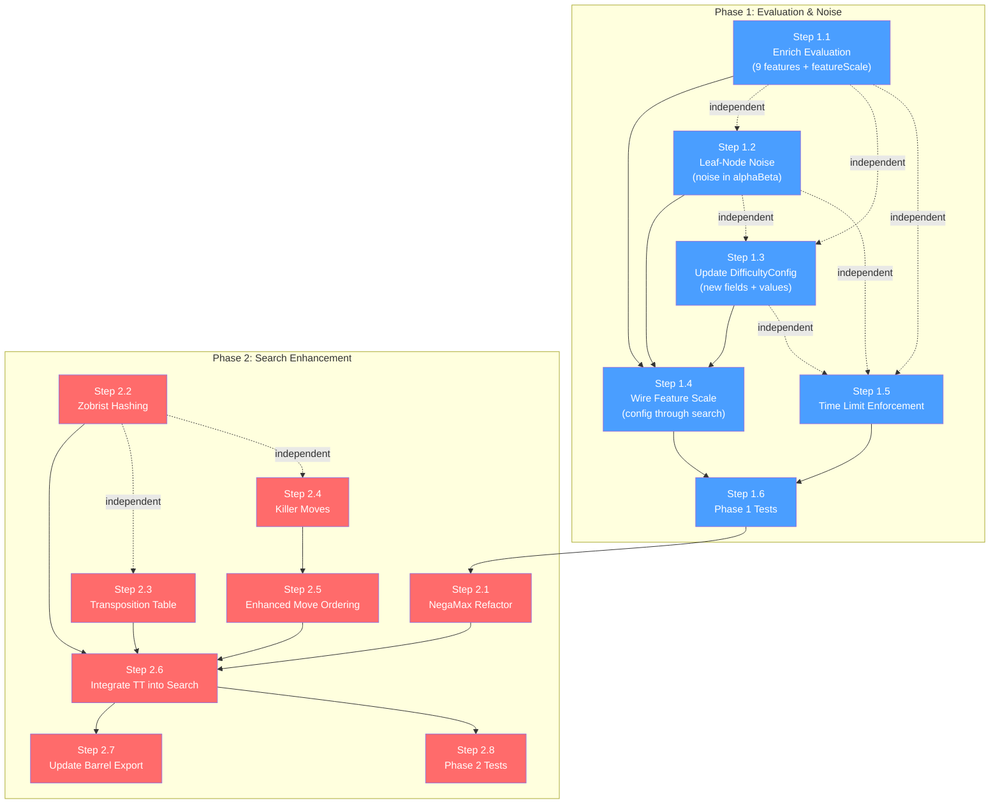

# Implementation Plan: Enhanced Client-Side AI Difficulty Scaling

**Feature:** `difficulty-scaling-v2`  
**ADR:** [ADR-006: Enhanced Client-Side AI Architecture](../adr/adr-006-enhanced-client-ai.md)  
**FRD:** [AI Difficulty Scaling v2](../features/difficulty-scaling-v2.md)  
**Created:** 2026-02-15  
**Status:** Ready for implementation

---

## Overview

This plan implements the enhanced client-side AI in two phases:

- **Phase 1 (Evaluation & Noise):** Enrich the evaluation function with 9 features ported from the C# Expert engine, redesign noise to apply at leaf nodes during search, and scale feature influence by difficulty. This delivers ~80% of the perceived improvement.
- **Phase 2 (Search Enhancement):** Refactor search to NegaMax, add Zobrist hashing, transposition table, and killer move tracking. This optimizes Hard difficulty search efficiency.

---

## Phase 1: Evaluation & Noise (High ROI — ~80% of improvement)

### Step 1.1: Enrich Evaluation Function

**Effort:** L | **Risk:** Medium  
**Files modified:** `shared/draughts-engine/src/ai/evaluation.ts`  
**Reference:** `backend/src/InternationalDraughts.Application/ExpertAi/Evaluator.cs` (lines 27–167), `backend/src/InternationalDraughts.Application/ExpertAi/EvaluationWeights.cs`

Port 9 positional evaluation features from the C# Expert `Evaluator` to the TypeScript `evaluate()` function. The current evaluation has 5 ad-hoc features (centerControl, advancement, backRow, kingCentralization) that are replaced by the Expert's feature set.

#### Features to port

| # | Feature | Weight (eu) | Source method in `Evaluator.cs` | Implementation notes |
|---|---------|-------------|--------------------------------|---------------------|
| 1 | Man mobility | 1 eu/move | `CountManMoves()` — counts forward quiet moves per man | Use `getSquareTopology()` from `topology.ts`; check forward directions for each man, count empty adjacent squares |
| 2 | King mobility | 2 eu/move | `CountKingMoves()` — counts all quiet moves per king (flying king rays) | Iterate all 4 diagonal rays from `topology.ts`; count empty squares until blocked |
| 3 | Piece structure | 4 eu/piece | `HasAdjacentFriendly()` — bonus for each piece with ≥1 adjacent friendly piece | Check all 4 diagonal adjacent squares via `getSquareTopology().adjacent` |
| 4 | First king bonus | 50 eu | Lines 44–45 — bonus when player has king(s) and opponent has none | Simple count comparison: `pKings > 0 && oKings === 0` |
| 5 | Locked position penalty | 10 eu | Lines 152–155 — penalty when a side has ≤2 moves but >2 pieces | Check accumulated mobility count against piece total |
| 6 | Runaway man bonus | 30 eu | `IsRunawayMan()` — man with clear diagonal path to promotion | Port the C# logic: check distance ≤4, verify at least one diagonal path has no enemy pieces blocking |
| 7 | Tempo diagonal | 2 eu/piece | Line 100 — bonus for pieces on main diagonals (`row === col` or `row + col === 9`) | Simple coordinate check using `squareToCoordinate()` |
| 8 | Endgame king advantage | 20 eu/king diff | Lines 157–160 — amplified king value when total pieces ≤10 | Multiply king count difference by weight when `pTotal + oTotal <= 10` |
| 9 | Left/right balance | 3 eu/imbalance | Lines 142–146 — penalty for imbalanced piece distribution across left/right halves | Track `col < 5` vs `col >= 5`; penalize `abs(left - right)` |

#### Existing features retained unchanged

The current material weights (`man = 100`, `king = 300`) and existing positional features (centerControl, advancement, backRow, kingCentralization) remain. The 9 new features are **added** to the existing evaluation — they do not replace the material or existing positional terms.

#### `featureScale` parameter

Add an optional `featureScale` parameter (default `1.0`) to `evaluate()`:

```typescript
export const evaluate = (
  board: BoardPosition,
  player: PlayerColor,
  featureScale: number = 1.0,
): number => {
  // Material — always at 100% strength
  let materialScore = (playerPieces.men - opponentPieces.men) * WEIGHTS.man;
  materialScore += (playerPieces.kings - opponentPieces.kings) * WEIGHTS.king;

  // Positional features — scaled by featureScale
  let positionalScore = 0;
  // ... compute all positional features ...
  positionalScore *= featureScale;  // 0.0 = material only, 1.0 = full

  return materialScore + Math.round(positionalScore);
};
```

- When `featureScale = 0.0`: evaluation === `quickEvaluate()` (material only).
- When `featureScale = 1.0`: full positional evaluation with all features.
- Intermediate values (e.g., `0.5` for Medium) scale all positional weights linearly.

#### New imports required

```typescript
import { getSquareTopology, ALL_DIRECTIONS, FORWARD_DIRECTIONS, PROMOTION_ROW } from '../board/topology';
import { PlayerColor } from '../types/piece';
```

#### `quickEvaluate()` — unchanged

The existing `quickEvaluate()` function remains exactly as-is for use in move ordering.

---

### Step 1.2: Redesign Noise Mechanism

**Effort:** S | **Risk:** Low  
**Files modified:** `shared/draughts-engine/src/ai/search.ts`

#### Current behavior (broken)

In `applyBlunderLogic()` (search.ts, lines 150–157), when the blunder roll fails:

```typescript
// Add noise to the score but keep the best move
return {
  ...bestResult,
  score: bestResult.score + (Math.random() - 0.5) * config.noiseAmplitude,
};
```

This only modifies the **reported** score — it never changes which move is selected. The noise is cosmetic.

#### New behavior: leaf-node noise

Modify the `alphaBeta()` function to add noise at every leaf-node evaluation (depth ≤ 0):

```typescript
// At leaf node inside alphaBeta():
if (depth <= 0) {
  let score = evaluate(board, currentPlayer, config.evalFeatureScale);
  if (config.noiseAmplitude > 0) {
    score += (Math.random() - 0.5) * 2 * config.noiseAmplitude;
  }
  return { score, nodes: 1 };
}
```

Key design points:
- Noise is drawn from a **uniform distribution** in `[-noiseAmplitude, +noiseAmplitude]`.
- Noise affects **every leaf evaluation**, so it propagates through minimax backup and genuinely changes which moves are selected at the root.
- At `noiseAmplitude = 0`, behavior is identical to no noise (used implicitly by Expert-compatible callers).
- The noise is stateless — no seed or determinism (randomness is the point).

#### Remove post-search cosmetic noise

In `applyBlunderLogic()`, remove the score noise line when the blunder roll fails. The no-blunder path should return `bestResult` unchanged:

```typescript
if (Math.random() >= config.blunderProbability) {
  return bestResult;  // No cosmetic noise — leaf noise already affected move selection
}
```

#### Injectable RNG for testing (NFR-4)

Accept an optional `randomFn` parameter for deterministic testing:

```typescript
// In search config or as parameter
randomFn?: () => number;  // defaults to Math.random
```

This allows tests to inject a fixed seed or constant function to verify noise behavior deterministically.

---

### Step 1.3: Update DifficultyConfig Interface

**Effort:** S | **Risk:** Low  
**Files modified:** `shared/draughts-engine/src/ai/difficulty.ts`

#### Interface changes

Add three new `readonly` fields to `DifficultyConfig`:

```typescript
export interface DifficultyConfig {
  /** Display name */
  readonly name: string;
  /** Maximum search depth (ply) */
  readonly maxDepth: number;
  /** Time limit per move in milliseconds */
  readonly timeLimitMs: number;
  /** Evaluation noise amplitude applied to every leaf-node evaluation (evaluation units) */
  readonly noiseAmplitude: number;
  /** Probability of making a deliberate blunder (0-1) */
  readonly blunderProbability: number;
  /** Score margin for blunder selection (evaluation units) */
  readonly blunderMargin: number;
  /** Positional evaluation feature scale (0.0 = material only, 1.0 = full) */
  readonly evalFeatureScale: number;
  /** Enable transposition table for search */
  readonly useTranspositionTable: boolean;
  /** Enable killer move tracking for search */
  readonly useKillerMoves: boolean;
}
```

#### Updated `DIFFICULTY_CONFIGS`

| Parameter | Easy (old → new) | Medium (old → new) | Hard (old → new) |
|-----------|------------------|--------------------|--------------------|
| `maxDepth` | 1 → **2** | 3 → **4** | 5 → **6** |
| `timeLimitMs` | 1000 → 1000 | 1500 → **2000** | 2000 → **3000** |
| `noiseAmplitude` | 300 → **200** | 120 → **60** | 30 → **15** |
| `blunderProbability` | 0.50 → **0.30** | 0.20 → **0.08** | 0.05 → **0.02** |
| `blunderMargin` | 350 → **250** | 200 → **120** | 75 → **50** |
| `evalFeatureScale` | — → **0.0** | — → **0.5** | — → **1.0** |
| `useTranspositionTable` | — → **false** | — → **false** | — → **true** |
| `useKillerMoves` | — → **false** | — → **false** | — → **true** |

Key rationale for changes:
- **Depth increased** (+1 each) because leaf noise + reduced eval features now provide the primary weakening — deeper search is needed to compensate.
- **Blunder probability halved** because continuous leaf noise handles most of the natural weakening.
- **Noise amplitude lowered** because it now applies at every leaf node (much more impactful than post-search).

---

### Step 1.4: Wire Feature Scale Through Search

**Effort:** M | **Risk:** Low  
**Files modified:** `shared/draughts-engine/src/ai/search.ts`

#### Changes to `findBestMove()`

Pass the full `DifficultyConfig` (or relevant params) into the search stack so that `alphaBeta()` can access `evalFeatureScale` and `noiseAmplitude` at leaf nodes.

Option A (preferred — pass config through):

```typescript
// searchRoot and alphaBeta receive the config
const searchRoot = (
  board: BoardPosition,
  player: PlayerColor,
  depth: number,
  legalMoves: readonly Move[],
  config: DifficultyConfig,
): SearchResult => { ... };

const alphaBeta = (
  board: BoardPosition,
  currentPlayer: PlayerColor,
  depth: number,
  alpha: number,
  beta: number,
  maximizingPlayer: PlayerColor,
  config: DifficultyConfig,
): { score: number; nodes: number } => { ... };
```

At the leaf node in `alphaBeta()`:

```typescript
if (depth <= 0) {
  let score = evaluate(board, maximizingPlayer, config.evalFeatureScale);
  if (config.noiseAmplitude > 0) {
    score += (Math.random() - 0.5) * 2 * config.noiseAmplitude;
  }
  return { score, nodes: 1 };
}
```

#### Evaluation call update

Change `evaluate(board, maximizingPlayer)` → `evaluate(board, maximizingPlayer, config.evalFeatureScale)` at the leaf node.

#### Note on `maximizingPlayer` vs `currentPlayer`

The current code evaluates from `maximizingPlayer`'s perspective at the leaf. This is correct for the current min-max formulation. After NegaMax refactoring (Step 2.1), this changes to `currentPlayer`.

---

### Step 1.5: Add Time Limit Enforcement

**Effort:** S | **Risk:** Low  
**Files modified:** `shared/draughts-engine/src/ai/search.ts`

The `timeLimitMs` field exists in `DifficultyConfig` but is never checked. Add a **complete-depth** time check in the iterative deepening loop:

```typescript
export const findBestMove = (
  board: BoardPosition,
  player: PlayerColor,
  config: DifficultyConfig = DIFFICULTY_CONFIGS.hard!,
): SearchResult | null => {
  // ... existing legal-move checks ...

  let bestResult: SearchResult | null = null;
  let totalNodes = 0;
  const startTime = performance.now();

  for (let depth = 1; depth <= config.maxDepth; depth++) {
    const result = searchRoot(board, player, depth, legalMoves, config);
    totalNodes += result.nodesEvaluated;
    bestResult = { ...result, depthReached: depth, nodesEvaluated: totalNodes };

    // Time check: if elapsed >= timeLimitMs, don't start next depth
    if (performance.now() - startTime >= config.timeLimitMs) break;
  }

  // ... blunder logic ...
};
```

This is a **between-depth** check, not mid-search cancellation. Per ADR-006 Decision 6, mid-search cancellation is rejected for simplicity. The primary constraint is `maxDepth`; the time limit is a safety net.

---

### Step 1.6: Update Tests for Phase 1

**Effort:** M | **Risk:** Low  
**Files modified:** `shared/draughts-engine/tests/ai.test.ts`

#### Evaluation tests — new

```
describe('Evaluation — new positional features')
  ✓ man mobility: more mobile side gets higher score
  ✓ king mobility: king with open diagonals scores higher
  ✓ piece structure: connected pieces score higher than isolated
  ✓ first king bonus: only king on board gives bonus
  ✓ locked position penalty: side with ≤2 moves and >2 pieces penalized
  ✓ runaway man: man with clear path to promotion gets bonus
  ✓ tempo diagonal: pieces on main diagonals score higher
  ✓ endgame king advantage: king diff amplified when ≤10 total pieces
  ✓ left/right balance: imbalanced distribution penalized
```

#### Feature scaling tests

```
describe('Evaluation — feature scaling')
  ✓ featureScale=0.0 equals quickEvaluate (material only)
  ✓ featureScale=1.0 gives full positional evaluation
  ✓ featureScale=0.5 gives intermediate score between 0.0 and 1.0
  ✓ featureScale does not affect material component
  ✓ featureScale does not affect win/loss detection (10000/-10000)
```

#### Leaf-node noise tests

```
describe('Search — leaf-node noise')
  ✓ noiseAmplitude=0 returns deterministic results (no noise)
  ✓ noiseAmplitude>0 produces varied move selections over multiple runs
  ✓ noise is bounded within [-amplitude, +amplitude] (inject fixed RNG)
  ✓ post-search cosmetic noise is removed (verify no score perturbation after search)
```

#### Difficulty config tests — updated

```
describe('Difficulty configs — updated')
  ✓ easy: depth 2, noise 200, blunder 0.30, margin 250, featureScale 0.0, TT false, killers false
  ✓ medium: depth 4, noise 60, blunder 0.08, margin 120, featureScale 0.5, TT false, killers false
  ✓ hard: depth 6, noise 15, blunder 0.02, margin 50, featureScale 1.0, TT true, killers true
  ✓ all configs include new fields (evalFeatureScale, useTranspositionTable, useKillerMoves)
```

#### Existing test updates

- `'equal material returns ~0'` — may need threshold adjustment (currently `< 50`) due to new positional features. Verify with featureScale=1.0 and adjust if needed. With matched piece counts on symmetric squares, positional score should still be near zero.
- `'easy has low depth and high blunder rate'` — update assertions from `maxDepth ≤ 3` to `maxDepth ≤ 3` (still passes with depth 2) and `blunderProbability > 0.2` to `blunderProbability > 0.2` (still passes with 0.30).
- `'hard has high depth and low blunders'` — update from `maxDepth ≥ 5` (still passes with 6) and `blunderProbability < 0.1` (still passes with 0.02).

---

## Phase 2: Search Enhancement (Optimization for Hard)

### Step 2.1: Refactor alphaBeta to NegaMax

**Effort:** M | **Risk:** High  
**Files modified:** `shared/draughts-engine/src/ai/search.ts`

#### Motivation

The current `alphaBeta()` uses a classic min-max formulation with `isMaximizing` branches (two separate loops duplicating logic). `searchRoot()` already uses NegaMax-style score negation (`-result.score`). This inconsistency makes TT integration incorrect — TT entries would store scores in an ambiguous frame of reference.

#### Changes

1. **Remove `maximizingPlayer` parameter** from `alphaBeta()`.
2. **Remove `isMaximizing` branching** (the two separate for-loops for max/min).
3. **Always evaluate from `currentPlayer`'s perspective** — the score returned by `alphaBeta()` is relative to the side to move.
4. **Always negate child scores**: `score = -alphaBeta(..., -beta, -alpha, ...)`.

Before (min-max, current):
```typescript
const alphaBeta = (board, currentPlayer, depth, alpha, beta, maximizingPlayer, config) => {
  if (depth <= 0) {
    return { score: evaluate(board, maximizingPlayer, config.evalFeatureScale), nodes: 1 };
  }
  const isMaximizing = currentPlayer === maximizingPlayer;
  if (isMaximizing) {
    let value = -Infinity;
    for (const move of legalMoves) { /* maximize */ }
    return { score: value, nodes };
  } else {
    let value = Infinity;
    for (const move of legalMoves) { /* minimize */ }
    return { score: value, nodes };
  }
};
```

After (NegaMax):
```typescript
const alphaBeta = (board, currentPlayer, depth, alpha, beta, config) => {
  if (depth <= 0) {
    return { score: evaluate(board, currentPlayer, config.evalFeatureScale), nodes: 1 };
  }
  // No legal moves — loss for current player
  if (legalMoves.length === 0) {
    return { score: -10000, nodes: 1 };
  }
  let bestScore = -Infinity;
  let nodes = 0;
  for (const move of legalMoves) {
    const newBoard = applyMoveToBoard(board, move);
    const result = alphaBeta(newBoard, oppositeColor(currentPlayer), depth - 1, -beta, -alpha, config);
    nodes += result.nodes;
    const score = -result.score;
    bestScore = Math.max(bestScore, score);
    alpha = Math.max(alpha, score);
    if (alpha >= beta) break;
  }
  return { score: bestScore, nodes };
};
```

#### `searchRoot()` — minimal change

`searchRoot()` already negates child scores. After NegaMax refactoring:
- Remove `maximizingPlayer` pass-through.
- `alphaBeta()` is called with `oppositeColor(player)` and negated bounds; the returned score is negated.

#### Verification

All existing search tests must produce identical move selections before and after refactoring. Run the full test suite after this step. This is a **correctness-critical** refactor — any bug here cascades into TT integration.

---

### Step 2.2: Implement Zobrist Hashing

**Effort:** M | **Risk:** Low  
**New file:** `shared/draughts-engine/src/ai/zobrist.ts`

#### Design (per ADR-006 Decision 3)

- **32-bit** hashes using JavaScript `number` type (not `BigInt`).
- Expected collision rate at 131K TT entries: ~1.5% — acceptable for game play.
- Deterministic PRNG seed for reproducible hash tables.

#### Zobrist table layout

```typescript
// 50 squares × 4 piece-types (WhiteMan, WhiteKing, BlackMan, BlackKing) = 200 entries
// + 1 side-to-move entry
const ZOBRIST_TABLE: readonly number[] = []; // 201 entries of random 32-bit ints

// Piece type indices
const PIECE_INDEX = {
  [PlayerColor.White]: { [PieceType.Man]: 0, [PieceType.King]: 1 },
  [PlayerColor.Black]: { [PieceType.Man]: 2, [PieceType.King]: 3 },
};
const SIDE_TO_MOVE_INDEX = 200;
```

#### PRNG

Use a seeded 32-bit xorshift PRNG to generate the table at module load time:

```typescript
function xorshift32(seed: number): () => number {
  let state = seed;
  return () => {
    state ^= state << 13;
    state ^= state >>> 17;
    state ^= state << 5;
    return state >>> 0; // unsigned 32-bit
  };
}
```

Seed value: any fixed constant (e.g., `0x12345678`). The specific values don't matter; only determinism and statistical quality matter.

#### API

```typescript
/** Compute full Zobrist hash for a board position and side to move */
export const computeZobristHash = (board: BoardPosition, sideToMove: PlayerColor): number;

/** Incrementally update hash when a piece moves */
export const updateHashPieceMove = (
  hash: number,
  fromSquare: number,
  toSquare: number,
  pieceType: PieceType,
  color: PlayerColor,
): number;

/** Incrementally update hash when a piece is removed (captured) */
export const updateHashPieceRemove = (hash: number, square: number, pieceType: PieceType, color: PlayerColor): number;

/** Toggle side-to-move bit */
export const updateHashSideToMove = (hash: number): number;
```

#### Performance note

For the initial implementation, use **full board hashing** (`computeZobristHash`) at each node rather than incremental hashing. Incremental hashing requires threading hash state through all move application calls, which is a larger refactor. Full hashing over 50 squares with 201 XOR lookups is fast enough (~0.5 μs on modern hardware) and sufficient for the client-side search depth budget.

---

### Step 2.3: Implement Transposition Table

**Effort:** M | **Risk:** Medium  
**New file:** `shared/draughts-engine/src/ai/transposition-table.ts`

#### Design (per ADR-006 Decision 2)

- **ArrayBuffer-based** with `DataView` access — no GC pressure.
- **4 MB** total, **131,072 entries** (2^17), **32 bytes per entry**.
- **Replace-always** policy — simplest; well-suited to iterative deepening.

#### Entry layout (32 bytes)

| Offset | Size | Field | Type |
|--------|------|-------|------|
| 0 | 4 | `hash` | uint32 — full hash for verification |
| 4 | 1 | `depth` | uint8 — search depth |
| 5 | 1 | `flag` | uint8 — 0=Exact, 1=LowerBound, 2=UpperBound |
| 6 | 2 | `score` | int16 — evaluation score |
| 8 | 4 | `bestMoveIndex` | int32 — index of best move in ordered move list |
| 12 | 20 | (padding) | reserved for future use, alignment |

#### API

```typescript
export const enum TtFlag {
  Exact = 0,
  LowerBound = 1,
  UpperBound = 2,
}

export interface TtEntry {
  readonly hash: number;
  readonly depth: number;
  readonly flag: TtFlag;
  readonly score: number;
  readonly bestMoveIndex: number;
}

export class TranspositionTable {
  private readonly buffer: ArrayBuffer;
  private readonly view: DataView;
  private readonly mask: number; // entryCount - 1

  constructor(sizeMb: number = 4);
  probe(hash: number): TtEntry | null;
  store(hash: number, depth: number, flag: TtFlag, score: number, bestMoveIndex: number): void;
  clear(): void;
}
```

#### Index computation

```typescript
const index = (hash >>> 0) & this.mask; // bitmask for power-of-2 size
const byteOffset = index * 32;
```

#### `probe()` logic

```typescript
probe(hash: number): TtEntry | null {
  const byteOffset = ((hash >>> 0) & this.mask) * 32;
  const storedHash = this.view.getUint32(byteOffset, true);
  if (storedHash !== (hash >>> 0)) return null; // No match or collision
  return {
    hash: storedHash,
    depth: this.view.getUint8(byteOffset + 4),
    flag: this.view.getUint8(byteOffset + 5) as TtFlag,
    score: this.view.getInt16(byteOffset + 6, true),
    bestMoveIndex: this.view.getInt32(byteOffset + 8, true),
  };
}
```

#### `store()` logic

```typescript
store(hash: number, depth: number, flag: TtFlag, score: number, bestMoveIndex: number): void {
  const byteOffset = ((hash >>> 0) & this.mask) * 32;
  this.view.setUint32(byteOffset, hash >>> 0, true);
  this.view.setUint8(byteOffset + 4, depth);
  this.view.setUint8(byteOffset + 5, flag);
  this.view.setInt16(byteOffset + 6, score, true);
  this.view.setInt32(byteOffset + 8, bestMoveIndex, true);
}
```

---

### Step 2.4: Implement Killer Moves

**Effort:** S | **Risk:** Low  
**New file:** `shared/draughts-engine/src/ai/killer-moves.ts`

#### Design

Track the 2 most recent moves that caused beta cutoffs at each search depth. Used in move ordering to try refutation moves early, improving pruning.

```typescript
const MAX_DEPTH = 64;
const SLOTS_PER_DEPTH = 2;

export class KillerMoveTable {
  private readonly table: Int32Array; // MAX_DEPTH * SLOTS_PER_DEPTH

  constructor();

  /** Store a killer move index at the given depth. Shifts existing killers down. */
  store(depth: number, moveIndex: number): void;

  /** Check if a move index is a killer at the given depth. Returns slot (0 or 1) or -1. */
  probe(depth: number, moveIndex: number): number;

  /** Clear all killer move entries (call between findBestMove invocations). */
  clear(): void;
}
```

#### Store logic

```typescript
store(depth: number, moveIndex: number): void {
  if (depth >= MAX_DEPTH) return;
  const base = depth * SLOTS_PER_DEPTH;
  // Don't store duplicates
  if (this.table[base] === moveIndex) return;
  // Shift slot 0 → slot 1
  this.table[base + 1] = this.table[base]!;
  this.table[base] = moveIndex;
}
```

#### Integration point

- Stored on **beta cutoffs** for **non-capture moves** inside `alphaBeta()`.
- Used in `orderMoves()` for priority scoring (see Step 2.5).
- Reset via `clear()` at the start of each `findBestMove()` call.

---

### Step 2.5: Enhanced Move Ordering

**Effort:** M | **Risk:** Low  
**Files modified:** `shared/draughts-engine/src/ai/search.ts`

Update `orderMoves()` to use all available ordering heuristics. The priority scheme (from highest to lowest):

| Priority | Source | Score | Condition |
|----------|--------|-------|-----------|
| 1 | TT best move | 1,000,000 | `config.useTranspositionTable && ttBestMoveIndex === i` |
| 2 | Captures | 500,000 + capture count × 1,000 | Always (existing) |
| 3 | Killer move slot 0 | 400,000 | `config.useKillerMoves && killerTable.probe(depth, i) === 0` |
| 4 | Killer move slot 1 | 399,000 | `config.useKillerMoves && killerTable.probe(depth, i) === 1` |
| 5 | Quick evaluate | quickEvaluate(newBoard) | Always (existing) |

Updated signature:

```typescript
const orderMoves = (
  board: BoardPosition,
  moves: readonly Move[],
  player: PlayerColor,
  depth: number,
  ttBestMoveIndex: number, // -1 if no TT hit
  killerTable: KillerMoveTable | null,
): Move[] => { ... };
```

When `config.useTranspositionTable` or `config.useKillerMoves` is `false`, skip the corresponding scoring — zero overhead for Easy/Medium.

---

### Step 2.6: Integrate TT into Search

**Effort:** L | **Risk:** High  
**Files modified:** `shared/draughts-engine/src/ai/search.ts`

#### Prerequisites

- Step 2.1 (NegaMax) must be complete — TT scores are stored relative to the side to move.
- Step 2.2 (Zobrist) must be complete — hash computation.
- Step 2.3 (TT) must be complete — table implementation.

#### Integration in `alphaBeta()`

At each node (before generating moves):

```typescript
// 1. Compute hash
const hash = computeZobristHash(board, currentPlayer);

// 2. Probe TT
if (config.useTranspositionTable && tt !== null) {
  const entry = tt.probe(hash);
  if (entry !== null && entry.depth >= depth) {
    switch (entry.flag) {
      case TtFlag.Exact:
        return { score: entry.score, nodes: 1 };
      case TtFlag.LowerBound:
        alpha = Math.max(alpha, entry.score);
        break;
      case TtFlag.UpperBound:
        beta = Math.min(beta, entry.score);
        break;
    }
    if (alpha >= beta) return { score: entry.score, nodes: 1 };
  }
}

// ... search as normal ...

// 3. Store result in TT
if (config.useTranspositionTable && tt !== null) {
  const flag = bestScore >= beta ? TtFlag.LowerBound
    : bestScore > originalAlpha ? TtFlag.Exact
    : TtFlag.UpperBound;
  tt.store(hash, depth, flag, bestScore, bestMoveIndex);
}
```

#### TT lifecycle in `findBestMove()`

```typescript
const tt = config.useTranspositionTable ? new TranspositionTable(4) : null;
// TT is used across iterative deepening iterations within a single findBestMove call.
// It is NOT persisted between calls (per FRD FR-4.1: "table entries do not persist between findBestMove() calls").
```

#### Pass TT reference through search stack

The `TranspositionTable` instance (or `null`) and `KillerMoveTable` instance (or `null`) must be passed into `searchRoot()` and `alphaBeta()`.

Option A (config-object approach):
```typescript
interface SearchContext {
  readonly config: DifficultyConfig;
  readonly tt: TranspositionTable | null;
  readonly killers: KillerMoveTable | null;
}
```

This avoids growing the parameter list of recursive functions.

---

### Step 2.7: Update Barrel Export

**Effort:** S | **Risk:** Low  
**Files modified:** `shared/draughts-engine/src/ai/index.ts`

Update the barrel export to include new modules:

```typescript
export * from './evaluation';
export * from './search';
export * from './difficulty';
export * from './zobrist';
export * from './transposition-table';
export * from './killer-moves';
```

Only export the **public API** from each module. Internal implementation details (Zobrist table contents, TT byte layout) should not be exported.

---

### Step 2.8: Tests for Phase 2

**Effort:** L | **Risk:** Low  
**New files:**
- `shared/draughts-engine/tests/zobrist.test.ts`
- `shared/draughts-engine/tests/transposition-table.test.ts`
- `shared/draughts-engine/tests/killer-moves.test.ts`

**Modified files:**
- `shared/draughts-engine/tests/ai.test.ts`

#### Zobrist tests (`zobrist.test.ts`)

```
describe('Zobrist hashing')
  ✓ empty board always produces same hash (deterministic)
  ✓ initial position always produces same hash (deterministic)
  ✓ different positions produce different hashes
  ✓ side-to-move changes hash
  ✓ hash is a 32-bit unsigned integer (0 ≤ hash ≤ 0xFFFFFFFF)
  ✓ adding then removing a piece restores original hash (XOR symmetry)
  ✓ two boards with pieces swapped produce different hashes
```

#### Transposition table tests (`transposition-table.test.ts`)

```
describe('TranspositionTable')
  ✓ newly created table returns null for any probe
  ✓ store then probe returns correct entry
  ✓ stores correct flag, depth, score, bestMoveIndex
  ✓ hash collision overwrites entry (replace-always)
  ✓ clear() removes all entries
  ✓ score stored as int16 handles negative values
  ✓ table size matches expected entry count (131072 for 4 MB)
```

#### Killer moves tests (`killer-moves.test.ts`)

```
describe('KillerMoveTable')
  ✓ newly created table returns -1 for any probe
  ✓ store then probe at same depth returns slot 0
  ✓ storing second killer shifts first to slot 1
  ✓ probing at different depth returns -1
  ✓ clear() removes all entries
  ✓ duplicate store does not shift killers
  ✓ depth >= 64 is silently ignored
```

#### Search integration tests (additions to `ai.test.ts`)

```
describe('Search — NegaMax refactoring')
  ✓ all existing search tests pass unchanged (identical move selection)
  ✓ search with NegaMax produces same results as original min-max

describe('Search — TT integration')
  ✓ Hard config with TT enabled produces valid moves
  ✓ Hard config evaluates fewer nodes than without TT (≥30% reduction on test position)
  ✓ TT does not change move legality (100 random positions, all moves legal)

describe('Search — killer moves')
  ✓ Hard config with killers enabled produces valid moves
  ✓ Hard config evaluates fewer nodes than without killers (≥15% reduction on test position)

describe('Move ordering')
  ✓ TT best move appears first in ordered list
  ✓ captures appear before quiet moves
  ✓ killer moves appear after captures but before other quiet moves
```

---

## Dependency Diagram



### Dependency rules

- **Phase 1 steps 1.1, 1.2, 1.3, 1.5** are mutually independent — can be implemented in any order or in parallel.
- **Step 1.4** depends on 1.1 + 1.2 + 1.3 (wires them together).
- **Step 1.6** depends on 1.4 + 1.5 (tests all Phase 1 changes).
- **Phase 2 requires Phase 1 complete** — NegaMax refactor starts from the Phase 1 search code.
- **Step 2.1** (NegaMax) is the prerequisite for **Step 2.6** (TT integration).
- **Steps 2.2, 2.3, 2.4** are mutually independent — can be implemented in parallel.
- **Step 2.5** depends on 2.4 (killer moves used in ordering).
- **Step 2.6** depends on 2.1 + 2.2 + 2.3 + 2.5 (integrates everything).
- **Steps 2.7 and 2.8** depend on 2.6.

---

## File-by-File Change Manifest

| File | Action | Phase | Steps | Description |
|------|--------|-------|-------|-------------|
| `shared/draughts-engine/src/ai/evaluation.ts` | **Modify** | 1 | 1.1 | Add 9 positional features, `featureScale` param, new weights, new helper functions (`countManMoves`, `countKingMoves`, `hasAdjacentFriendly`, `isRunawayMan`) |
| `shared/draughts-engine/src/ai/difficulty.ts` | **Modify** | 1 | 1.3 | Extend `DifficultyConfig` with 3 new fields; update all 3 config objects with new values |
| `shared/draughts-engine/src/ai/search.ts` | **Modify** | 1+2 | 1.2, 1.4, 1.5, 2.1, 2.5, 2.6 | Leaf noise, config pass-through, time limit, NegaMax refactor, enhanced move ordering, TT/killer integration |
| `shared/draughts-engine/src/ai/zobrist.ts` | **Create** | 2 | 2.2 | PRNG, Zobrist table, `computeZobristHash()`, incremental update helpers |
| `shared/draughts-engine/src/ai/transposition-table.ts` | **Create** | 2 | 2.3 | `TranspositionTable` class with ArrayBuffer, probe/store/clear |
| `shared/draughts-engine/src/ai/killer-moves.ts` | **Create** | 2 | 2.4 | `KillerMoveTable` class with Int32Array, store/probe/clear |
| `shared/draughts-engine/src/ai/index.ts` | **Modify** | 2 | 2.7 | Add exports for new modules |
| `shared/draughts-engine/tests/ai.test.ts` | **Modify** | 1+2 | 1.6, 2.8 | Update existing tests, add new evaluation/noise/search tests |
| `shared/draughts-engine/tests/zobrist.test.ts` | **Create** | 2 | 2.8 | Zobrist hashing unit tests |
| `shared/draughts-engine/tests/transposition-table.test.ts` | **Create** | 2 | 2.8 | TT unit tests |
| `shared/draughts-engine/tests/killer-moves.test.ts` | **Create** | 2 | 2.8 | Killer move unit tests |

---

## Effort & Risk Summary

| Step | Description | Effort | Risk | Notes |
|------|-------------|--------|------|-------|
| 1.1 | Enrich Evaluation | L | Medium | Most code; must match C# logic precisely |
| 1.2 | Leaf-Node Noise | S | Low | Small, isolated change to alphaBeta leaf |
| 1.3 | Update DifficultyConfig | S | Low | Interface + config values only |
| 1.4 | Wire Feature Scale | M | Low | Plumbing — pass config through search stack |
| 1.5 | Time Limit Enforcement | S | Low | One conditional in iterative deepening loop |
| 1.6 | Phase 1 Tests | M | Low | New test cases + update existing |
| 2.1 | NegaMax Refactor | M | **High** | Correctness-critical rewrite of alphaBeta |
| 2.2 | Zobrist Hashing | M | Low | Self-contained module, well-defined algorithm |
| 2.3 | Transposition Table | M | Medium | ArrayBuffer/DataView byte arithmetic |
| 2.4 | Killer Moves | S | Low | Simple data structure |
| 2.5 | Enhanced Move Ordering | M | Low | Extend existing orderMoves with new priorities |
| 2.6 | TT + Search Integration | L | **High** | Most complex step; correctness depends on 2.1+2.2+2.3 |
| 2.7 | Update Barrel Export | S | Low | One-line additions |
| 2.8 | Phase 2 Tests | L | Low | Many new test files and integration tests |

**Total estimated effort:** ~2–3 sprint weeks for a single developer.

---

## Quality Gates

Before merging each phase:

1. **Zero TypeScript type errors** (`npx tsc --noEmit`)
2. **Zero ESLint errors** (`npx eslint . --max-warnings 0`)
3. **All 190+ shared engine tests pass** (`npm test`)
4. **Code coverage meets thresholds** (≥85% statements/branches/functions/lines)
5. **All 162 frontend tests pass** (no frontend code changes, but verify)
6. **All 192 backend tests pass** (no backend changes, but verify)
7. **Manual smoke test:** Play 5 games at each difficulty, verify:
   - No illegal moves
   - Easy feels genuinely weak (not random)
   - Hard feels strong with positional understanding
   - Performance within time budgets
