# Implementation Plan: Game Setup Dialog

**Feature:** `game-setup-flow`
**Plan Version:** 1.0
**Created:** 2026-02-17
**References:**
- [Feature Spec](../features/game-setup-flow.md)
- [ADR-008](../adr/adr-008-game-setup-dialog.md)

---

## Architecture Diagrams

### L0 — High-Level Component Interaction

Shows which components talk to which and how data flows between them.


### L1 — Game Setup Dialog Internal Component Structure

Shows the composable sub-component architecture within the dialog.

```mermaid
graph TB
    subgraph GameSetupDialog
        direction TB
        Container["GameSetupDialog Container<br/>─────────────<br/>• native &lt;dialog&gt; element<br/>• local formState (useState)<br/>• Start Game / Quick Start / Cancel buttons"]

        OS[OpponentSelector<br/>──────<br/>vs AI / vs Human toggle]
        DS[DifficultySelector<br/>──────<br/>Easy / Medium / Hard / Expert<br/>segmented control]
        CP[ColorPicker<br/>──────<br/>White / Black / Random<br/>three-option selector]
        TMT[TimedModeToggle<br/>──────<br/>On / Off switch]
        CPS[ClockPresetSelector<br/>──────<br/>Preset chip grid]

        Container --> OS
        Container --> DS
        Container --> CP
        Container --> TMT
        Container --> CPS
    end

    subgraph Props Flow
        direction LR
        OS -- "opponent" --> Container
        DS -- "difficulty" --> Container
        CP -- "playAs" --> Container
        TMT -- "timedMode" --> Container
        CPS -- "clockPreset" --> Container
    end

    note1["Each sub-component receives<br/>value + onChange props.<br/>No direct store access."]

    style DS fill:#f0f0f0,stroke:#999,stroke-dasharray: 5 5
    style CPS fill:#f0f0f0,stroke:#999,stroke-dasharray: 5 5
```



> Dashed components are conditionally rendered:
> `DifficultySelector` only when opponent = "ai";
> `ClockPresetSelector` only when timedMode = true.

### L2 — State Flow Diagram

Full lifecycle from dialog open → game play → game end → rematch/new game.


---

## Task Breakdown

### Phase 1: Foundation

#### SETUP-01 — Create Config Persistence Utility

| Field | Detail |
|-------|--------|
| **Title** | Create `game-config-persistence.ts` localStorage utility |
| **Description** | Implement the `loadLastGameConfig()` and `saveLastGameConfig()` functions per ADR-008 Decision 4. Define the `LastGameConfig` interface. Use storage key `draughts-last-game-config`. Include JSON parse/stringify with try-catch error handling and schema validation. Return `null` on missing or corrupt data. |
| **Files to create** | `frontend/src/lib/game-config-persistence.ts` |
| **Files to modify** | None |
| **Test files to create** | `frontend/src/lib/__tests__/game-config-persistence.test.ts` |
| **Dependencies** | None |
| **Estimated effort** | 1.5 hours |
| **ADR reference** | Decision 4 — Separate localStorage Utility |

**Acceptance criteria:**
- `saveLastGameConfig(config)` writes to `localStorage` under key `draughts-last-game-config`
- `loadLastGameConfig()` returns the saved config or `null` if none / corrupt
- `DEFAULT_SETUP_CONFIG` exported as a constant: `{ opponent: 'ai', difficulty: 'medium', playAs: 'white', timedMode: false, clockPreset: 'rapid-10+0' }`
- All functions have JSDoc comments
- Tests cover: save/load round-trip, missing key returns null, corrupt JSON returns null, default config values

---

#### SETUP-02 — Add `playAs` Field to `GameConfig` and Update `startGame()`

| Field | Detail |
|-------|--------|
| **Title** | Extend `GameConfig` with `playAs` and handle random color resolution |
| **Description** | Add `playAs: 'white' \| 'black' \| 'random'` to the `GameConfig` interface (default: `'white'`). Update `startGame()` to resolve `playAs === 'random'` to a concrete `PlayerColor` and assign it to `playerColor`. Preserve backward compatibility — `playerColor` remains the resolved source of truth during gameplay. Add JSDoc comments distinguishing `playAs` (user preference) from `playerColor` (resolved value). Update `serializeGameState` / `deserializeGameState` for the new field. |
| **Files to modify** | `frontend/src/stores/game-store.ts` |
| **Test files to modify** | Existing game store tests (if any), or verify via `GameControls.test.tsx` integration |
| **Dependencies** | None |
| **Estimated effort** | 2 hours |
| **ADR reference** | Decision 4 — `playAs` field design, `GameConfig` interface extension |

**Acceptance criteria:**
- `GameConfig.playAs` is `'white' | 'black' | 'random'` with default `'white'`
- `startGame({ playAs: 'random' })` sets `playerColor` to either `White` or `Black` randomly
- `startGame({ playAs: 'white' })` sets `playerColor` to `White`
- `startGame({ playAs: 'black' })` sets `playerColor` to `Black`
- Serialization/deserialization preserves the `playAs` field
- Existing tests continue to pass

---

### Phase 2: Game Setup Dialog

#### SETUP-03 — Create `OpponentSelector` Sub-Component

| Field | Detail |
|-------|--------|
| **Title** | Implement opponent toggle: vs AI / vs Human (Local) |
| **Description** | Toggle cards or segmented control. Receives `value: 'ai' \| 'human'` and `onChange` callback. Uses Tailwind styling consistent with existing UI. Includes ARIA labels and keyboard support. |
| **Files to create** | `frontend/src/components/game/setup/OpponentSelector.tsx` |
| **Test files to create** | `frontend/src/components/game/setup/__tests__/OpponentSelector.test.tsx` |
| **Dependencies** | None |
| **Estimated effort** | 1 hour |

---

#### SETUP-04 — Create `DifficultySelector` Sub-Component

| Field | Detail |
|-------|--------|
| **Title** | Implement AI difficulty segmented control: Easy / Medium / Hard / Expert |
| **Description** | Segmented control with four options. Expert shows a subtle info badge: "Requires server connection". Receives `value: AIDifficulty` and `onChange` callback. Extracts the existing difficulty options data from `SettingsPanel.tsx` (the `DIFFICULTIES` array). |
| **Files to create** | `frontend/src/components/game/setup/DifficultySelector.tsx` |
| **Test files to create** | `frontend/src/components/game/setup/__tests__/DifficultySelector.test.tsx` |
| **Dependencies** | None (uses `AIDifficulty` type from game-store) |
| **Estimated effort** | 1.5 hours |

**Acceptance criteria:**
- Renders four difficulty buttons
- Expert button includes an info badge/icon indicating server requirement
- Correct option is visually highlighted based on `value` prop
- `onChange` is called with the selected difficulty

---

#### SETUP-05 — Create `ColorPicker` Sub-Component

| Field | Detail |
|-------|--------|
| **Title** | Implement Play As selector: White / Black / Random |
| **Description** | Three-option selector with icons and labels (⚪ White, ⚫ Black, 🎲 Random). Receives `value: 'white' \| 'black' \| 'random'` and `onChange` callback. This is the `playAs` preference, not the resolved color. |
| **Files to create** | `frontend/src/components/game/setup/ColorPicker.tsx` |
| **Test files to create** | `frontend/src/components/game/setup/__tests__/ColorPicker.test.tsx` |
| **Dependencies** | SETUP-02 (for `playAs` type) |
| **Estimated effort** | 1 hour |

---

#### SETUP-06 — Create `TimedModeToggle` Sub-Component

| Field | Detail |
|-------|--------|
| **Title** | Implement Timed Mode on/off toggle switch |
| **Description** | Toggle switch matching existing switch style in `SettingsPanel.tsx`. Receives `value: boolean` and `onChange` callback. Includes proper `role="switch"` and `aria-checked`. |
| **Files to create** | `frontend/src/components/game/setup/TimedModeToggle.tsx` |
| **Test files to create** | `frontend/src/components/game/setup/__tests__/TimedModeToggle.test.tsx` |
| **Dependencies** | None |
| **Estimated effort** | 0.5 hours |

---

#### SETUP-07 — Create `ClockPresetSelector` Sub-Component

| Field | Detail |
|-------|--------|
| **Title** | Implement clock preset chip grid |
| **Description** | Grid of selectable preset chips: Blitz 3+2, Blitz 5+5, Rapid 10+0, Rapid 15+10, Classical 30+0, Classical 60+30. Receives `value: string` and `onChange` callback. Extracts existing `CLOCK_PRESETS` data from `SettingsPanel.tsx`. |
| **Files to create** | `frontend/src/components/game/setup/ClockPresetSelector.tsx` |
| **Test files to create** | `frontend/src/components/game/setup/__tests__/ClockPresetSelector.test.tsx` |
| **Dependencies** | None |
| **Estimated effort** | 1 hour |

---

#### SETUP-08 — Create `GameSetupDialog` Container Component

| Field | Detail |
|-------|--------|
| **Title** | Implement the main Game Setup Dialog container |
| **Description** | Native `<dialog>` element with `showModal()`. Composes all five sub-components (SETUP-03 through SETUP-07). Manages interim `formState` via `useState`, initialized from `loadLastGameConfig() ?? DEFAULT_SETUP_CONFIG` on open. Conditional rendering: `DifficultySelector` hidden when opponent = 'human'; `ClockPresetSelector` hidden when timedMode = false. Three action buttons: "Start Game" (saves config + starts game + closes), "Quick Start" (uses last/default config + starts + closes), "Cancel" (closes without side effects). Smooth CSS transitions for conditional sections. Responsive: full-width on mobile, centered max-w-[480px] card on desktop. `::backdrop` styling for overlay. Escape closes via `cancel` event. |
| **Files to create** | `frontend/src/components/game/GameSetupDialog.tsx` |
| **Test files to create** | `frontend/src/components/game/__tests__/GameSetupDialog.test.tsx` |
| **Dependencies** | SETUP-01, SETUP-02, SETUP-03, SETUP-04, SETUP-05, SETUP-06, SETUP-07 |
| **Estimated effort** | 4 hours |

**Key implementation notes:**
- Use `useRef<HTMLDialogElement>` to call `showModal()` / `close()`
- `useEffect` to call `showModal()` when `open` prop becomes true
- Initialize `formState` from `loadLastGameConfig()` on open
- On "Start Game": `saveLastGameConfig(formState)` → `onStartGame(formState)` → `onClose()`
- On "Quick Start": `onStartGame(loadLastGameConfig() ?? DEFAULT_SETUP_CONFIG)` → `onClose()`
- On "Cancel" / Escape: `onClose()` only
- Focus trap provided natively by `<dialog>` + `showModal()`

**Props interface:**
```typescript
interface GameSetupDialogProps {
  open: boolean;
  onStartGame: (config: LastGameConfig) => void;
  onClose: () => void;
}
```

---

#### SETUP-09 — Wire Game Setup Dialog to Play Page

| Field | Detail |
|-------|--------|
| **Title** | Integrate `GameSetupDialog` into the Play page |
| **Description** | Add `showSetupDialog` local state to `PlayPage`. Open dialog: (1) when `phase === 'not-started'` and no saved game on mount, (2) when `?setup=true` query param is present (consume once and remove via `router.replace`), (3) when user clicks "New Game" button in `GameControls`. Mutual exclusivity: `showResumePrompt` takes priority — suppress setup dialog if resume prompt is active. Wire `onStartGame` to resolve `playAs` and call `startGame()`. Import and render `GameSetupDialog`. |
| **Files to modify** | `frontend/src/app/play/page.tsx` |
| **Test files to modify** | `frontend/src/app/play/__tests__/page.test.tsx` |
| **Dependencies** | SETUP-08, SETUP-01 |
| **Estimated effort** | 3 hours |

**Key changes to `page.tsx`:**
- Add `const [showSetupDialog, setShowSetupDialog] = useState(false)`
- Add `useSearchParams()` for `?setup=true` detection
- Auto-open dialog when no saved game and phase is `'not-started'`
- Handle `onStartGame`: resolve random color, call `startGame(config)`, close dialog
- Suppress setup dialog when `showResumePrompt` is true
- After discard in `ResumePrompt`, open setup dialog
- Pass `onNewGame` callback down to `GameControls` (or lift the New Game / Rematch behavior here)

---

#### SETUP-10 — Update Home Page "Play Now" Link

| Field | Detail |
|-------|--------|
| **Title** | Add `?setup=true` query param to Home Page "Play Now" link |
| **Description** | Change the Home page "Play Now" `<Link href="/play">` to `<Link href="/play?setup=true">` so that navigating from Home triggers the setup dialog on the Play page. |
| **Files to modify** | `frontend/src/app/page.tsx` |
| **Test files to modify** | `frontend/src/app/page.test.tsx` |
| **Dependencies** | SETUP-09 |
| **Estimated effort** | 0.5 hours |

---

### Phase 3: Settings Panel Refactor

#### SETUP-11 — Remove Game-Critical Options from SettingsPanel

| Field | Detail |
|-------|--------|
| **Title** | Refactor `SettingsPanel` to contain only cosmetic/display options |
| **Description** | Remove the following sections from `SettingsPanel.tsx`: AI Difficulty fieldset, Player Color ("Play As") fieldset, Opponent Type fieldset, Timed Mode toggle and Clock Preset section. Retain: Board Theme, Show Notation, Show Legal Moves, Animation Speed. Add missing cosmetic options from FRD: Sound Effects toggle, Volume slider, Confirm Move toggle, Show Move History toggle, Promotion Animation toggle. Update the heading from "Settings" to "Display & Preferences". Remove the `DIFFICULTIES` and `CLOCK_PRESETS` constants (moved to sub-components). |
| **Files to modify** | `frontend/src/components/settings/SettingsPanel.tsx` |
| **Test files to modify** | `frontend/src/components/settings/__tests__/SettingsPanel.test.tsx` |
| **Dependencies** | SETUP-08 (dialog must exist before removing options from settings) |
| **Estimated effort** | 2 hours |

**Tests to update:**
- Remove: "changes AI difficulty", "renders Expert difficulty option", "sets expert difficulty when clicked", "disables difficulty change during active game"
- Update: assertions that depend on removed sections
- Add: tests for any new cosmetic options added

---

### Phase 4: Post-Game Flow & Config Summary

#### SETUP-12 — Create `GameConfigSummary` Component

| Field | Detail |
|-------|--------|
| **Title** | Implement in-game config summary display |
| **Description** | Small, muted text component that shows current game configuration during active play. Reads from `useGameStore` config. Format: `"vs AI · Medium · Playing as White"` (PvC untimed), `"vs AI · Hard · White · Rapid 15+10"` (PvC timed), `"vs Human · Local"` (PvP untimed), `"vs Human · Local · Blitz 3+2"` (PvP timed). Single line on desktop, may wrap on mobile. Non-interactive, purely informational. Uses secondary/muted text color and smaller font. |
| **Files to create** | `frontend/src/components/game/GameConfigSummary.tsx` |
| **Test files to create** | `frontend/src/components/game/__tests__/GameConfigSummary.test.tsx` |
| **Dependencies** | None (reads existing store state) |
| **Estimated effort** | 1.5 hours |

**Placement:** Rendered in `PlayPage` below the `<GameStatus />` component, visible only when `phase === 'in-progress'`.

---

#### SETUP-13 — Update `GameControls` with Rematch / New Game Split

| Field | Detail |
|-------|--------|
| **Title** | Split post-game "New Game" into "Rematch" + "New Game" buttons |
| **Description** | Replace the single post-game "New Game" button in `GameControls` with two buttons: (1) **Rematch** (primary) — calls `startGame()` with the same config as the just-completed game, no dialog; (2) **New Game** (secondary) — calls `resetGame()` and triggers the setup dialog via a callback prop. Side-by-side on desktop, stacked on mobile. Rematch is the emphasized (green) button; New Game is secondary (outline/gray). Preserve not-started state "New Game" button behavior to open the dialog instead of directly starting. |
| **Files to modify** | `frontend/src/components/game/GameControls.tsx` |
| **Test files to modify** | `frontend/src/components/game/__tests__/GameControls.test.tsx` |
| **Dependencies** | SETUP-09 (dialog must be wired to Play page) |
| **Estimated effort** | 2 hours |

**Props change:** `GameControls` needs a callback prop (e.g., `onNewGame?: () => void`) so it can signal the Play page to open the setup dialog. The Rematch action stays self-contained (reads last config from store and calls `startGame()`).

**Updated component API:**
```typescript
interface GameControlsProps {
  onNewGame?: () => void;
}
```

**Test updates:**
- Update "shows New Game after game ends" to verify both Rematch and New Game buttons
- Add: "Rematch starts game with same config"
- Add: "New Game calls onNewGame callback"
- Update: "starts a game when New Game is clicked" — now opens dialog instead

---

#### SETUP-14 — Wire `GameConfigSummary` to Play Page

| Field | Detail |
|-------|--------|
| **Title** | Add GameConfigSummary to Play page layout |
| **Description** | Import and render `GameConfigSummary` in the Play page, positioned below `<GameStatus />` and above `<GameBoard />`. Only shown when `phase === 'in-progress'`. |
| **Files to modify** | `frontend/src/app/play/page.tsx` |
| **Dependencies** | SETUP-12 |
| **Estimated effort** | 0.5 hours |

---

### Phase 5: Testing & Polish

#### SETUP-15 — Integration Tests for Full Setup Flow

| Field | Detail |
|-------|--------|
| **Title** | End-to-end integration tests for the setup dialog flow |
| **Description** | Write integration tests covering the full flow: (1) Dialog opens on first visit, (2) User configures options and starts game, (3) Config is persisted, (4) User completes game and clicks Rematch, (5) User completes game and clicks New Game → dialog re-opens with saved config, (6) Quick Start uses saved config, (7) Cancel dismisses without side effects, (8) `?setup=true` from home opens dialog. Test in `PlayPage` context with store and localStorage. |
| **Test files to create** | `frontend/src/app/play/__tests__/setup-flow.test.tsx` |
| **Dependencies** | SETUP-09, SETUP-13 |
| **Estimated effort** | 3 hours |

---

#### SETUP-16 — Accessibility Audit

| Field | Detail |
|-------|--------|
| **Title** | Verify accessibility requirements (FRD AC #25–#28) |
| **Description** | Verify: (1) Dialog is keyboard-navigable — Tab between controls, Enter/Space to select, Escape to close. (2) Screen reader: `role="dialog"`, `aria-modal="true"`, `aria-labelledby` pointing to dialog title. (3) Focus trap: focus stays within dialog when open, returns to trigger on close. (4) Contrast: all text/controls meet WCAG 2.1 AA. Run automated accessibility checks (e.g., axe-core in tests). |
| **Files to modify** | Any components needing a11y fixes discovered during audit |
| **Dependencies** | SETUP-08, SETUP-09 |
| **Estimated effort** | 2 hours |

---

#### SETUP-17 — Mobile Responsiveness Check

| Field | Detail |
|-------|--------|
| **Title** | Verify and fix mobile layout (≤375px) |
| **Description** | Verify: (1) Dialog is full-width on mobile with proper padding. (2) Sub-components stack vertically on narrow screens. (3) Post-game buttons (Rematch / New Game) stack on mobile, side-by-side on desktop. (4) Config summary wraps gracefully on narrow screens. (5) No layout shifts on dialog open/close. (6) Touch targets meet minimum 44×44px size. |
| **Files to modify** | Any components needing responsive fixes |
| **Dependencies** | SETUP-08, SETUP-12, SETUP-13 |
| **Estimated effort** | 1.5 hours |

---

#### SETUP-18 — Update Barrel Exports

| Field | Detail |
|-------|--------|
| **Title** | Add new components to barrel export files |
| **Description** | Update `frontend/src/components/game/index.ts` to export `GameSetupDialog` and `GameConfigSummary`. Create `frontend/src/components/game/setup/index.ts` barrel export for all sub-components. |
| **Files to modify** | `frontend/src/components/game/index.ts` |
| **Files to create** | `frontend/src/components/game/setup/index.ts` |
| **Dependencies** | SETUP-08, SETUP-12, SETUP-03 through SETUP-07 |
| **Estimated effort** | 0.5 hours |

---

## Summary

### File Creation Matrix

| File | Task | Type |
|------|------|------|
| `frontend/src/lib/game-config-persistence.ts` | SETUP-01 | Utility |
| `frontend/src/lib/__tests__/game-config-persistence.test.ts` | SETUP-01 | Test |
| `frontend/src/components/game/setup/OpponentSelector.tsx` | SETUP-03 | Component |
| `frontend/src/components/game/setup/__tests__/OpponentSelector.test.tsx` | SETUP-03 | Test |
| `frontend/src/components/game/setup/DifficultySelector.tsx` | SETUP-04 | Component |
| `frontend/src/components/game/setup/__tests__/DifficultySelector.test.tsx` | SETUP-04 | Test |
| `frontend/src/components/game/setup/ColorPicker.tsx` | SETUP-05 | Component |
| `frontend/src/components/game/setup/__tests__/ColorPicker.test.tsx` | SETUP-05 | Test |
| `frontend/src/components/game/setup/TimedModeToggle.tsx` | SETUP-06 | Component |
| `frontend/src/components/game/setup/__tests__/TimedModeToggle.test.tsx` | SETUP-06 | Test |
| `frontend/src/components/game/setup/ClockPresetSelector.tsx` | SETUP-07 | Component |
| `frontend/src/components/game/setup/__tests__/ClockPresetSelector.test.tsx` | SETUP-07 | Test |
| `frontend/src/components/game/GameSetupDialog.tsx` | SETUP-08 | Component |
| `frontend/src/components/game/__tests__/GameSetupDialog.test.tsx` | SETUP-08 | Test |
| `frontend/src/components/game/GameConfigSummary.tsx` | SETUP-12 | Component |
| `frontend/src/components/game/__tests__/GameConfigSummary.test.tsx` | SETUP-12 | Test |
| `frontend/src/components/game/setup/index.ts` | SETUP-18 | Barrel |
| `frontend/src/app/play/__tests__/setup-flow.test.tsx` | SETUP-15 | Test |

### File Modification Matrix

| File | Tasks | Changes |
|------|-------|---------|
| `frontend/src/stores/game-store.ts` | SETUP-02 | Add `playAs` to `GameConfig`, update `startGame()`, update serialization |
| `frontend/src/app/play/page.tsx` | SETUP-09, SETUP-14 | Add setup dialog state, `?setup=true` handling, render dialog + summary |
| `frontend/src/app/page.tsx` | SETUP-10 | Update "Play Now" link href |
| `frontend/src/components/settings/SettingsPanel.tsx` | SETUP-11 | Remove game-critical options, rename heading |
| `frontend/src/components/game/GameControls.tsx` | SETUP-13 | Add Rematch/New Game split, accept `onNewGame` prop |
| `frontend/src/components/game/index.ts` | SETUP-18 | Add new exports |
| `frontend/src/components/settings/__tests__/SettingsPanel.test.tsx` | SETUP-11 | Remove tests for moved options |
| `frontend/src/components/game/__tests__/GameControls.test.tsx` | SETUP-13 | Update post-game button tests |
| `frontend/src/app/play/__tests__/page.test.tsx` | SETUP-09 | Update for dialog behavior |
| `frontend/src/app/page.test.tsx` | SETUP-10 | Update Play Now link assertion |

### Dependency Graph


### Effort Estimate

| Phase | Tasks | Hours |
|-------|-------|-------|
| **Phase 1: Foundation** | SETUP-01, SETUP-02 | 3.5 |
| **Phase 2: Game Setup Dialog** | SETUP-03 – SETUP-10 | 12.5 |
| **Phase 3: Settings Panel Refactor** | SETUP-11 | 2 |
| **Phase 4: Post-Game & Config Summary** | SETUP-12 – SETUP-14 | 4 |
| **Phase 5: Testing & Polish** | SETUP-15 – SETUP-18 | 7 |
| **Total** | 18 tasks | **29 hours** |

### Suggested Execution Order

Tasks can be parallelized within each group where dependencies allow:

1. **SETUP-01** + **SETUP-02** (parallel — no dependencies between them)
2. **SETUP-03** + **SETUP-04** + **SETUP-05** + **SETUP-06** + **SETUP-07** (parallel — all independent sub-components; SETUP-05 needs SETUP-02 but only the type)
3. **SETUP-08** (depends on all sub-components + persistence utility)
4. **SETUP-09** + **SETUP-12** (parallel — dialog wiring and config summary are independent)
5. **SETUP-10** + **SETUP-11** + **SETUP-13** + **SETUP-14** (parallel — all depend on prior tasks, not each other)
6. **SETUP-15** + **SETUP-16** + **SETUP-17** + **SETUP-18** (final polish — can be parallelized)

### Implementation Notes

- **Native `<dialog>` element:** Use `showModal()` for automatic focus trapping and backdrop. No custom focus-trap logic needed. Handle the `cancel` event for Escape key. (ADR-008 Decision 1)
- **No new dependencies:** All components use React, Tailwind CSS, and native APIs only. (ADR-008)
- **Local state for dialog:** `formState` lives in `GameSetupDialog` via `useState`. No Zustand store pollution. Dialog unmounting discards uncommitted state automatically. (ADR-008 Decision 3)
- **Overlay coordination:** In Play page, `showResumePrompt` takes priority > `showSetupDialog` > `showSettings`. Consider extracting to `usePlayPageOverlays` hook if logic grows complex. (ADR-008 Consequences)
- **`playAs` vs `playerColor`:** `playAs` is the user's preference (`'white' | 'black' | 'random'`); `playerColor` is the resolved value used during gameplay. Resolution happens in `startGame()`. (ADR-008 Decision 4)
- **Smooth transitions:** Use CSS transitions (150–200ms) for conditional section show/hide (difficulty, clock presets). Match existing UI transition timing.
- **`?setup=true`:** Consumed once on mount via `useSearchParams()`, then removed via `router.replace('/play', { scroll: false })`. Not persisted in URL.
