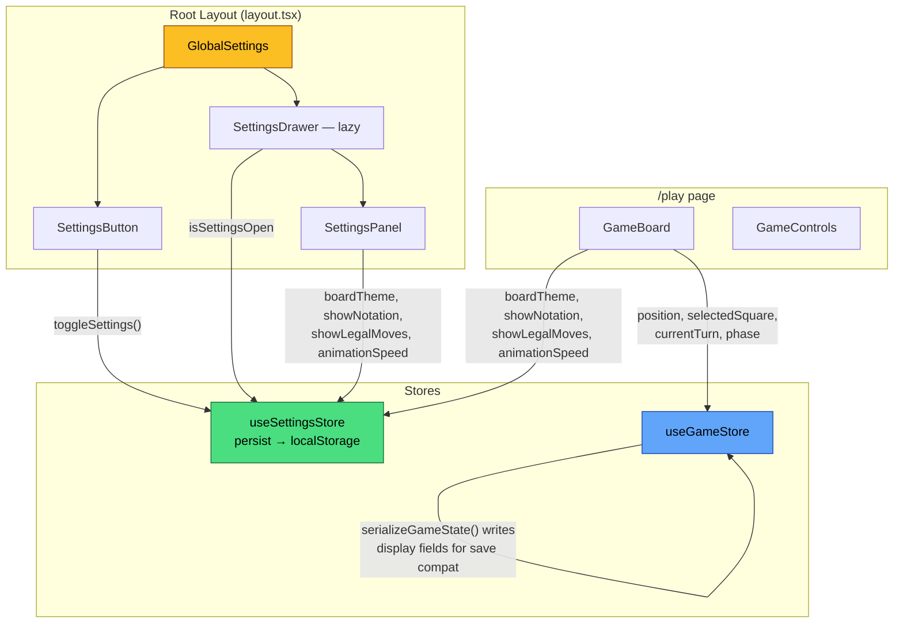
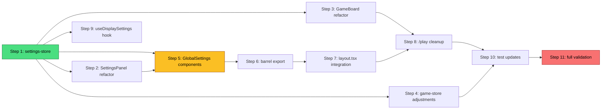

# Global Settings Button — Implementation Plan

> **Spec**: [features/global-settings-button.md](../features/global-settings-button.md)
> **ADR**: [adr-018-global-settings-architecture.md](../adr/adr-018-global-settings-architecture.md)
> **Status**: Plan — not yet implemented

---

## Component / Store Relationships



---

## Implementation Order

The steps are ordered to keep the app functional after each step (no broken intermediate states). Each step can be committed independently.

---

### Step 1: Create `settings-store.ts`

| | |
|---|---|
| **Files** | `frontend/src/stores/settings-store.ts` (create) |
| **What** | New Zustand store with `persist` middleware. Exports `useSettingsStore`. Contains the four display settings + `isSettingsOpen` + actions (`setDisplaySetting`, `toggleNotation`, `toggleLegalMoves`, `openSettings`, `closeSettings`, `toggleSettings`). `partialize` excludes `isSettingsOpen`. localStorage key: `draughts-display-settings`. |
| **Complexity** | Low — ~50 lines, follows established `auth-store.ts` pattern |
| **Risk** | None — new file, no existing code changes |

**Testing:**
- Create `frontend/src/stores/__tests__/settings-store.test.ts`
- Test default values match current game-store defaults (`classic-wood`, `false`, `true`, `normal`)
- Test each action mutates state correctly
- Test `isSettingsOpen` defaults to `false` and is excluded from persistence
- Test `persist` round-trip: set values → clear store → rehydrate → values restored

**Verification:**
```bash
cd frontend && npx vitest run src/stores/__tests__/settings-store.test.ts
```

---

### Step 2: Refactor `SettingsPanel` to read from settings store

| | |
|---|---|
| **Files** | `frontend/src/components/settings/SettingsPanel.tsx` (modify) |
| **What** | Replace `import { useGameStore }` with `import { useSettingsStore }`. Destructure `boardTheme`, `showNotation`, `showLegalMoves`, `animationSpeed`, `setDisplaySetting`, `toggleNotation` from `useSettingsStore()`. Update all references from `config.X` to direct variables. Import `type { DisplaySettings }` for theme type instead of `GameConfig`. |
| **Complexity** | Low — mechanical find-and-replace within one file |
| **Risk** | Medium — `SettingsPanel` is only rendered on `/play` page; must not break existing rendering |

**Testing:**
- Update `frontend/src/components/settings/__tests__/SettingsPanel.test.tsx`:
  - Replace `useGameStore.getState().resetGame()` in `beforeEach` with `useSettingsStore` initial state
  - Replace `useGameStore.getState().config.boardTheme` assertions with `useSettingsStore.getState().boardTheme`
  - All 6 existing tests must continue to pass

**Verification:**
```bash
cd frontend && npx vitest run src/components/settings/__tests__/SettingsPanel.test.tsx
```

---

### Step 3: Refactor `GameBoard` to read display settings from settings store

| | |
|---|---|
| **Files** | `frontend/src/components/game/GameBoard.tsx` (modify) |
| **What** | Add `import { useSettingsStore } from '@/stores/settings-store'`. Destructure `boardTheme`, `showNotation`, `showLegalMoves`, `animationSpeed` from `useSettingsStore()`. Replace `config.showNotation`, `config.boardTheme`, `config.showLegalMoves`, `config.animationSpeed` references with direct variables. Keep all game-logic reads (`position`, `selectedSquare`, `currentTurn`, etc.) from `useGameStore`. |
| **Complexity** | Low — ~10-line diff, four variable substitutions |
| **Risk** | Medium — `GameBoard` is the core gameplay component; incorrect wiring breaks the board |

**Specific changes (4 lines):**
1. `config.animationSpeed as AnimationSpeed` → `animationSpeed as AnimationSpeed` (line ~114)
2. `showNotation={config.showNotation}` → `showNotation={showNotation}` (line ~132)
3. `theme={config.boardTheme}` → `theme={boardTheme}` (line ~133)
4. `legalMoveSquares={config.showLegalMoves ? ...}` → `legalMoveSquares={showLegalMoves ? ...}` (line ~135)

**Testing:**
- Run existing GameBoard-related tests (if any exist in `__tests__/`)
- Manual: open `/play`, start a game, verify board renders with correct theme, notation, legal moves
- Change settings → board updates immediately

**Verification:**
```bash
cd frontend && npx vitest run --reporter=verbose 2>&1 | grep -E "FAIL|PASS|GameBoard"
```

---

### Step 4: Update `game-store.ts` — keep display fields for serialization, adjust `resumeGame()`

| | |
|---|---|
| **Files** | `frontend/src/stores/game-store.ts` (modify) |
| **What** | 1) `resumeGame()`: stop overwriting display fields from saved state — keep `DEFAULT_CONFIG` values for display fields (settings store is now authoritative). 2) `serializeGameState()`: read display settings from `useSettingsStore.getState()` instead of `state.config` for the serialized `config` object. 3) Keep `setBoardTheme` and `toggleNotation` actions for now (they remain as no-ops or deprecated aliases that delegate to settings store), OR simply leave them as-is since `SettingsPanel` no longer calls them. |
| **Complexity** | Medium — requires careful handling of serialization/deserialization boundaries |
| **Risk** | High — incorrect serialization could break game persistence. Existing saved games must still load correctly. |

**Key constraints:**
- `serializeGameState()` must still write display fields into the saved game object (backward compat for users with existing saved games who haven't upgraded yet)
- `deserializeGameState()` / `resumeGame()` must ignore display fields from saved data (settings store is authoritative per ADR)
- `startGame()` should NOT merge display fields from config overrides into `GameConfig` (they're no longer relevant for game sessions)

**Testing:**
- Update `frontend/src/stores/__tests__/game-store.test.ts`:
  - Test that `startGame({ boardTheme: 'dark' })` still sets config field (backward compat)
  - Test that `resumeGame()` does NOT override display settings from the settings store
  - Test that `serializeGameState()` includes current display settings from settings store
  - Existing 25+ game-store tests must continue to pass

**Verification:**
```bash
cd frontend && npx vitest run src/stores/__tests__/game-store.test.ts
```

---

### Step 5: Create `GlobalSettings.tsx`, `SettingsButton.tsx`, `SettingsDrawer.tsx`

| | |
|---|---|
| **Files** | `frontend/src/components/settings/GlobalSettings.tsx` (create), `frontend/src/components/settings/SettingsButton.tsx` (create), `frontend/src/components/settings/SettingsDrawer.tsx` (create) |
| **What** | See component specs below. |
| **Complexity** | Medium — three new components with animation, focus trap, and a11y |
| **Risk** | Low — new files, no existing code changes |

#### `GlobalSettings.tsx`
- `'use client'` component
- Renders `<SettingsButton />`
- Lazy-loads `<SettingsDrawer />` via `next/dynamic` when `isSettingsOpen` is true
- Reads `isSettingsOpen` from `useSettingsStore`

#### `SettingsButton.tsx`
- Fixed position: `fixed top-4 right-4 z-40`
- Size: `w-11 h-11` (44×44px — WCAG target size)
- Background: `bg-white/80 dark:bg-gray-800/80 backdrop-blur-sm rounded-full shadow-lg`
- Gear SVG icon (`w-6 h-6`)
- `aria-label="Display settings"`, `aria-expanded={isSettingsOpen}`
- onClick: `toggleSettings()`

#### `SettingsDrawer.tsx`
- Backdrop: `fixed inset-0 bg-black/50 z-[60]`, click to close
- Drawer panel: `fixed top-0 right-0 h-screen w-80 max-sm:w-full z-[60]`
- Entry animation: `translate-x-full → translate-x-0` (200ms ease-out)
- Exit animation: `translate-x-0 → translate-x-full` (150ms ease-in)
- Header: "Display Settings" title + close (×) button
- Body: `<SettingsPanel />`
- Focus trap via `useEffect` (Tab/Shift+Tab)
- Close on Escape keydown
- Close on route change via `usePathname()` watcher
- `role="dialog"`, `aria-modal="true"`, `aria-label="Display settings"`

**Testing:**
- Create `frontend/src/components/settings/__tests__/GlobalSettings.test.tsx`:
  - Renders the settings button
  - Clicking button opens the drawer
  - Clicking backdrop closes the drawer
  - Escape key closes the drawer
  - `aria-expanded` reflects state
  - Drawer contains `SettingsPanel`

**Verification:**
```bash
cd frontend && npx vitest run src/components/settings/__tests__/GlobalSettings.test.tsx
```

---

### Step 6: Update barrel export

| | |
|---|---|
| **Files** | `frontend/src/components/settings/index.ts` (modify) |
| **What** | Add exports: `export { GlobalSettings } from './GlobalSettings';` |
| **Complexity** | Trivial — 1 line |
| **Risk** | None |

**Verification:** TypeScript compilation.

---

### Step 7: Add `<GlobalSettings />` to root layout + theme script

| | |
|---|---|
| **Files** | `frontend/src/app/layout.tsx` (modify) |
| **What** | 1) Import `GlobalSettings` from `@/components/settings/GlobalSettings`. 2) Add `<GlobalSettings />` after `<InstallPrompt />` (before `<ServiceWorkerRegistration />`). 3) Add synchronous inline `<script>` in `<head>` to read `draughts-display-settings` from localStorage and set `data-board-theme` on `<html>` to prevent theme flash on load. |
| **Complexity** | Low — 3 additions to the layout file |
| **Risk** | Low — layout is server component, `GlobalSettings` is client component (valid pattern) |

**Layout after change:**
```tsx
<body>
  <OfflineBanner />
  <a href="#main-content" className="skip-to-content">Skip to content</a>
  <main id="main-content" role="main">{children}</main>
  <GlobalSettings />    {/* ← NEW */}
  <InstallPrompt />
  <ServiceWorkerRegistration />
</body>
```

**Theme script in `<head>`:**
```tsx
<script dangerouslySetInnerHTML={{ __html: `
  try {
    const s = JSON.parse(localStorage.getItem('draughts-display-settings') || '{}');
    if (s.state?.boardTheme) document.documentElement.dataset.boardTheme = s.state.boardTheme;
  } catch {}
` }} />
```

**Testing:**
- Manual: navigate to every page (`/`, `/play`, `/tutorial`, `/login`, `/settings`, `/profile`, `/play/replay`, `/learn`) and confirm:
  - Gear button visible in top-right corner
  - Clicking opens drawer
  - Changing theme applies immediately
  - Closing drawer persists settings

**Verification:**
```bash
cd frontend && npm run build   # Ensure no SSR errors
cd frontend && npm run dev     # Manual check
```

---

### Step 8: Remove local settings from `/play` page

| | |
|---|---|
| **Files** | `frontend/src/app/play/page.tsx` (modify) |
| **What** | 1) Delete `import { SettingsPanel }`. 2) Delete `const [showSettings, setShowSettings] = useState(false)`. 3) Delete the gear icon `<button>` from the header. 4) Delete `{showSettings && <SettingsPanel />}` from the sidebar. 5) Optionally keep the "?" tutorial link in the header. |
| **Complexity** | Low — pure deletion (~20 lines removed) |
| **Risk** | Medium — must ensure the page still renders correctly without the settings panel |

**Specific deletions:**
1. Line with `import { SettingsPanel }` (~line 13)
2. Line with `const [showSettings, setShowSettings] = useState(false);` (~line 78)
3. The gear `<button onClick={() => setShowSettings(...)}...>` block (~lines 187-194)
4. `{showSettings && <SettingsPanel />}` in the sidebar (~line 241)

**Testing:**
- Update `frontend/src/app/play/__tests__/page.test.tsx`:
  - **Remove** the `'toggles settings visibility'` test (it asserts clicking the gear icon shows `SettingsPanel`)
  - All remaining tests must pass (title, skip nav, game status, board/controls)
  - Optionally add: `'does not render inline settings panel'` (assert `SettingsPanel` is not in sidebar)

**Verification:**
```bash
cd frontend && npx vitest run src/app/play/__tests__/page.test.tsx
```

---

### Step 9: Create convenience hook `useDisplaySettings`

| | |
|---|---|
| **Files** | `frontend/src/hooks/useDisplaySettings.ts` (create) |
| **What** | Thin wrapper: selects `{ boardTheme, showNotation, showLegalMoves, animationSpeed }` from `useSettingsStore` with individual selectors for minimal re-renders. |
| **Complexity** | Trivial — ~15 lines |
| **Risk** | None — new file, optional convenience |

```typescript
import { useSettingsStore } from '@/stores/settings-store';

export function useDisplaySettings() {
  const boardTheme = useSettingsStore((s) => s.boardTheme);
  const showNotation = useSettingsStore((s) => s.showNotation);
  const showLegalMoves = useSettingsStore((s) => s.showLegalMoves);
  const animationSpeed = useSettingsStore((s) => s.animationSpeed);
  return { boardTheme, showNotation, showLegalMoves, animationSpeed } as const;
}
```

**Testing:**
- Optional unit test, or rely on integration via `GameBoard` tests

**Verification:**
```bash
cd frontend && npx tsc --noEmit
```

---

### Step 10: Update remaining test files

| | |
|---|---|
| **Files** | `frontend/src/stores/__tests__/game-store.test.ts` (modify) |
| **What** | Update the `setBoardTheme` and `toggleNotation` tests if those actions are removed or deprecated. If kept as-is in game-store (for backward compat), tests can remain. |
| **Complexity** | Low — mechanical |
| **Risk** | Low |

**Affected test files (audit):**

| Test File | Change Needed |
|-----------|---------------|
| `stores/__tests__/game-store.test.ts` | Update `setBoardTheme` / `toggleNotation` tests if actions change |
| `components/settings/__tests__/SettingsPanel.test.tsx` | Already updated in Step 2 |
| `app/play/__tests__/page.test.tsx` | Already updated in Step 8 |

**Verification:**
```bash
cd frontend && npx vitest run --reporter=verbose
```

---

### Step 11: Full test suite + lint + typecheck

| | |
|---|---|
| **Files** | None (validation only) |
| **What** | Run full CI quality gates locally to confirm zero regressions. |

**Verification:**
```bash
cd frontend && npm run lint && npx tsc --noEmit && npx vitest run
```

All 162+ frontend tests must pass. Zero lint errors. Zero type errors.

---

## Dependency Graph



**Parallelizable steps** (after Step 1):
- Steps 2, 3, 4, 5, 9 can all be done in parallel (they depend only on Step 1)

---

## Files Summary

### Created (5 files)
| File | Step |
|------|------|
| `frontend/src/stores/settings-store.ts` | 1 |
| `frontend/src/stores/__tests__/settings-store.test.ts` | 1 |
| `frontend/src/components/settings/GlobalSettings.tsx` | 5 |
| `frontend/src/components/settings/SettingsButton.tsx` | 5 |
| `frontend/src/components/settings/SettingsDrawer.tsx` | 5 |
| `frontend/src/components/settings/__tests__/GlobalSettings.test.tsx` | 5 |
| `frontend/src/hooks/useDisplaySettings.ts` | 9 |

### Modified (7 files)
| File | Step | Nature of Change |
|------|------|------------------|
| `frontend/src/components/settings/SettingsPanel.tsx` | 2 | Swap store import |
| `frontend/src/components/settings/__tests__/SettingsPanel.test.tsx` | 2 | Swap store assertions |
| `frontend/src/components/game/GameBoard.tsx` | 3 | Read display settings from settings store |
| `frontend/src/stores/game-store.ts` | 4 | Adjust serialization + resumeGame |
| `frontend/src/components/settings/index.ts` | 6 | Add barrel export |
| `frontend/src/app/layout.tsx` | 7 | Add GlobalSettings + theme script |
| `frontend/src/app/play/page.tsx` | 8 | Remove local settings UI |
| `frontend/src/app/play/__tests__/page.test.tsx` | 8 | Remove settings toggle test |
| `frontend/src/stores/__tests__/game-store.test.ts` | 10 | Update display-setting tests |

---

## Estimated Effort

| Step | Complexity | Lines Changed (est.) | Time (est.) |
|------|-----------|---------------------|-------------|
| 1 — settings-store | Low | +80 (store + tests) | 15 min |
| 2 — SettingsPanel | Low | ~20 changed | 10 min |
| 3 — GameBoard | Low | ~10 changed | 5 min |
| 4 — game-store | Medium | ~30 changed | 20 min |
| 5 — Global components | Medium | +250 (3 components + tests) | 40 min |
| 6 — barrel export | Trivial | +1 | 1 min |
| 7 — layout.tsx | Low | +10 | 5 min |
| 8 — /play cleanup | Low | -25 lines, ~5 test changes | 10 min |
| 9 — useDisplaySettings | Trivial | +15 | 5 min |
| 10 — test updates | Low | ~15 changed | 10 min |
| 11 — validation | — | 0 | 5 min |
| **Total** | | **~460 lines net** | **~2 hours** |

---

## Rollback Strategy

Each step is independently revertible via `git revert` on its commit.

| Scenario | Rollback |
|----------|----------|
| **Step 1 fails** | Delete `settings-store.ts` and test file. No other files affected. |
| **Steps 2/3 break rendering** | Revert SettingsPanel/GameBoard to use `useGameStore` again. Settings store remains but is unused — harmless. |
| **Step 4 breaks persistence** | Revert `game-store.ts` changes. Display fields continue being read from `GameConfig` as before. |
| **Step 5 has bugs** | Delete 3 new component files. Layout and play page are unchanged at this point. |
| **Step 7/8 cause SSR issues** | Revert layout.tsx and play/page.tsx. Components exist but aren't rendered. |
| **Full rollback** | `git revert --no-commit HEAD~N` where N = number of commits. All new files deleted, all modified files restored. The app returns to the pre-feature state with zero residual effects (localStorage key `draughts-display-settings` is harmless and unused). |

**Safety net:** At every step, run `npx vitest run` and `npx tsc --noEmit` before committing. If either fails, do not proceed to the next step.

---

## Edge Cases to Watch

1. **Existing saved games**: Old saved games have display fields in `config`. `deserializeGameState()` still parses them (no crash), but `resumeGame()` must **not** apply them to the settings store — just ignore them.
2. **First-time user**: No `draughts-display-settings` in localStorage → defaults apply. The theme script in `<head>` gracefully handles missing/malformed JSON.
3. **Settings changed mid-game**: Theme/notation/legal-moves/animation changes apply instantly to the current board. No game restart needed. AI move computation is not affected by display settings.
4. **Multiple tabs**: Zustand `persist` doesn't sync across tabs by default. This is acceptable per ADR — each tab reads localStorage on load but doesn't live-sync. If needed later, add a `storage` event listener.
5. **`z-index` layering**: Settings button at `z-40` must not obscure game controls. Settings drawer at `z-[60]` must be above `PauseOverlay` (`z-50`). Verify with `PauseOverlay` visible.
6. **Mobile viewport**: Settings button must not overlap with the back arrow or tutorial "?" link on small screens. Check at 320px width.
