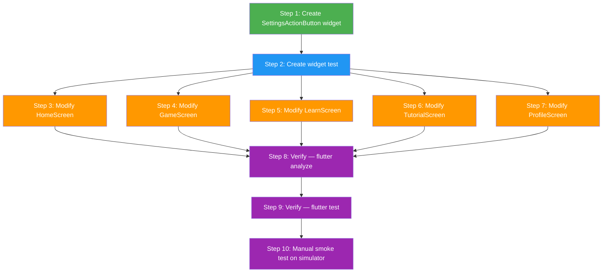

# Implementation Plan: Mobile Global Settings Button

**Task ID:** `mobile-global-settings-button`
**FRD:** [`specs/features/mobile-global-settings-button.md`](../features/mobile-global-settings-button.md)
**ADR:** [`specs/adr/adr-mobile-settings-button.md`](../adr/adr-mobile-settings-button.md)
**Status:** Ready for implementation
**Estimated LOC:** ~90 new, ~15 modified
**Risk:** Low — purely additive; no changes to navigation, state, or business logic

---

## Implementation Flow



**Legend:** 🟢 Create | 🔵 Test | 🟠 Modify | 🟣 Verify

---

## Step 1: Create `SettingsActionButton` widget

**File:** `mobile/lib/shared/widgets/settings_action_button.dart` (NEW)
**Dependencies:** None
**Priority:** P0 — all subsequent steps depend on this

### Code

```dart
import 'package:flutter/material.dart';
import 'package:go_router/go_router.dart';

import 'package:international_draughts/core/routing/router.dart';

/// Reusable settings gear icon for AppBar actions.
///
/// Navigates to the settings screen via [context.push] to preserve
/// the back-stack. Use as `const SettingsActionButton()` in any
/// `AppBar.actions` list.
class SettingsActionButton extends StatelessWidget {
  /// Creates a [SettingsActionButton].
  const SettingsActionButton({super.key});

  @override
  Widget build(BuildContext context) {
    return IconButton(
      icon: const Icon(Icons.settings_outlined),
      tooltip: 'Settings',
      onPressed: () => context.push(AppRoutes.settings),
    );
  }
}
```

**Validation:** File exists, compiles, < 30 LOC, zero external dependencies beyond Flutter + GoRouter.

---

## Step 2: Create widget test for `SettingsActionButton`

**File:** `mobile/test/shared/widgets/settings_action_button_test.dart` (NEW)
**Dependencies:** Step 1

### Code

```dart
import 'package:flutter/material.dart';
import 'package:flutter_test/flutter_test.dart';
import 'package:go_router/go_router.dart';

import 'package:international_draughts/shared/widgets/settings_action_button.dart';

void main() {
  group('SettingsActionButton', () {
    testWidgets('renders a gear icon with tooltip', (tester) async {
      final router = GoRouter(
        routes: [
          GoRoute(path: '/', builder: (_, __) => const Scaffold(
            appBar: _TestAppBar(),
          )),
          GoRoute(path: '/settings', builder: (_, __) => const Scaffold()),
        ],
      );

      await tester.pumpWidget(MaterialApp.router(routerConfig: router));
      await tester.pumpAndSettle();

      expect(find.byIcon(Icons.settings_outlined), findsOneWidget);
      expect(find.byTooltip('Settings'), findsOneWidget);
    });

    testWidgets('navigates to /settings on tap', (tester) async {
      bool navigated = false;

      final router = GoRouter(
        routes: [
          GoRoute(path: '/', builder: (_, __) => const Scaffold(
            appBar: _TestAppBar(),
          )),
          GoRoute(
            path: '/settings',
            builder: (_, __) {
              navigated = true;
              return const Scaffold(body: Text('Settings'));
            },
          ),
        ],
      );

      await tester.pumpWidget(MaterialApp.router(routerConfig: router));
      await tester.pumpAndSettle();

      await tester.tap(find.byIcon(Icons.settings_outlined));
      await tester.pumpAndSettle();

      expect(navigated, isTrue);
    });
  });
}

class _TestAppBar extends StatelessWidget implements PreferredSizeWidget {
  const _TestAppBar();

  @override
  Widget build(BuildContext context) {
    return AppBar(
      title: const Text('Test'),
      actions: const [SettingsActionButton()],
    );
  }

  @override
  Size get preferredSize => const Size.fromHeight(kToolbarHeight);
}
```

**Validation:** `flutter test test/shared/widgets/settings_action_button_test.dart` — 2 tests pass.

---

## Step 3: Modify `HomeScreen` — replace inline IconButton

**File:** `mobile/lib/features/home/presentation/home_screen.dart`
**Dependencies:** Step 1

### Before (lines 20–30)

```dart
        actions: [
          IconButton(
            icon: const Icon(Icons.person_outline),
            tooltip: 'Profile',
            onPressed: () => context.push(AppRoutes.profile),
          ),
          IconButton(
            icon: const Icon(Icons.settings_outlined),
            tooltip: 'Settings',
            onPressed: () => context.push(AppRoutes.settings),
          ),
        ],
```

### After

```dart
        actions: [
          IconButton(
            icon: const Icon(Icons.person_outline),
            tooltip: 'Profile',
            onPressed: () => context.push(AppRoutes.profile),
          ),
          const SettingsActionButton(),
        ],
```

### Import to add

```dart
import 'package:international_draughts/shared/widgets/settings_action_button.dart';
```

**Note:** The `go_router` import can remain since `context.push` is still used for the profile button. Behaviour is identical — this is a DRY refactor only.

---

## Step 4: Modify `GameScreen` — replace broken IconButton

**File:** `mobile/lib/features/game/presentation/screens/game_screen.dart`
**Dependencies:** Step 1

### Before (lines 83–91)

```dart
        actions: [
          // Pause button when timed game is active.
          if (phase is InProgress && phase.config.isTimed)
            _buildPauseResumeButton(),
          IconButton(
            icon: const Icon(Icons.settings),
            onPressed: () {
              // TODO: Open in-game settings.
            },
          ),
        ],
```

### After

```dart
        actions: [
          // Pause button when timed game is active.
          if (phase is InProgress && phase.config.isTimed)
            _buildPauseResumeButton(),
          const SettingsActionButton(),
        ],
```

### Import to add

```dart
import 'package:international_draughts/shared/widgets/settings_action_button.dart';
```

**Notes:**
- Fixes the broken TODO no-op callback (AC-4).
- Icon changes from `Icons.settings` (filled) → `Icons.settings_outlined` (outlined) per FRD FR-12.
- Per ADR Decision 3, the clock is **not** auto-paused. The existing pause/resume button remains available.

---

## Step 5: Modify `LearnScreen` — append to existing actions

**File:** `mobile/lib/features/learning/presentation/learn_screen.dart`
**Dependencies:** Step 1

### Before (lines 30–38)

```dart
        actions: [
          IconButton(
            icon: const Icon(Icons.refresh),
            tooltip: 'Restart tutorial',
            onPressed: () {
              ref.read(learningProvider.notifier).restart();
            },
          ),
        ],
```

### After

```dart
        actions: [
          IconButton(
            icon: const Icon(Icons.refresh),
            tooltip: 'Restart tutorial',
            onPressed: () {
              ref.read(learningProvider.notifier).restart();
            },
          ),
          const SettingsActionButton(),
        ],
```

### Import to add

```dart
import 'package:international_draughts/shared/widgets/settings_action_button.dart';
```

**Note:** Per ADR Decision 4, the `_LearningBoard` hardcoded `BoardTheme.classicWood` is **not** fixed in this PR. That is tracked separately.

---

## Step 6: Modify `TutorialScreen` — add actions to AppBar

**File:** `mobile/lib/features/tutorial/presentation/tutorial_screen.dart`
**Dependencies:** Step 1

### Before (line 20)

```dart
      appBar: AppBar(title: const Text('Rules & Tutorial')),
```

### After

```dart
      appBar: AppBar(
        title: const Text('Rules & Tutorial'),
        actions: const [SettingsActionButton()],
      ),
```

### Import to add

```dart
import 'package:international_draughts/shared/widgets/settings_action_button.dart';
```

---

## Step 7: Modify `ProfileScreen` — insert before logout button

**File:** `mobile/lib/features/profile/presentation/profile_screen.dart`
**Dependencies:** Step 1

### Before (lines 66–78)

```dart
        actions: [
          if (authState is Authenticated)
            IconButton(
              icon: const Icon(Icons.logout),
              tooltip: 'Logout',
              onPressed: () async {
                await ref.read(authProvider.notifier).logout();
                if (context.mounted) {
                  context.go(AppRoutes.home);
                }
              },
            ),
        ],
```

### After

```dart
        actions: [
          const SettingsActionButton(),
          if (authState is Authenticated)
            IconButton(
              icon: const Icon(Icons.logout),
              tooltip: 'Logout',
              onPressed: () async {
                await ref.read(authProvider.notifier).logout();
                if (context.mounted) {
                  context.go(AppRoutes.home);
                }
              },
            ),
        ],
```

### Import to add

```dart
import 'package:international_draughts/shared/widgets/settings_action_button.dart';
```

**Note:** Settings button appears **before** logout (leftmost position) per FRD §8.2. Settings is always visible; logout is conditional on auth state.

---

## Step 8: Verify — `flutter analyze`

**Command:**

```bash
cd mobile && flutter analyze
```

**Expected:** Zero issues on new and modified files.

**Files to check specifically:**
- `lib/shared/widgets/settings_action_button.dart`
- `lib/features/home/presentation/home_screen.dart`
- `lib/features/game/presentation/screens/game_screen.dart`
- `lib/features/learning/presentation/learn_screen.dart`
- `lib/features/tutorial/presentation/tutorial_screen.dart`
- `lib/features/profile/presentation/profile_screen.dart`

---

## Step 9: Verify — `flutter test`

**Command:**

```bash
cd mobile && flutter test
```

**Expected:** All existing tests pass + 2 new tests pass.

**Existing tests that might be affected:**
- `test/features/learning/learning_notifier_test.dart` — Tests the `LearningNotifier` only (no widget tests for `LearnScreen`), so **no impact**.
- `test/widget_test.dart` — Default counter smoke test from Flutter template, **no impact**.

**No existing widget/screen tests exist for the five modified screens**, so there is zero risk of breaking existing tests.

---

## Step 10: Manual smoke test on simulator

Run the app on iOS Simulator and verify on each screen:

| # | Screen | Check |
|---|--------|-------|
| 1 | HomeScreen (`/`) | Gear icon visible in AppBar; tapping opens `/settings`; back returns to home |
| 2 | GameScreen (`/play`) | Start a game; gear icon visible; tapping opens `/settings`; back returns to game; game state preserved; clock continues (if timed) |
| 3 | LearnScreen (`/learn`) | Gear icon visible after restart button; tapping opens `/settings`; back returns to learn |
| 4 | TutorialScreen (`/tutorial`) | Gear icon visible in AppBar; tapping opens `/settings`; back returns to tutorial |
| 5 | ProfileScreen (`/profile`) | Gear icon visible before logout button; tapping opens `/settings`; back returns to profile |
| 6 | LoginScreen (`/login`) | No gear icon — **not** added |
| 7 | RegisterScreen (`/register`) | No gear icon — **not** added |
| 8 | Settings reactivity | Change theme in settings from any screen; on return, theme change is reflected |

---

## Dependency Graph

```
Step 1 (create widget)
  ├── Step 2 (create test)        — depends on Step 1
  ├── Step 3 (HomeScreen)         — depends on Step 1
  ├── Step 4 (GameScreen)         — depends on Step 1
  ├── Step 5 (LearnScreen)        — depends on Step 1
  ├── Step 6 (TutorialScreen)     — depends on Step 1
  └── Step 7 (ProfileScreen)      — depends on Step 1
Steps 2–7 are independent of each other (can be done in parallel)
Step 8 (analyze) — depends on Steps 1–7
Step 9 (test)    — depends on Steps 1–8
Step 10 (smoke)  — depends on Step 9
```

---

## Files Summary

| Action | File | LOC Change |
|--------|------|------------|
| **CREATE** | `mobile/lib/shared/widgets/settings_action_button.dart` | +25 |
| **CREATE** | `mobile/test/shared/widgets/settings_action_button_test.dart` | +65 |
| MODIFY | `mobile/lib/features/home/presentation/home_screen.dart` | +1 import, −4 lines, +1 line |
| MODIFY | `mobile/lib/features/game/presentation/screens/game_screen.dart` | +1 import, −4 lines, +1 line |
| MODIFY | `mobile/lib/features/learning/presentation/learn_screen.dart` | +1 import, +1 line |
| MODIFY | `mobile/lib/features/tutorial/presentation/tutorial_screen.dart` | +1 import, +3 lines (AppBar expansion) |
| MODIFY | `mobile/lib/features/profile/presentation/profile_screen.dart` | +1 import, +1 line |

**Total:** 2 files created, 5 files modified, ~90 lines added, ~8 lines removed.

---

## Out of Scope (per ADR)

- Clock auto-pause on settings navigation (ADR Decision 3 — accepted behaviour)
- `_LearningBoard` theme hardcoding fix (ADR Decision 4 — separate issue)
- Settings on LoginScreen / RegisterScreen (FRD §7.6–7.7)
- New settings fields or backend changes
